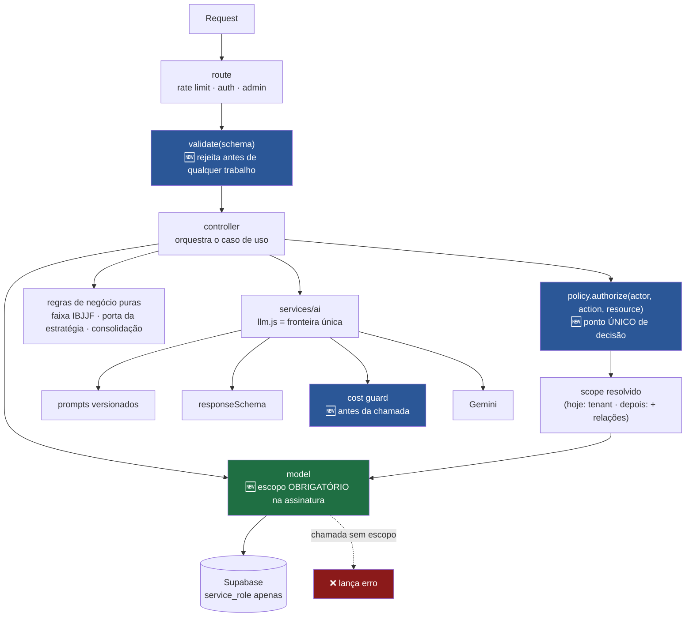
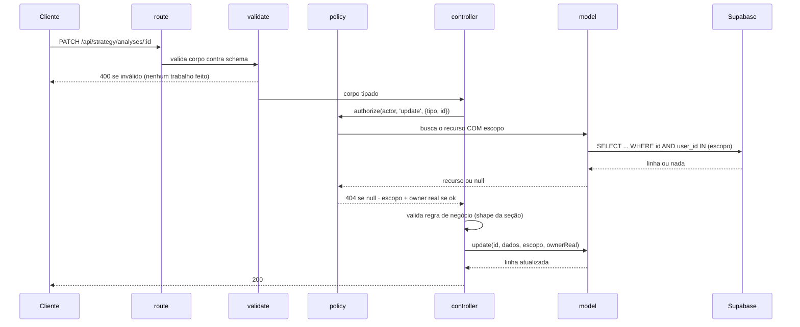
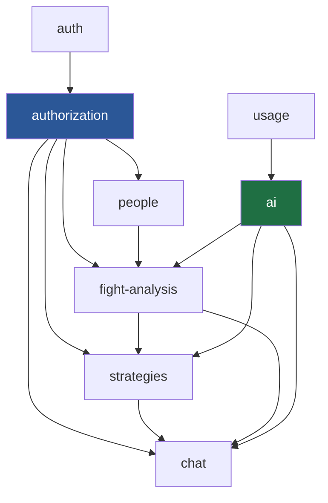
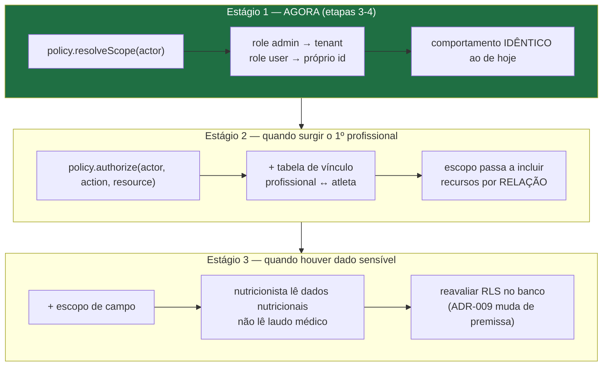
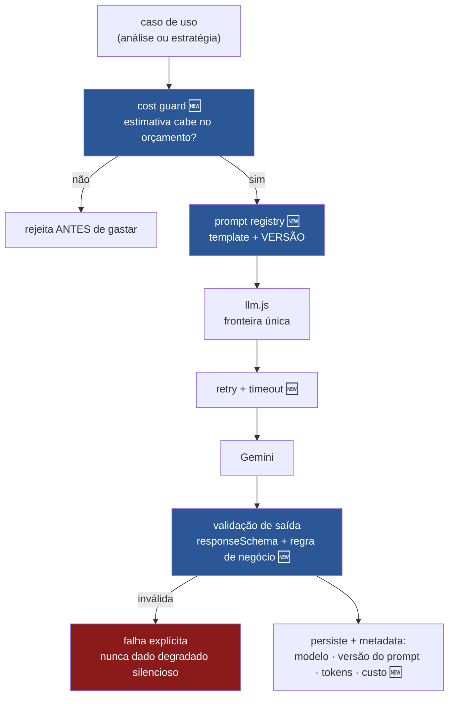
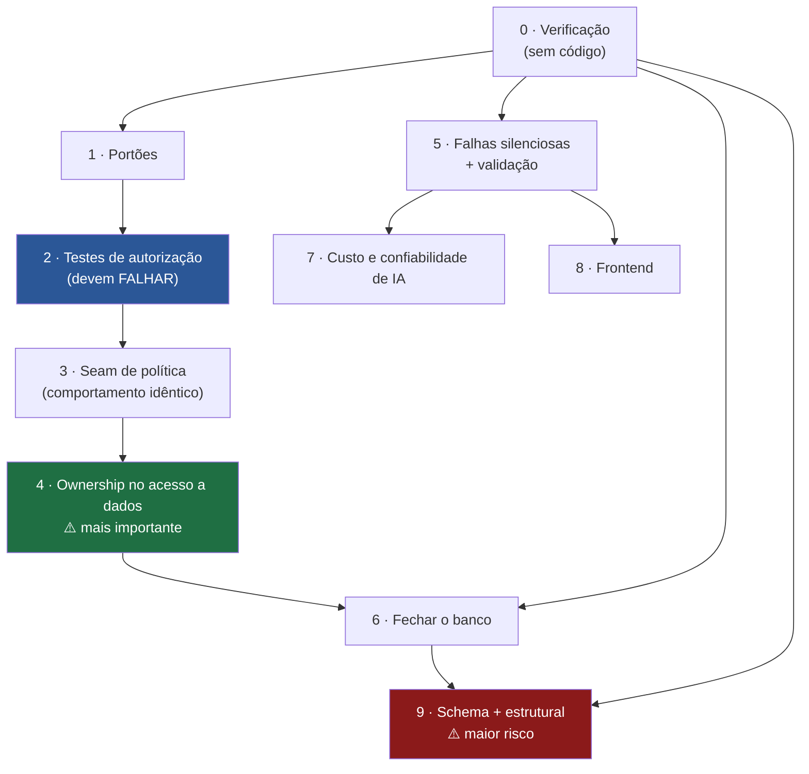

# JiuMetrics — Arquitetura-alvo e plano de refatoração

> **Status: PROPOSTO.** Nada aqui está implementado. Nenhum código, banco, dependência, prompt ou API foi alterado na produção deste documento.
>
> **Fontes:** código atual (`server/src`, `frontend/src`), migrations, [`AUDIT.md`](./AUDIT.md), [`docs/`](./docs/), [`CLAUDE.md`](./CLAUDE.md), histórico do git. Baseline: `main` (`895066f`), 2026-08-12.
>
> **Convenção deste documento:** **`CURRENT`** = existe hoje. **`TARGET`** = arquitetura desejada. **`PROPOSED`** = mudança sugerida, não aprovada. **`NEEDS_CONFIRMATION`** = não determinável pelo repositório.

---

## Executive Summary

O JiuMetrics **não precisa de rewrite**. Precisa de três coisas, nesta ordem: uma rede de testes que prove autorização, uma mudança estrutural que torne o vazamento de dados impossível em vez de improvável, e a correção de falhas que já existem.

A leitura central da auditoria é que **os problemas não são causados pela arquitetura em camadas** — são causados por três ausências concretas:

1. **A posse do dado é uma convenção de chamada, não um requisito de assinatura.** `FightAnalysis.update()` aceita qualquer ID. O sistema é seguro só enquanto todo controller lembrar de filtrar — e 6 não lembraram.
2. **Não existe validação de entrada.** Dois dos problemas mais graves (corpo arbitrário indo para o LLM, array de vídeos sem limite) são o mesmo problema: nada valida o que entra.
3. **Erros são engolidos.** Cinco `catch` que só logam esconderam três funcionalidades que nunca funcionaram.

Reorganizar em *feature folders*, introduzir Clean Architecture ou modelar agregados de DDD **não corrigiria nenhuma dessas três**. Por isso a arquitetura-alvo mantém as camadas atuais e adiciona exatamente **três elementos estruturais**, cada um justificado por uma falha real:

| Elemento novo | Corrige |
|---|---|
| **Ownership exigido na camada de acesso a dados** | os 6 IDORs — a omissão passa a falhar, não a vazar |
| **Seam de política de autorização** (1 módulo) | permite papéis profissionais depois sem tocar 23 call sites |
| **Validação de entrada por endpoint** | corpo arbitrário no LLM, vídeos sem limite, campo inesperado |

Tudo o mais é correção de defeito, consolidação de duplicação ou remoção de código morto — não mudança arquitetural.

**Sequência que governa o plano:** verificar → provar → corrigir → consolidar → evoluir. A primeira etapa não escreve código; a segunda escreve testes que devem **falhar**. Só a terceira toca comportamento.

**Custo estimado da abordagem oposta (rewrite):** reescrever 148 arquivos sem nenhum teste de autorização existente, num sistema com 6 falhas de posse conhecidas e 23 pontos de incerteza sobre o próprio banco. Rejeitado.

---

## 1. Behavior Preservation

O que **precisa continuar funcionando exatamente como hoje** depois de cada etapa. Esta lista é o contrato da refatoração: qualquer mudança que quebre um item aqui é regressão, não melhoria.

### 1.1 Fluxos de produto que não podem quebrar

| # | Fluxo | Comportamento a preservar |
|---|---|---|
| B1 | **Login** | E-mail + senha → JWT de 7 dias (30 com `rememberMe`). Resposta inclui `{id, name, email, role}` e o token. Conta inativa é rejeitada |
| B2 | **Sessão** | `Authorization: Bearer`. `role` lido do **banco**, `is_active` reconsultado, `token_version` comparado. Troca de papel/desativação derruba sessões vivas |
| B3 | **Escopo de dados** | `admin` vê todos os `user_id` do seu `tenant_id`; `user` vê **apenas o próprio**. Sem exceção |
| B4 | **CRUD de atleta/adversário** | Só `name` obrigatório. Defaults aplicados quando o campo é omitido (ver B15) |
| B5 | **Análise de vídeo** | URL do YouTube → 5 gráficos + `technical_stats` + resumo. Tentativa direta ao Gemini, com fallback para download + Files API. Se um vídeo falha, os demais continuam |
| B6 | **Consolidação de perfil** | `technical_summary` regenerado ao criar/deletar análise; **limpo** se sobram zero análises |
| B7 | **Regra de porta da estratégia** | Impossível gerar estratégia sem ≥1 análise de **cada** lado; erro indica **qual** lado falta |
| B8 | **Regra de faixa IBJJF** | A faixa **mais restritiva** entre os dois competidores governa as técnicas. Faixa vazia/desconhecida → conjunto de branca |
| B9 | **Reuso de resumo salvo** | Se `technical_summary` existe, é reutilizado em vez de reconsolidar via IA |
| B10 | **Tolerância de persistência** | Falha ao salvar no histórico **não derruba** a geração da estratégia |
| B11 | **Chat de refinamento** | 3 contextos (`analysis`, `profile`, `strategy`). IA sugere, usuário aceita. Snapshot congela o contexto |
| B12 | **Mitigação de injeção no chat** | `systemInstruction` fixa; dado do usuário entra como primeiro turno `user` |
| B13 | **Versionamento** | Versão original preservada antes da primeira edição. Restauração de análise e de estratégia funciona |
| B14 | **Admin de usuários** | Criar, editar, trocar papel, desativar, reativar, excluir. Exclusão exige escolha explícita: transferir **ou** apagar. Admin não pode se auto-desativar/rebaixar/excluir. `assertSameTenant` em toda operação |
| B15 | **Defaults fabricados** | `age: 25`, `weight: 75`, `belt: 'Branca'`, `style: 'Guarda'`, `cardio: 50`. ⚠️ **É dívida** (`DOMAIN.md`), mas remover muda o comportamento observável — só sai com decisão de produto explícita |
| B16 | **Exportação de PDF** | O relatório continua sendo gerado, com o mesmo conteúdo. Só a **forma de construir o DOM** muda |

### 1.2 Contratos de API que devem permanecer compatíveis

O frontend é o único consumidor conhecido, mas ele **é** um consumidor real e não deve quebrar. **NEEDS_CONFIRMATION:** existe algum outro consumidor (script, integração, app)?

| Manter | Detalhe |
|---|---|
| **Todos os paths e verbos atuais** | exceto `GET /api/fight-analysis/debug/all`, cuja remoção é intencional |
| **Formato de envelope** | `{ success: true, data }` / `{ success: false, error }`. Alguns endpoints usam formatos ligeiramente diferentes (`{ versions }`, `{ stats }`) — **preservar cada um como está** |
| **404 para recurso fora do escopo** | não trocar para 403 |
| **`snake_case` na resposta imediata** de `POST /api/ai/analyze-link` | mudar isso quebra a única tela que hoje mostra estatísticas técnicas |
| **Nomes de campo em `strategy_data`** | `resumo_rapido`, `analise_de_matchup`, `plano_tatico_faseado`, `cronologia_inteligente`, `checklist_tatico` — persistidos em JSONB de linhas existentes |
| **`operation_type` de `api_usage`** | `video_analysis`, `strategy`, `summary`, `consolidate_profile`, `chat_analysis`, `chat_profile`, `chat_strategy` |

### 1.3 Dados que precisam ser preservados

| Dado | Risco na refatoração |
|---|---|
| `athletes`, `opponents` | unificação (etapa 8) exige migração cuidadosa e possível deduplicação manual |
| `fight_analyses` | `person_id` é polimórfico **sem FK** — qualquer mudança de tipo exige backfill validado |
| `tactical_analyses.strategy_data` (JSONB) | **estratégias históricas geradas por modelos e prompts antigos.** Não podem ser reinterpretadas com schema novo |
| `analysis_versions`, `strategy_versions`, `profile_versions` | histórico de edições. `profile_versions` está **vazia** (`NEEDS_CONFIRMATION`) |
| `ai_chat_sessions.messages` (JSONB) | conversas com a IA |
| `users` — `tenant_id`, `token_version`, `created_by` | quebrar `tenant_id` quebra todo o escopo de dados |
| `api_usage` | **provavelmente vazia** (`NEEDS_CONFIRMATION`) |
| `user_id` em `VARCHAR` | podem existir valores **não-UUID** (a migration `019` filtra `user_id <> ''`). Converter sem limpar antes **perde linhas** |

### 1.4 O que explicitamente PODE mudar

Para deixar claro que a lista acima não é imobilismo:

- estrutura interna de arquivos e módulos do backend, desde que os endpoints não mudem;
- assinaturas de funções internas (models, services, utils);
- padrão de fetch do frontend, desde que a tela renderize o mesmo;
- mensagens de log;
- `details: error.message` nas respostas de erro (**é vazamento**, deve sair);
- código morto, arquivos órfãos, documentação obsoleta.

---

## 2. Current vs Target

| Área | `CURRENT` | Problema concreto | `TARGET` | Justificativa |
|---|---|---|---|---|
| **Organização do backend** | Camadas: `routes/controllers/models/services/utils` | Nenhum. Funciona e é convencional | **Manter camadas.** Split apenas dos 3 arquivos obesos | Nenhuma das falhas da auditoria vem do layering. Reorganizar por feature seria big-bang sem retorno |
| **Acesso a dados** | 10 models = *data mappers* PostgREST. Ownership é **convenção de chamada** | `FightAnalysis.update/delete` aceitam qualquer ID → 6 IDORs. `AnalysisVersion` não filtra nada | **Escopo obrigatório na assinatura.** Chamada sem escopo **lança** | Transforma "lembrar de filtrar" em "impossível esquecer". Única mudança estrutural que fecha a classe inteira |
| **Autorização** | `getScopeIds` (8 linhas) chamado em 23 pontos; ausente em 6 | Regra correta, **não obrigatória**. Sem lugar para futuros papéis profissionais | **1 módulo de política** — ponto único que responde "ator pode ação em recurso?". Começa idêntico ao atual | Insere a costura para ReBAC futuro sem tocar 23 call sites depois |
| **Autenticação** | JWT próprio, 3 validações por request, cache 5 min | **Fallback abre em falha de DB** (volta a confiar no token) | **Manter o desenho.** Falhar fechado no erro | O desenho é bom — é a razão de não haver escalonamento de privilégio. Só o fallback está errado |
| **Validação de entrada** | **Não existe.** `if (!campo)` ad hoc | Corpo arbitrário → LLM; `videos[]` sem limite; campo inesperado aceito | **Schema por endpoint, na borda** | Duas falhas HIGH são o mesmo problema. Não é padrão por estética |
| **Domínio** | Sem camada de domínio. Regras espalhadas em controllers e services | Regra de faixa e regra de porta funcionam, mas moram em `geminiService`/`strategyService` | **Extrair só o que é regra de negócio pura** para módulos testáveis. Sem entidades ricas, sem agregados | Regras já testáveis não ganham nada com envelopamento em classes |
| **Banco — integridade** | 4 FKs reais; `user_id` VARCHAR × UUID; zero `UNIQUE` | Sem integridade referencial; tipo divergente mascara bugs | **Unificar em UUID, recriar FKs, adicionar `UNIQUE`** | O bug de `updateTechnicalProfile` só passou silencioso porque a coluna é VARCHAR |
| **Banco — acesso** | RLS desligado/neutralizado; GRANTs de `anon` presumivelmente ativos; credenciais versionadas | Banco alcançável **sem passar pela API** | **Revogar `anon`; só `service_role`** ([ADR-009](./docs/decisions/009-acesso-ao-banco-exclusivamente-por-service-role.md)) | Decidido. Torna obrigatório o ownership no acesso a dados |
| **Banco — migrations** | 22 arquivos, sem runner, sem controle de estado, `users` nunca criada | Impossível reconstruir o banco a partir do repo | **Baseline via `pg_dump` + runner** | Todo trabalho de schema hoje começa com arqueologia |
| **IA — fronteira** | `services/llm.js` como fronteira única | Nenhum. É a melhor abstração do projeto | **Manter.** Vazamentos menores em `schemas/*.js` | Trocar de modelo já é trivial; trocar de provedor é 70% do caminho |
| **IA — saída** | `responseSchema` em análise e estratégia; **chat usa regex** | Sugestões que **escrevem no banco** dependem de regex frágil | **Saída estruturada no chat também** | Fecha a última exceção ao princípio já adotado |
| **IA — confiabilidade** | Sem retry, sem timeout de inferência | Falha transitória perde a operação **após** pagar o vídeo | **Retry com backoff + timeout explícito** | Custo já foi consumido quando a falha ocorre |
| **IA — custo** | `PRICING` correto; persistência **provavelmente quebrada**; modelo do cliente sem validação | Gasto ilimitado e **invisível** | **Corrigir registro → allow-list → limite → quota** | Nesta ordem: sem visibilidade, limitar é às cegas |
| **IA — reprodutibilidade** | `metadata` guarda modelo e tokens | Não guarda **versão do prompt** → análise histórica não é reproduzível | **Versionar prompts; registrar a versão em `metadata`** | Requisito explícito. Custo: um campo |
| **APIs** | 10 routers; 1 rota de debug vazando tudo; envelopes inconsistentes | Vazamento cross-tenant; formatos divergentes | **Remover a rota de debug. Preservar todo o resto** | Padronizar envelope quebraria o frontend sem ganho |
| **Erros** | 12 classes tipadas (bom); `handleError` vaza `error.message`; 5 `catch` que engolem | Vaza schema; esconde falha real | **Manter a taxonomia. Nunca vazar. Nunca engolir no caminho de persistência** | O desenho está certo; a aplicação é inconsistente |
| **Observabilidade** | `console.*` com emoji, sem nível, sem correlação, com PII | Impossível filtrar; e-mails em log; custo em serverless | **Logger com nível + request id; PII redigida** | Nenhuma investigação de produção é viável hoje |
| **Testes** | 16 suítes backend (mockam models), 5 frontend, 6 E2E **que nunca rodam** | **Zero teste de autorização.** Nenhuma das 6 falhas seria detectada | **Testes de posse no nível que os prova** + E2E no CI | Ver §12 — o mock de model impede o controller test de provar ownership |
| **Frontend — dados** | 2 padrões de fetch; 12 services sem transformação | Invalidação cruzada ausente; `technical_stats` × `technicalStats` nunca renderiza | **React Query único + normalização na borda** | A ausência de camada de normalização é a causa direta do bug |
| **Frontend — lógica** | PDF montado por string HTML na página; `athleteStats` duplicado do backend | Sink de XSS; duas fontes de verdade **já divergentes** | **DOM por API; cálculo só no backend** | XSS é segurança; duplicação já divergiu |
| **Frontend — tipagem** | 0 arquivos TS | 3 falhas silenciosas seriam erro de compilação | **`checkJs` + `@ts-check` opt-in; depois migração** | [ADR-010](./docs/decisions/010-adotar-typescript-incrementalmente.md). Não em paralelo com autorização |
| **Deploy** | Vercel **e** GitHub Pages | Ambiguidade; build do Pages pode apontar para `localhost` | **Só Vercel** ([ADR-008](./docs/decisions/008-vercel-como-unico-destino-de-deploy.md)) | Decidido |
| **Trabalho longo** | IA síncrona no request, em serverless | Provável timeout **após** consumir tokens | **Job assíncrono** — última etapa | Habilita progresso real; alto impacto, não urgente |

---

## 3. Arquitetura-alvo

### 3.1 Princípio

> Uma requisição atravessa quatro fronteiras, e **cada fronteira tem uma pergunta própria**. Nenhuma fronteira confia na anterior ter feito o trabalho dela.

| Fronteira | Pergunta | Onde |
|---|---|---|
| **Transporte** | "a entrada tem a forma esperada?" | route + schema de validação |
| **Autorização** | "este ator pode esta ação neste recurso?" | módulo de política |
| **Caso de uso** | "qual é a regra de negócio?" | controller / service |
| **Acesso a dados** | "esta query está escopada?" | model — **exige escopo, não confia** |

A quarta fronteira é a mudança central: hoje ela confia. No alvo, ela **recusa**.

### 3.2 Diagrama — `TARGET`



### 3.3 Onde cada coisa fica — `TARGET`

| Preocupação | Lugar | Regra |
|---|---|---|
| **Validação de entrada** | schema declarado junto da rota | Nenhum controller recebe corpo não validado |
| **Decisão de autorização** | módulo de política, chamado pelo controller | **Nenhum `if (role === ...)` fora dele** |
| **Aplicação do escopo** | assinatura do model | Model **recusa** query sem escopo |
| **Regras de negócio** | funções puras em módulos próprios | Testáveis sem banco e sem IA |
| **Orquestração** | controller | Sem query direta, sem SDK, sem regra de negócio complexa |
| **Queries** | apenas em `models/` | **Zero query em `routes/`** (hoje há uma) |
| **Integração externa** | `services/` — `llm.js` para IA, `videoDownloader.js` para YouTube | Nenhum import de SDK fora dali |
| **Prompts** | `services/prompts/*.txt`, versionados | Zero prompt inline (hoje há um) |
| **Tradução de nomes** | `utils/dbParsers.js`, para **todos** os models | Hoje cobre 3 de 10 |
| **Erros** | taxonomia em `utils/errors.js` | Nunca vazar `message`; nunca engolir em persistência |

### 3.4 Fluxo de comando (escrita) — `TARGET`



O ponto que importa: **o model é chamado duas vezes e nas duas exige escopo.** Não existe caminho em que um ID do `req.body` chegue a um `UPDATE` sem escopo.

### 3.5 Fluxo de leitura — `TARGET`

Idêntico ao atual, com uma diferença: o escopo deixa de ser um argumento opcional que o controller *pode* passar e passa a ser exigido. Leituras de listagem ganham paginação (`limit`/`offset`), seguindo o padrão que `TacticalAnalysis` já implementa.

### 3.6 O que NÃO entra na arquitetura-alvo

Rejeições explícitas, com motivo — para que ninguém as reintroduza como "boa prática":

| Padrão | Por que **não** |
|---|---|
| **Clean / Hexagonal Architecture** | Exigiria portas e adaptadores para um sistema com **um** banco, **um** provedor de IA e nenhuma segunda implementação planejada. Indireção sem payoff |
| **Repository pattern com interface** | A interface só faz sentido com ≥2 implementações. Existe uma (PostgREST). Os models **são** o repositório |
| **Entidades ricas / agregados de DDD** | As regras de negócio reais (faixa IBJJF, porta da estratégia, consolidação) são **funções puras sobre dados**. Envelopá-las em classes com invariantes internas adiciona cerimônia e não pega nenhum bug conhecido |
| **Value objects** | Nenhuma falha da auditoria seria evitada por `new Belt('azul')`. Tipagem ([ADR-010](./docs/decisions/010-adotar-typescript-incrementalmente.md)) pega mais por menos |
| **CQRS / event sourcing** | Não há requisito de leitura e escrita divergirem, nem de replay. As tabelas `*_versions` já cobrem auditoria de edição |
| **Event bus / mensageria** | Um único efeito colateral assíncrono existe (reconsolidar perfil). Uma chamada de função resolve |
| **Container de DI** | CommonJS com `require` já injeta o suficiente; os testes mockam por módulo e funciona |
| **Microserviços** | 69 arquivos de backend, um time pequeno, um banco |
| **Reorganização em feature folders** | Big-bang que toca todos os arquivos e **não corrige nenhuma das 3 ausências** identificadas |
| **GraphQL / tRPC** | Trocaria um contrato funcionando por outro, sem problema motivador |

---

## 4. Modularização

### 4.1 Escolha: camadas, com módulos de domínio dentro

**Decisão: manter a organização por camada; introduzir módulos de domínio apenas para regras de negócio puras.**

O raciocínio, a partir do código real:

- **Por feature seria melhor se** o acoplamento fosse entre camadas de features diferentes. Não é: `athleteController` não conhece `strategyController`. O acoplamento problemático é **vertical** (controller → model sem contrato de escopo).
- **Por camada tem um custo real** — um módulo "estratégia" tem seus arquivos espalhados por 5 diretórios. Isso é inconveniente, não é a causa de nenhum defeito.
- **O que dói de verdade** são 3 arquivos que misturam subdomínios: `chatController.js` (818 linhas, 3 subdomínios), `geminiService.js` (845 linhas, 3 responsabilidades), `config/ai.js` (domínio esportivo + infra de IA + rate limits).

Portanto: **não reorganize a árvore. Divida os 3 arquivos e extraia as regras de negócio.**

### 4.2 Módulos — `TARGET`

Módulos são **fronteiras de responsabilidade**, não necessariamente diretórios novos. Os seis primeiros já estão documentados em [`docs/modules/`](./docs/modules/).

#### `auth` — autenticação e identidade
- **Responsabilidade:** provar quem é o ator e manter identidade/papel/tenant.
- **Pode depender de:** `models/User`, `utils/errors`.
- **NÃO pode depender de:** nenhum módulo de domínio, nenhum service de IA.
- **Entidades:** `User`.
- **Casos de uso:** login, validar sessão, CRUD administrativo de usuários.
- **API:** `/api/auth/*`, `/api/admin/*`.
- **Nota:** `getScopeIds` **sai daqui** para `authorization` — hoje mistura identidade com decisão de acesso.

#### `authorization` — política de acesso 🆕
- **Responsabilidade:** responder "este ator pode esta ação neste recurso?" e resolver o escopo de dados.
- **Pode depender de:** `auth` (para saber quem é o ator), `models/User` (composição do tenant).
- **NÃO pode depender de:** controllers, services de IA, HTTP. **Deve ser testável sem Express.**
- **Casos de uso:** `resolveScope(actor)`, `authorize(actor, action, resource)`.
- **API:** nenhuma. É consumido, não exposto.
- **Por que módulo próprio:** é o ponto de extensão para papéis profissionais (§6). Hoje `getScopeIds` recebe o `req` do Express, o que amarra a regra ao transporte e impede testá-la isoladamente.

#### `people` — atletas e adversários
- **Responsabilidade:** cadastro dos lutadores e armazenamento do perfil técnico.
- **Pode depender de:** `authorization`, `models`.
- **NÃO pode depender de:** `ai` (não gera o resumo, só o guarda), `strategies`.
- **Entidades:** `Athlete`, `Opponent` → **uma entidade com papel** após a etapa 8 ([ADR-007](./docs/decisions/007-unificar-athlete-e-opponent-numa-entidade-com-papel.md)).
- **API:** `/api/athletes/*`, `/api/opponents/*`.

#### `fight-analysis` — evidência
- **Responsabilidade:** transformar vídeo em análise estruturada e persistí-la.
- **Pode depender de:** `ai`, `people` (validar posse da pessoa), `authorization`, `usage`.
- **NÃO pode depender de:** `strategies` (a dependência é a inversa).
- **Regras puras a extrair:** consolidação de gráficos e stats (hoje em `geminiService`/`strategyService`).
- **API:** `/api/fight-analysis/*`, `POST /api/ai/analyze-link`.

#### `strategies` — o entregável
- **Responsabilidade:** cruzar dois perfis e produzir o plano tático.
- **Pode depender de:** `people`, `fight-analysis` (leitura), `ai`, `authorization`, `usage`.
- **NÃO pode depender de:** `chat` (o chat depende dela).
- **Regras puras a extrair:** **regra de porta** (≥1 análise de cada lado) e **regra de faixa mais restritiva** — hoje dentro de `strategyService`/`geminiService`, misturadas com montagem de prompt.
- **API:** `/api/strategy/*`.

#### `chat` — refinamento e versões
- **Responsabilidade:** conversa de refinamento e histórico de edições.
- **Pode depender de:** `fight-analysis`, `strategies`, `people`, `ai`, `authorization`.
- **NÃO pode depender de:** nada depende de `chat` — é folha.
- **Ação estrutural:** dividir `chatController.js` (818 linhas) em **3 arquivos por subdomínio** (`analysis`, `profile`, `strategy`). É onde estão 4 dos 6 IDORs, e o tamanho é parte da causa.

#### `ai` — integração com modelo
- **Responsabilidade:** falar com o provedor, montar prompts, validar saída, medir custo.
- **Pode depender de:** `usage` (registro de custo), `config`.
- **NÃO pode depender de:** nenhum model de domínio. **Recebe dados, não os busca.**
- **Ação estrutural:** dividir `geminiService.js` em (a) montagem de prompt, (b) regras de domínio IBJJF → move para `strategies`, (c) parsing de resposta.
- **Fronteira dura:** `llm.js` é o único que importa `@google/genai`.

#### `usage` — custo
- **Responsabilidade:** registrar consumo, calcular custo, **barrar** antes de gastar.
- **Pode depender de:** `models/ApiUsage`, `authorization`.
- **NÃO pode depender de:** `ai` (a dependência é a inversa — `ai` consulta o guard).
- **Novo caso de uso:** `assertWithinBudget(actor, operacaoEstimada)` — hoje o módulo só observa.

### 4.3 Regra de dependência



**Sem ciclos. Duas regras invioláveis:** `ai` nunca importa model de domínio; `authorization` nunca importa controller.

---

## 5. Domínio

### 5.1 Entidades — `TARGET`

Mesmas de hoje ([`docs/DOMAIN.md`](./docs/DOMAIN.md)). **Nenhuma entidade nova.** A única mudança de modelo é a unificação de `Athlete`/`Opponent` ([ADR-007](./docs/decisions/007-unificar-athlete-e-opponent-numa-entidade-com-papel.md)).

### 5.2 Regras de negócio a extrair

Não é criação de abstração — é **mover** regra que já existe para onde possa ser testada sem banco e sem IA:

| Regra | Hoje | `TARGET` |
|---|---|---|
| **Faixa mais restritiva governa** | dentro de `generateTacticalStrategy`, junto da montagem do prompt | função pura `resolveRestrictiveBelt(a, b)` |
| **Porta: ≥1 análise de cada lado** | dentro de `generateStrategy`, junto de I/O | função pura sobre contagens |
| **Consolidação de stats** | `strategyService.consolidateTechnicalStats` — já é pura, mas convive com I/O | módulo próprio |
| **Normalização de gráficos** | `geminiService.normalizeAnalysisCharts` | módulo próprio |
| **Elegibilidade para estratégia** | implícita, espalhada | explícita e testável |

### 5.3 Value objects e agregados

**Não introduzir.** `Belt` como value object não pega nenhum bug conhecido — `resolveBeltKey` já normaliza aliases e é testado. Um agregado `Athlete` com invariantes internas não pega nenhum dos 6 IDORs (que são de autorização, não de invariante de domínio).

O instrumento certo para a classe de bug que este projeto tem (contrato, aridade, nome de chave) é **tipagem**, não modelagem rica.

### 5.4 Invariantes — o que o alvo passa a garantir

De [`docs/DOMAIN.md`](./docs/DOMAIN.md) §5, das 10 invariantes hoje apenas 3 são garantidas:

| # | Invariante | Hoje | `TARGET` | Como |
|---|---|---|---|---|
| 1 | Todo dado pertence a um `user_id` | ❌ | ✅ | `NOT NULL` após limpar órfãos (etapa 7) |
| 3 | Análise aponta para pessoa existente | ❌ | ✅ | FK real + validação de posse (etapas 4, 7) |
| 6 | Toda edição gera versão | ⚠️ | ✅ | corrigir o contrato de `profile_versions` (etapa 5) |
| 7 | Uma única versão `is_current` | ❌ | ✅ | índice único parcial (etapa 7) |
| 8 | Número de versão único | ❌ | ✅ | `UNIQUE(analysis_id, version_number)` (etapa 7) |
| 9 | Usuário não acessa dado de outro | ❌ | ✅ | escopo obrigatório no model (etapa 4) |
| 10 | Todo consumo de IA é registrado | ❌ | ✅ | corrigir `api_usage` (etapa 5) |

Invariantes 2, 4 e 5 já são garantidas e devem continuar (B7, B8, B6).

---

## 6. Autenticação e autorização — `TARGET`

### 6.1 Autenticação: preservar o desenho, corrigir o fallback

O desenho atual é **bom** e não deve ser trocado. Uma correção: **falhar fechado** quando o banco não responde, em vez de voltar a confiar no `role` do token.

Melhorias futuras (não urgentes): access token curto + refresh; verificar senha antes de diferenciar resposta (enumeração); rate limiting com store externo.

### 6.2 Autorização: por que RBAC puro não serve

O requisito futuro é: *"profissionais poderão ter permissões específicas sobre informações do atleta"*.

Modelando com RBAC puro, um papel `nutricionista` responde "pode ver dados nutricionais" — mas **não** responde **de quais atletas**. Para isso, RBAC exige um papel por atleta (`nutricionista_do_atleta_42`), o que explode combinatoriamente e é inadministrável.

O que o requisito realmente pede são **três dimensões independentes**:

| Dimensão | Pergunta | Exemplo |
|---|---|---|
| **Role** | que tipo de ator é? | `admin`, `user`, futuramente `nutricionista` |
| **Relationship** | tem vínculo com **este** recurso? | é nutricionista **deste** atleta |
| **Resource scope** | quais **partes** do recurso? | dados nutricionais **sim**, laudo médico **não** |

**Modelo proposto: RBAC + ReBAC + escopo de campo, atrás de um ponto único de decisão.**

A escolha de arquitetura importante não é *qual modelo* — é **onde a decisão mora**. Se hoje existir um único ponto que responde `authorize(actor, action, resource)`, as três dimensões podem ser adicionadas depois **sem tocar nenhum call site**. Se não existir, cada nova dimensão exige varrer os controllers de novo.

### 6.3 Evolução em três estágios



**O Estágio 1 é a única coisa a fazer agora**, e é deliberadamente sem ganho funcional: mesma regra, mesmo comportamento, novo endereço. É a costura.

✅ **Estágio 1 CONCLUÍDO (etapas 3 e 4 — specs 005 e 006, 2026-08-18).** A spec 005 criou `services/authorization.js` (`resolveScope`/`authorize`) e migrou os 23 call sites, com comportamento idêntico. A spec 006 empurrou a exigência de escopo para a **assinatura dos models** (`utils/scopeGuard.js#requireScope` → `MissingScopeError`) e fechou os 6 vazamentos. Ver [ADR-011](./docs/decisions/011-seam-de-politica-de-autorizacao.md).

### 6.4 Como evitar os problemas conhecidos

| Problema | Mecanismo no `TARGET` |
|---|---|
| **IDOR** | Escopo **obrigatório na assinatura do model**. Chamada sem escopo lança. O ID do `req.body` não tem caminho até um `UPDATE` sem escopo |
| **Condicionais espalhadas no frontend** | Frontend **nunca** decide autorização. Continua com `ProtectedRoute` para UX, e o backend devolve apenas o que o ator pode ver. Nenhum `if (isNutricionista)` na UI — a API já filtrou |
| **Proteção de API** | Validação → política → escopo, nesta ordem. Nenhum controller recebe corpo não validado nem consulta sem escopo |
| **Proteção de dados** | Hoje: só aplicação ([ADR-009](./docs/decisions/009-acesso-ao-banco-exclusivamente-por-service-role.md)). **Se o Estágio 3 chegar, RLS volta à mesa** — dado clínico cruzando fronteira de organização sem defesa no banco é imprudente, e isso **muda a premissa do ADR-009** |
| **`analysis_versions` sem dono** | ✅ **decidido e implementado (P4, spec 006):** autorização deriva da análise pai, verificada em duas etapas na aplicação. `JOIN` do PostgREST foi descartado por ser **inviável** — `analysis_id` é polimórfico e sem FK |

---

## 7. Modelo futuro de atleta e profissionais

> Análise de viabilidade. **Nada aqui é para implementar.**

### 7.1 O modelo atual suporta a evolução?

**Parcialmente — e há uma armadilha que precisa ser evitada agora.**

Hoje `athletes.user_id` significa **"o usuário que criou/possui este registro"** — tipicamente um treinador com sua lista de atletas. O atleta **não é** um usuário; é um registro sobre uma pessoa.

Se atletas passarem a fazer login, surgem **duas relações diferentes** que hoje se parecem com uma:

| Relação | Significado |
|---|---|
| `athletes.user_id` | quem **gerencia** o registro (treinador) |
| *(não existe)* | qual **conta** pertence a esta pessoa (o próprio atleta) |

**Conflatar as duas é o erro caro.** Se alguém escrever código assumindo que `athletes.user_id` é "a conta do atleta", todo o escopo de dados passa a estar errado quando o primeiro atleta logar.

### 7.2 `User` deveria representar diretamente um `Athlete`?

**Não.** Três razões concretas no código atual:

1. **Cardinalidade errada.** Hoje um usuário tem **muitos** atletas. Um atleta que loga é **um** usuário. São coisas diferentes.
2. **Ciclo de vida independente.** Atletas existem sem conta (é o caso hoje, para todos). Adversários provavelmente **nunca** terão conta.
3. **`users` é infraestrutura de identidade** (`password_hash`, `token_version`, `tenant_id`); `athletes` é **domínio esportivo** (faixa, peso, perfil técnico). Fundi-las coloca credencial e dado esportivo na mesma tabela.

**`Athlete` deve permanecer entidade de domínio separada**, com um vínculo *opcional* para uma conta.

### 7.3 Como modelar profissional ↔ atleta

Conceitualmente (**não criar tabela agora**): uma relação explícita ligando *conta profissional* + *atleta* + *tipo de vínculo* + *escopo concedido* + *estado*.

Três propriedades que a modelagem precisa ter, e que decorrem do produto:

- **Consentimento é do atleta**, não do profissional — o vínculo precisa de estado (`pendente`/`ativo`/`revogado`), não ser um simples `INSERT`.
- **Escopo é por tipo de informação**, não por atleta inteiro — nutricionista vê dado nutricional, não laudo médico.
- **Revogação precisa ser efetiva e auditável** — dado sensível exige saber quem viu o quê.

### 7.4 Privacidade e ownership

O modelo atual tem uma propriedade que **não sobrevive** a esta evolução: hoje o dono do dado é quem **criou** o registro. Com dado de saúde, o dono moral é o **atleta**, e o profissional é um **visitante autorizado**.

Isso significa que `athletes.user_id` deixaria de ser "dono" e passaria a ser "gestor". É mudança de semântica, não só de schema — e é o motivo de esta análise existir antes de qualquer implementação.

### 7.5 Decisões necessárias AGORA (custo zero) vs depois

| Agora | Por quê |
|---|---|
| **Não escrever código que assuma `athletes.user_id` = conta do atleta** | Evita a armadilha 7.1 sem custo nenhum |
| **Ter um ponto único de decisão de autorização** (§6) | Sem isso, adicionar relações exige varrer controllers de novo |
| **Manter `Athlete` separado de `User`** | Já é o caso; só não fundir |
| **Registrar que dado de saúde reabre a discussão de RLS** | Feito aqui e no [ADR-009](./docs/decisions/009-acesso-ao-banco-exclusivamente-por-service-role.md) |

| Pode esperar | Por quê |
|---|---|
| Tabela de vínculo profissional ↔ atleta | Criar sem consumidor é dívida por antecipação |
| Tabela de roles/permissions | O enum de 2 papéis funciona; migrar depois é barato |
| Escopo de campo | Não existe campo sensível hoje |
| Fluxo de consentimento | Depende de decisão de produto inexistente |
| Trilha de auditoria de acesso | Depende de haver dado sensível |

**Nenhuma tabela deve ser criada por antecipação.**

---

## 8. Banco de dados

### 8.1 Required Now

Mínimo para a refatoração de autorização e para as correções silenciosas.

#### RN-1 — Autorização de `analysis_versions`

- **Problema:** a tabela não tem `user_id`; nenhum método filtra por dono → leitura cross-tenant (AZ-3). **Não é corrigível apenas no código.**
- **Solução:** ✅ **DECIDIDO e IMPLEMENTADO (P4, spec 006, 2026-08-18) — opção (a), verificação em duas etapas na aplicação.**
  - **(a) derivar da análise pai** — sem migração, sem backfill; custa uma query a mais por chamada. **Escolhida.**
  - **(b) `user_id` denormalizado** — mais rápido; exige migração + backfill, e cria uma segunda fonte de verdade de posse que pode divergir do pai. Descartada.
- ⚠️ **Correção de rumo em relação a este plano:** a opção (a) foi descrita aqui como "`JOIN` com `fight_analyses`". **O `JOIN` do PostgREST é inviável neste caso** — `analysis_id` é polimórfico (aponta para `fight_analyses` **ou** `tactical_analyses`, conforme `analysis_type`) e **não tem foreign key**, e o PostgREST só embeda relação declarada. A implementação é, portanto, uma verificação em duas etapas na aplicação: confirma o pai no escopo, depois consulta as versões. O efeito de autorização é o mesmo; o mecanismo, não.
- **Impacto:** leitura e escrita de versões de análise.
- **Risco:** baixo — nenhum dado tocado.
- **Migration:** nenhuma.
- **Rollback:** reverter código.

#### RN-2 — Revogar GRANTs de `anon`/`authenticated`

- **Problema:** com RLS desligada e GRANTs default, a chave publicável dá acesso irrestrito ao banco, contornando toda a autorização.
- **Solução:** `REVOKE` nas tabelas de `public`; backend usa apenas `service_role` ([ADR-009](./docs/decisions/009-acesso-ao-banco-exclusivamente-por-service-role.md)).
- **Impacto:** nenhum consumidor legítimo conhecido — o frontend **não usa** Supabase (verificado). **NEEDS_CONFIRMATION:** algum script/automação externa usa a chave anon?
- **Risco:** **alto se houver consumidor não mapeado** → daí a Etapa 0 vir antes.
- **Migration:** DCL (`REVOKE`), não DDL. Sem alteração de dado.
- **Rollback:** `GRANT` de volta — imediato e completo.
- **Preservação:** nenhum dado tocado.

#### RN-3 — Documentar o schema real

- **Problema:** `users` nunca é criada por migration; falta a `020`; sem controle de estado. Impossível reconstruir o banco.
- **Solução:** `pg_dump --schema-only` commitado como baseline; runner (Supabase CLI) daí em diante.
- **Impacto:** nenhum em runtime.
- **Risco:** nenhum (somente leitura).
- **Preservação:** total.

### 8.2 Useful Later

| # | Mudança | Por que pode esperar | Pré-requisito |
|---|---|---|---|
| UL-1 | **`user_id` unificado em UUID** + FKs para `public.users(id)` | Ganho de integridade, não de segurança. Exige limpar órfãos | Contagem de órfãos (Etapa 0) |
| UL-2 | **`UNIQUE(users.email)`** | Race condition real, mas improvável no volume atual | Verificar duplicatas existentes |
| UL-3 | **`UNIQUE(analysis_id, version_number)`** + índice único parcial em `is_current` | Corrige invariantes 7 e 8; requer limpar duplicatas | Auditoria de duplicatas |
| UL-4 | **`user_id NOT NULL`** | Fecha a invariante 1 | UL-1 + limpeza |
| UL-5 | **Unificar `athletes` e `opponents`** | Maior ganho de manutenção, **maior risco** | UL-1; possível dedup manual |
| UL-6 | **Índices de paginação** | Só quando o volume justificar | Medição |

### 8.3 Do Not Change

Deliberadamente preservado — mexer aqui é regressão:

| Item | Por quê |
|---|---|
| **`strategy_versions.analysis_id` FK CASCADE** | É o único cascade correto do banco. Funciona |
| **Nomes desnormalizados em `tactical_analyses`** (`athlete_name`, `opponent_name`) | Parece dívida, **é feature**: a estratégia sobrevive à renomeação ou exclusão da pessoa, com o nome de quando foi gerada. Normalizar **perde** informação histórica |
| **`strategy_data` e `charts` como JSONB** | Guardam saída de IA com shape que evoluiu. Normalizar em colunas quebraria a leitura de linhas antigas geradas por modelos anteriores |
| **`ai_chat_sessions.context_id` nullable** | Deliberado (migration `014`): estratégias temporárias não têm ID |
| **Índices parciais em `is_current`** | Bem colocados |
| **`api_usage.metadata` JSONB** | Formato flexível apropriado para metadado de operação |
| **Semântica de `token_version`** | Base da invalidação de sessão. Não tocar |

### 8.4 Migrations problemáticas — nunca reexecutar

- **`018`** — `UPDATE users SET role = 'user';` **sem `WHERE`**. Reexecutar **rebaixa todos os admins**.
- **`019`, `022`** — movem dados entre contas, com e-mails hardcoded. Não idempotentes.
- **`004`** — `DROP TABLE public.api_usage CASCADE`. **Apaga o histórico de custo.**

O baseline (RN-3) deve deixar explícito que estas são históricas e não fazem parte do caminho de reconstrução.

---

## 9. Arquitetura de IA — `TARGET`

### 9.1 O que preservar

`services/llm.js` é a melhor abstração do projeto e **não deve ser reescrita**. A fronteira funciona: nenhum controller ou model importa o SDK, e os testes mockam o módulo.

### 9.2 O que adicionar



| Elemento | Justificativa concreta |
|---|---|
| **Cost guard antes da chamada** | Hoje não há teto: sem limite de `videos[]`, modelo escolhido pelo cliente, registro quebrado. Barrar **depois** de gastar não serve |
| **Versionamento de prompt + registro em `metadata`** | Requisito explícito de reproduzir análise histórica. `metadata` já guarda modelo e tokens; falta a versão do prompt. Custo: um campo |
| **Retry com backoff + timeout** | Falha transitória hoje perde a operação **após** baixar o vídeo e pagar tokens |
| **Allow-list de modelos** | `resolveModel` aceita qualquer string do cliente → custo arbitrário e contabilidade errada |
| **Validação de saída além do schema** | `responseSchema` garante *forma*, não *conteúdo*. Nada verifica se a estratégia sugere técnica ilegal para a faixa — a regra é só instrução de prompt |
| **Falha explícita em vez de degradação silenciosa** | Hoje, se a consolidação por IA falha, grava `summaries.join(' ')` **indistinguível** de um resumo real, e isso alimenta a estratégia |

### 9.3 Fight Analysis vs Strategy Generation — diferenças que a arquitetura deve respeitar

| Aspecto | Fight Analysis | Strategy Generation |
|---|---|---|
| **Entrada** | mídia externa (vídeo de terceiros) | dados internos já consolidados |
| **Custo** | alto e **variável** (N vídeos × modelo pro) | previsível (1 chamada) |
| **Latência** | minutos; excede request serverless | segundos |
| **Superfície de injeção** | **alta** — conteúdo de terceiros | indireta, via `technical_summary` |
| **Determinismo** | baixo (interpretação de vídeo) | médio |
| **Reprodutibilidade** | precisa de: vídeo + prompt + modelo | precisa de: resumos + prompt + modelo |
| **Consequência arquitetural** | **candidata a job assíncrono**, cost guard rígido, tratar entrada como não confiável | pode seguir síncrona; foco em validação de regra de negócio na saída |

São dois perfis diferentes e **não devem compartilhar política de retry, timeout ou orçamento**.

### 9.4 Troca de provedor

Hoje: trocar **modelo** é trivial; trocar **provedor** é ~70% do caminho. Os 30% restantes: `schemas/*.js` importam `Type` de `@google/genai` e usam o dialeto OpenAPI do Gemini; a Files API é conceito específico do provedor.

**Decisão: não pagar esse custo agora.** Não há segundo provedor em vista, e abstrair schema entre provedores sem um segundo caso real produziria a abstração errada. O que **deve** ser feito é manter a disciplina de `llm.js` como única porta — o que já é regra em [`CLAUDE.md`](./CLAUDE.md).

---

## 10. Estratégia de testes — `TARGET`

### 10.1 Descoberta que muda o desenho

**Os testes de controller mockam os models** (`jest.mock('../../models/FightAnalysis')`). Consequência: **um teste de controller nunca poderá provar ownership** — o model que faria o filtro foi substituído por um mock.

Isso invalida o instinto natural ("testar autorização nos controllers") e determina onde a rede tem que ficar:

| Camada | Prova o quê | Ferramenta |
|---|---|---|
| **Model (integração)** | a query realmente filtra por escopo | Jest + Supabase de teste ou fake de PostgREST |
| **API (ponta a ponta interna)** | a requisição inteira respeita o escopo | `supertest` sobre o `app` exportado |
| **Política (unitário)** | a regra de escopo está certa | Jest puro — `authorization` não depende de Express |

✅ **P1 aprovado (2026-08-18):** `supertest` foi adicionado como devDependency do backend — a única que este plano propôs. `server/index.js` já faz `module.exports = app`, então funciona sem abrir porta.

✅ **P2 decidido (2026-08-18):** fake de PostgREST em memória, não Supabase de teste. Só existe o banco de **produção** configurado (`server/.env`; sem `.env.test` nem projeto separado) — rodar fixtures de 2 tenants contra ele significaria criar/apagar dado de teste misturado aos 25 usuários reais a cada execução do CI, o oposto da regra "nunca apague dados para fazer testes passarem" do `CLAUDE.md`. Consequência aceita: a rede prova que o filtro foi *pedido* na chamada, não que a query final restringiria as linhas num Postgres real. Ver `specs/004-authorization-safety-net/spec.md` e `docs/PROJECT_STATUS.md` § Technical Debt.

### 10.2 Prioridades

Ordenado por "quanto dói se quebrar sem ninguém ver":

| Prioridade | O que testar | Tipo |
|---|---|---|
| **1** | **Ownership**: A não lê nem escreve dado de B; admin lê do próprio tenant, não de outro; resposta é **404** | API + model |
| **2** | **Regras de negócio**: porta da estratégia, faixa mais restritiva, consolidação de stats | unitário puro |
| **3** | **Contratos de fronteira**: `versionManager` ↔ `ProfileVersion`; `parseAnalysisFromDB` ↔ leitores de `technical_stats` | unitário com fixture do shape **real** |
| **4** | **Persistência**: as três falhas silenciosas — **verificando a linha no banco**, não o status HTTP (todas as três passariam num teste que só checa 200) | integração |
| **5** | **Custo**: `logUsage` grava; modelo desconhecido **rejeitado**, não reprecificado; limite barra antes da chamada | integração + unitário |
| **6** | **Fluxos críticos E2E**: login → criar atleta → analisar vídeo (IA mockada) → gerar estratégia | Playwright, no CI |
| **7** | **IA**: montagem de prompt e parsing com fixtures gravadas. **Nunca chamar o provedor real em teste** | unitário com mock de `llm.js` |

### 10.3 O que **não** testar

- Cobertura ampla de componentes React — custo alto, retorno baixo para os riscos deste projeto.
- Chamadas reais ao Gemini — custo em dinheiro e não determinístico.
- Getters/setters e wrappers finos de axios.
- Perseguir uma meta de percentual de cobertura. A meta é **as 7 prioridades**, não um número.

### 10.4 Regra de processo

**Todo teste de posse é escrito e verificado falhando antes da correção.** Um teste que nunca falhou não prova nada — e é exatamente esse tipo de garantia que já falhou três vezes neste projeto.

---

## 11. Observabilidade e erros — `TARGET`

| Preocupação | `CURRENT` | `TARGET` | Justificativa |
|---|---|---|---|
| **Logging** | `console.*` com emoji, sem nível, com PII, um log por request | Logger com **nível**, **request id** e **PII redigida** | Nenhuma investigação de produção é viável hoje; e-mails em log são risco LGPD; log por request custa em serverless |
| **Erro ao cliente** | `handleError` devolve `error.message` em ~30 handlers | Mensagem genérica + código; detalhe só em log | Vaza nome de coluna e constraint do Postgres |
| **Erro engolido** | 5 `catch` que só logam | **Proibido no caminho de persistência.** Onde tolerar falha for intencional, registrar em campo observável | Esconderam três funcionalidades quebradas |
| **Falha de IA** | erro tipado (bom), sem retry, fallback degrada em silêncio | Retry + timeout; degradação **marcada** no registro | Dado de qualidade inferior hoje é indistinguível do bom |
| **Falha de banco** | `authMiddleware` **abre**; models propagam | **Falhar fechado** em auth | Indisponibilidade do banco não pode virar bypass de autorização |
| **Falha de API externa** | YouTube já bem classificado (10 modos, mensagens em pt-BR) | **Preservar como está** | É o melhor tratamento de erro do projeto |
| **Monitoring** | nenhum | Health check com dependências; alerta de custo anômalo | O custo é o risco financeiro direto |

**Não propor**: APM completo, tracing distribuído, agregador de logs. Um monólito de duas peças não justifica essa infraestrutura ainda.

---

## 12. Dependências

Nenhuma alteração nesta etapa. Classificação para decisão futura.

### KEEP

| Dependência | Por quê |
|---|---|
| `@supabase/supabase-js` | Todo o acesso a dados. Trocar = reescrever 10 models |
| `@google/genai` | Isolado em `llm.js`. SDK atual do provedor |
| `jsonwebtoken`, `bcrypt` | Autenticação inteira. Desenho bom |
| `express` | Sem motivo para trocar |
| `react`, `react-dom`, `react-router-dom`, `vite` | Base do frontend |
| `@tanstack/react-query` | Vai passar a ser o **único** padrão de fetch |
| `recharts`, `lucide-react` | Em uso real |
| `express-rate-limit` | Manter a lib; **trocar o store** (§13) |
| `jest`, `vitest`, `@playwright/test` | Bases de teste em uso |

### REPLACE

| Dependência | Por quê | Substituto |
|---|---|---|
| `express-rate-limit` **MemoryStore** | Inoperante em serverless — é a lib que fica, o store que sai | Store externo (Redis/Upstash) ou rate limit na borda |
| `html2pdf.js` (**REVIEW**) | Serve **uma** funcionalidade, é importado estaticamente e empacota jsPDF + html2canvas. Trocar não é urgente; **tornar o import dinâmico é** | Import dinâmico primeiro; avaliar geração server-side depois |

### REMOVE

| Dependência | Por quê |
|---|---|
| `@supabase/supabase-js` **na raiz** | Nada na raiz usa Supabase |
| `@tanstack/react-query-devtools` | **0 referências** no código |
| `typescript` + `@types/react` + `@types/node` + `@types/react-dom` **do frontend** | 0 arquivos TS. ⚠️ **Voltam a ser necessários** na adoção de TS ([ADR-010](./docs/decisions/010-adotar-typescript-incrementalmente.md)) — remover agora e reinstalar depois é churn. **Recomendação: manter e usar**, não remover |
| `uuid` (server) | Não localizei `require('uuid')`. **NEEDS_CONFIRMATION** |
| **3 dos 6 lockfiles** (os `yarn.lock`) | CI usa `npm ci`; os yarn.lock estão obsoletos e resolvem árvore diferente |

### ADD (proposto — exige aprovação)

| Dependência | Por quê | Alternativa se recusada |
|---|---|---|
| **`supertest`** (devDep) | **Único caminho** para testar autorização ponta a ponta. `app` já é exportado | Testar só no nível de model + E2E via Playwright — cobertura menor, ciclo mais lento |
| **Validador de schema** (zod ou joi) | Duas falhas HIGH são "nenhuma validação de entrada" | Validação manual — mais código, menos garantia, tende a divergir |
| **ESLint no backend** (devDep) | 69 arquivos sem análise estática | Nenhuma |

### REVIEW LATER

| Item | Quando |
|---|---|
| `@distube/ytdl-core` + `yt-dlp` | Dependências mais frágeis do projeto (quebram quando o YouTube muda) e `yt-dlp` é **dependência de sistema não declarada**. Revisar quando quebrar ou ao tratar ingestão de vídeo |
| `date-fns` | 1 arquivo; a maior parte da formatação usa `Intl` nativo. Consolidar num só |
| Stack na ponta (React 19, Express 5, Vite 7, Tailwind 4) | Todos com major recente. **Não atualizar** até haver rede de testes |
| `bcrypt` rounds (10 → 12) | Junto de outro trabalho em auth |

---

## 13. Plano de refatoração

Nove etapas. Cada uma é revisável de forma independente. **Ordem justificada em §14.**

---

### Etapa 0 — Verificação e contenção

**Goal.** Substituir suposição por fato antes de projetar sobre o banco, e fechar o vazamento mais fácil de explorar.

**Why.** Existem **23 `NEEDS_CONFIRMATION`**, e pelo menos dois podem **refutar** conclusões da auditoria (se `api_usage` tiver linhas, o diagnóstico de RLS está errado). Projetar sobre suposição é o risco mais barato de eliminar. `GET /debug/all` é deleção isolada que remove o vazamento cross-tenant mais trivial e os IDs que alimentam os outros.

**Scope.** Rotacionar a chave do Gemini. Executar as consultas de verificação (RLS, políticas, GRANTs, `api_usage`, `profile_versions`, órfãos, duplicatas de e-mail). Registrar os resultados em `docs/DATABASE.md`, substituindo os `NEEDS_CONFIRMATION`. Remover `GET /api/fight-analysis/debug/all`.

**Out of Scope.** Qualquer outra alteração de código. Qualquer `REVOKE`. Qualquer migration.

**Dependencies.** Nenhuma. **Pode começar imediatamente.**

**Risks.** Baixo. Único risco real: a rotação da chave interrompe a IA até a nova ser configurada — coordenar.

**Tests.** Nenhum teste novo. Verificar que a suíte atual segue verde após remover a rota.

**Documentation.** `docs/DATABASE.md` (estado real), `docs/PROJECT_STATUS.md` (fechar itens 1–11 de *Needs Confirmation*), `CHANGELOG.md`.

**Acceptance Criteria.**
- [ ] Chave antiga do Gemini revogada; nova em produção
- [ ] `docs/DATABASE.md` sem `NEEDS_CONFIRMATION` sobre RLS, políticas e GRANTs
- [ ] As três falhas silenciosas **confirmadas ou refutadas** por consulta, com o resultado registrado
- [ ] Contagem de órfãos documentada
- [ ] `GET /api/fight-analysis/debug/all` não existe; suíte verde

---

### Etapa 1 — Portões de qualidade

**Goal.** Fazer o CI recusar o que hoje ele apenas comenta.

**Why.** O scanner de segredos roda com `continue-on-error` — **foi por isso que a chave commitada nunca foi bloqueada**. O backend não tem lint. Sem portão, cada etapa seguinte depende de vigilância humana.

**Scope.** Remover `continue-on-error` do secrets scanning. ESLint no backend com regras mínimas (`no-undef`, `no-unused-vars`, `no-unreachable`) bloqueando merge. Lint do frontend passa a bloquear. Playwright roda no CI (IA mockada). Remover `server/tests/` (3 arquivos quebrados que nunca rodam e fingem cobertura).

**Out of Scope.** Corrigir código que o lint reprovar além do mínimo para passar. Nenhuma mudança de comportamento. Regras de estilo (Prettier) — fora.

**Dependencies.** Etapa 0 (a chave precisa ser rotacionada antes de o scanner passar a bloquear, ou o CI trava).

**Risks.** **Médio:** ligar lint em 69 arquivos nunca analisados pode revelar dezenas de problemas. **Mitigação:** começar com o conjunto mínimo de regras que pegam erro real (não estilo) e ampliar depois. Playwright no CI pode ser instável — se for, rodar como job não bloqueante **explicitamente marcado como tal**, nunca com `continue-on-error` silencioso.

**Tests.** Os próprios portões. Verificar que um segredo de teste **reprova** o CI.

**Documentation.** `docs/ARCHITECTURE.md` §7 (tabela de CI), `CLAUDE.md` (comandos), `CHANGELOG.md`.

**Acceptance Criteria.**
- [ ] Commit com segredo plantado **reprova** o CI
- [ ] `npm run lint` existe no backend e bloqueia merge
- [ ] Lint do frontend bloqueia merge
- [ ] Playwright roda no CI, com estado (bloqueante ou não) explícito
- [ ] `server/tests/` removido; nenhuma suíte real perdida

---

### Etapa 2 — Rede de testes de autorização

**Goal.** Provar, com testes que **falham hoje**, que os 6 endpoints vazam.

**Why.** É a etapa que torna a Etapa 4 verificável em vez de confiável. Nenhuma das 6 falhas seria detectada pela suíte atual, e testes de controller **nunca poderão** detectá-las (mockam os models). Escrever o teste depois da correção não prova que a correção funciona.

**Scope.** Adicionar `supertest` (devDep — **exige aprovação**, §14). Criar fixtures de dois tenants com dois usuários cada. Para cada um dos 6 endpoints: teste de que A não lê/escreve dado de B, que admin lê do próprio tenant e não de outro, e que a resposta é **404**. Testes de unidade da regra de escopo atual (`getScopeIds`) como *baseline* de comportamento.

**Out of Scope.** **Nenhuma correção.** Os testes ficam vermelhos, marcados como *expected failure* documentado. Nenhuma mudança de código de produção.

**Dependencies.** Etapa 1 (CI precisa rodar e bloquear para os testes valerem).

**Risks.** **Médio:** exige ambiente de banco para teste. Se o Supabase de teste não estiver viável, o fallback é um fake de PostgREST — mais rápido, porém prova menos (não valida a query real). **Decisão pendente** (§14).

**Tests.** É a etapa de testes.

**Documentation.** `docs/PROJECT_STATUS.md` (estado dos testes), nova seção de estratégia de teste.

**Acceptance Criteria.**
- [ ] 6 testes de ownership existem e **falham**, com o motivo documentado
- [ ] Testes de escopo de admin passam (comportamento atual correto)
- [ ] Fixtures de dois tenants reutilizáveis
- [ ] CI executa os testes; a falha é visível e intencional

---

### Etapa 3 — Seam de política de autorização

**Goal.** Criar o ponto único de decisão de autorização, **sem alterar comportamento**.

**Why.** Sem essa costura, adicionar papéis profissionais depois exige varrer 23 call sites de novo. Fazer agora custa ~1 módulo; fazer depois custa a mesma varredura que estamos tentando não repetir.

**Scope.** Criar o módulo `authorization` com `resolveScope(actor)`, inicialmente **idêntico** a `getScopeIds`. Desacoplar do Express — recebe um ator, não um `req`. Migrar os 23 call sites para o novo módulo. `getScopeIds` fica como wrapper deprecado, depois sai.

**Out of Scope.** Roles, permissions, relacionamentos, escopo de campo. **Nada de RBAC.** Nenhuma mudança de comportamento observável.

**Dependencies.** Etapa 2 (os testes de escopo de admin garantem que a migração não mudou nada).

**Risks.** **Baixo-médio:** é refatoração mecânica em 23 pontos; o risco é uma migração incompleta. **Mitigação:** os testes da Etapa 2 cobrem o comportamento; `grep` garante que não sobrou call site.

**Tests.** Testes de unidade do módulo (sem Express). Os testes de escopo da Etapa 2 devem continuar passando **sem alteração** — é a prova de que o comportamento não mudou.

**Documentation.** `docs/AUTHORIZATION.md` (nova seção `TARGET` → `CURRENT`), novo ADR sobre o seam.

**Acceptance Criteria.**
- [ ] `authorization` testável sem Express
- [ ] Zero referência a `getScopeIds` fora do wrapper deprecado
- [ ] Todos os testes da Etapa 2 passam **sem modificação**
- [ ] Nenhuma resposta de API mudou (diff de comportamento vazio)

---

### Etapa 4 — Ownership obrigatório no acesso a dados

**Goal.** Fechar os 6 IDORs e tornar a próxima omissão um erro em vez de um vazamento.

**Why.** **É a etapa mais importante do plano.** Corrigir apenas os 6 endpoints deixa a armadilha armada: `FightAnalysis.update()` continuaria aceitando qualquer ID. A correção estrutural é a assinatura.

**Scope.** `FightAnalysis.update/delete` passam a exigir escopo e **lançar** sem ele. Mesmo tratamento nas escritas desprotegidas de `ChatSession` (`addMessage`, `addMessages`, `updateContextSnapshot`). Autorização de `analysis_versions` via a decisão de RN-1. Corrigir os 6 endpoints. Corrigir o escopo escalar nos 3 caminhos de chat de perfil. `athlete-summary` passa a receber `athleteId` em vez de corpo arbitrário.

**Out of Scope.** `REVOKE` de GRANTs (Etapa 6). Mudanças de schema além de RN-1. Validação de entrada genérica (Etapa 5).

**Dependencies.** Etapas 2 e 3.

**Risks.** **Alto — a mais arriscada do plano.** Um escopo exigido a mais quebra funcionalidade legítima (ex.: admin editando dado de membro do grupo). **Mitigações:** (a) os testes da Etapa 2 devem ficar **verdes**; (b) os testes de escopo de admin devem **continuar** verdes; (c) `athlete-summary` muda o contrato da API — **quebra o frontend** e exige mudança coordenada, ou uma camada de compatibilidade temporária.

**Tests.** Os 6 testes da Etapa 2 passam. Novos testes de unidade: model **lança** sem escopo. Regressão: admin continua operando sobre dado do grupo.

**Documentation.** `docs/AUTHORIZATION.md` (mover de *Known Issues* para *Current Implementation*), `docs/DATABASE.md` (ownership por model), `docs/modules/{chat-and-versions,fight-analysis}.md`, ADR-009 (progresso), `CHANGELOG.md` — **seção de segurança**.

**Acceptance Criteria.** ✅ **Etapa 4 CONCLUÍDA (spec 006, 2026-08-18)**
- [x] Os 6 testes de ownership **passam**
- [x] Model **lança** quando chamado sem escopo (63 casos de unidade, incluindo `[undefined]`)
- [x] Admin continua acessando dado do próprio tenant (B2/B4 verdes; 2 testes novos de perfil verificados falhando com o bug reintroduzido)
- [x] `analysis_versions` só devolve versões do escopo (autorização pela análise pai)
- [x] Nenhum teste de admin regrediu
- [x] Mudança de contrato de `athlete-summary` coordenada com o frontend — verificado que **nenhum componente** chamava o endpoint; o service foi alinhado no mesmo commit

---

### Etapa 5 — Falhas silenciosas e validação de entrada

**Goal.** Fazer as funcionalidades quebradas funcionarem, e impedir que a próxima falhe em silêncio. (Eram **duas**, não três — a Etapa 0 refutou a do rastreamento de custo.)

**Why.** São defeitos, não dívida arquitetural — a UI oferece recursos que não existem. E a causa comum (erro engolido + nenhuma validação de entrada) é o que permitiria repetir o problema.

**Scope.** Corrigir o contrato `versionManager.saveProfileVersion` ↔ `ProfileVersion.create` e **propagar o erro**. Corrigir `updateTechnicalProfile` (argumento faltando) e fazê-la lançar. Corrigir o cliente de `api_usage`. Corrigir `versionManager` lendo `technical_stats` onde o objeto tem `technicalStats`. Introduzir validação de schema por endpoint (começando pelos que recebem corpo). `handleError` deixa de vazar `error.message`. Auditar os 5 `catch` que engolem e decidir caso a caso: propagar ou registrar em campo observável.

**Out of Scope.** Remover os defaults fabricados (B15 — decisão de produto). Cost guard e quota (Etapa 7). Sink de XSS (Etapa 8).

**Dependencies.** Etapa 0 (confirmar as falhas). Independente das Etapas 3–4 — **pode ir em paralelo**.

**Risks.** **Médio:** propagar erro onde antes era engolido **muda comportamento observável** — operações que "funcionavam" (com falha oculta) passarão a retornar erro. Isso é correto, mas pode parecer regressão. **Mitigação:** comunicar; verificar cada `catch` individualmente. Validação de schema pode **rejeitar** requisições que hoje passam — mapear o que o frontend realmente envia antes.

**Tests.** Prioridades 3 e 4 do §10: testes de contrato com fixture real e testes de integração que **verificam a linha no banco** — todas as três falhas passariam num teste que só checa status HTTP.

**Documentation.** `docs/PROJECT_STATUS.md` (remover as três de *Known Issues*), `docs/modules/{chat-and-versions,athletes-opponents,usage-tracking}.md`, `CLAUDE.md` (remover a advertência das três funcionalidades), `CHANGELOG.md`.

**Acceptance Criteria.** ✅ **Etapa 5 CONCLUÍDA (spec 007, 2026-08-18)**, com duas ressalvas declaradas
- [x] `profile_versions` grava — ⚠️ **o "aparece na UI" NÃO foi verificado** (exige rodar a aplicação contra um banco)
- [x] `technical_profile` muda após criar análise — eram **duas** causas, não uma; a segunda (chave `technical_profile` × `technicalProfile`) só apareceu ao corrigir a primeira
- [~] `api_usage` grava — **fora do escopo**: a Etapa 0 refutou a falha (173 linhas, US$ 3,03 medidos)
- [x] Versões salvas contêm as estatísticas técnicas
- [x] Nenhuma resposta de produção contém `error.message` — `errorDetails()` centraliza a decisão
- [~] Endpoints com corpo validam schema — **PARCIAL: 3 dos ~15**, só os de IA. Ver [ADR-012](./docs/decisions/012-zod-para-validacao-de-entrada.md)
- [x] Nenhum `catch` no caminho de persistência retorna `null` silencioso — 5 auditados, decisão em comentário, e 2 endpoints ganharam estado explícito na resposta

---

### Etapa 6 — Fechamento do acesso ao banco

**Goal.** Tornar a aplicação o único caminho até o dado.

**Why.** Com RLS desligada e GRANTs de `anon` ativos, toda a autorização das Etapas 3–4 é contornável falando direto com o PostgREST. Sem isso, o trabalho anterior protege a porta da frente e deixa a de trás aberta.

**Scope.** `REVOKE` de `anon`/`authenticated` nas tabelas de `public`. Unificar o backend em `service_role`; **falhar no boot** sem a chave (fim do fallback silencioso). Remover as variáveis de Supabase de `frontend/.env.production`; rotacionar as chaves.

**Out of Scope.** Reativar RLS (decisão do [ADR-009](./docs/decisions/009-acesso-ao-banco-exclusivamente-por-service-role.md) foi a outra via). Mudanças de schema.

**Dependencies.** Etapa 0 (**confirmar que não há consumidor externo da chave anon** — sem isso, é mudança às cegas). Etapa 4 (a aplicação precisa estar protegida **antes** de ser o único guardião).

**Risks.** **Alto:** um consumidor não mapeado quebra imediatamente. **Mitigação:** Etapa 0; e o rollback é `GRANT` de volta — imediato e completo. Efeito colateral **positivo esperado**: provável correção do registro de custo (a política de `api_usage` deixa de bloquear).

**Tests.** Teste que **falha** ao chamar o PostgREST com a chave anon. Suíte inteira verde com `service_role`. Boot sem a chave **falha**.

**Documentation.** `docs/DATABASE.md` (estado de acesso), `docs/AUTHORIZATION.md`, [ADR-009](./docs/decisions/009-acesso-ao-banco-exclusivamente-por-service-role.md) → implementado, `docs/ARCHITECTURE.md` (variáveis obrigatórias), `CHANGELOG.md` — **segurança**.

**Acceptance Criteria.**
- [ ] Chamada ao PostgREST com chave anon **falha** para todas as tabelas de `public`
- [ ] Backend **não inicia** sem `SUPABASE_SERVICE_ROLE_KEY`
- [ ] `frontend/.env.production` sem credencial de Supabase; chaves rotacionadas
- [ ] Nenhum fallback silencioso entre clientes
- [ ] Suíte verde

---

### Etapa 7 — Custo e confiabilidade de IA

**Goal.** Tornar o gasto de IA visível, limitado e resiliente a falha transitória.

**Why.** Hoje um usuário autenticado pode gerar gasto ilimitado, e **ninguém vê**. O registro corrigido na Etapa 5 dá a visibilidade; esta etapa usa isso para impor limite. E uma falha transitória hoje perde a operação **depois** de pagar por ela.

**Scope.** Allow-list de modelos em `resolveModel`. Limite explícito de `videos[]`. Cost guard **antes** da chamada. Quota por ator. Retry com backoff e timeout de inferência, com políticas **distintas** para análise e estratégia (§9.3). Versionamento de prompt + registro da versão em `metadata`. Trazer o prompt hardcoded de `strategyService` para `services/prompts/`. Marcar explicitamente `technical_summary` gerado por fallback degradado. Store externo para rate limiting.

**Out of Scope.** Saída estruturada no chat (etapa própria, muda comportamento da IA). Job assíncrono (Etapa 9). Troca de provedor. **Nenhuma alteração de conteúdo de prompt** — mover arquivo preserva o texto **byte a byte**.

**Dependencies.** Etapa 5 (registro de custo funcionando — **limitar sem medir é às cegas**).

**Risks.** **Médio:** allow-list rejeita modelo que algum usuário selecionou (verificar `localStorage` em uso); quota mal calibrada bloqueia uso legítimo — começar permissiva e observar. **Retry aumenta custo** em caso de falha parcial — limitar tentativas. **Risco alto e específico:** mover o prompt de `strategyService` **não pode** alterar o texto; qualquer diferença muda a saída da IA em silêncio → comparar byte a byte.

**Tests.** `logUsage` grava; modelo fora da allow-list é **rejeitado**, não reprecificado; limite barra **antes** da chamada; retry respeita o teto; prompt movido é **idêntico** ao original.

**Documentation.** `docs/AI.md` (custo, limites, versionamento, retry), `docs/modules/usage-tracking.md`, ADR novo sobre versionamento de prompt, `CHANGELOG.md`.

**Acceptance Criteria.**
- [ ] Modelo fora da allow-list rejeitado
- [ ] `videos[]` acima do limite rejeitado **sem** chamar a IA
- [ ] Quota excedida rejeitada antes da chamada
- [ ] `metadata` contém a versão do prompt
- [ ] Prompt movido é byte-idêntico
- [ ] Retry e timeout ativos, com políticas distintas por fluxo
- [ ] Resumo degradado é distinguível de resumo consolidado
- [ ] Rate limiting efetivo em serverless

---

### Etapa 8 — Consolidação do frontend

**Goal.** Remover o sink de XSS, unificar o padrão de dados e eliminar a duplicação de regra.

**Why.** O sink de XSS combinado com JWT em `localStorage` é roubo de sessão de 7–30 dias. A ausência de normalização é a causa direta de as estatísticas técnicas nunca aparecerem no histórico. E `processPersonAnalyses` duplicado **já divergiu** — duas respostas para o mesmo número.

**Scope.** Substituir `innerHTML` por construção de DOM (`createElement`/`textContent`); adicionar CSP e `helmet`. Normalização na borda dos services (hoje eles não transformam nada — casa natural). Unificar em React Query as 5 páginas com `useEffect` cru; adicionar invalidações. Eliminar `frontend/src/utils/athleteStats.js`, com o backend como fonte única. Remover os 6 componentes órfãos. Import dinâmico de `html2pdf.js`. Corrigir a rota `/video-analysis` inexistente e o render de `{error}` que derruba a página.

**Out of Scope.** Redesign visual. Refatorar os componentes de 1000+ linhas. Unificar os 4 sistemas de estilo. Substituir os `alert()` nativos. Progresso real (depende da Etapa 9). Demais itens da [`SPEC-FRONTEND.md`](./SPEC-FRONTEND.md).

**Dependencies.** Etapa 5 (a normalização depende de saber qual é o shape correto). Independente das etapas de backend a partir daí.

**Risks.** **Médio:** normalizar pode mudar o que as telas renderizam — é o **objetivo** (hoje não renderizam), mas exige verificação visual. Migrar `useEffect` → React Query muda o momento do fetch e pode expor race conditions latentes. Mover o cálculo para o backend pode **mudar números exibidos**, já que as duas versões divergiram — **decidir qual está certa antes** (`NEEDS_CONFIRMATION`).

**Tests.** Playwright cobrindo as telas afetadas. Testes de unidade da normalização com fixture do shape real do banco. Verificação manual do PDF.

**Documentation.** `docs/ARCHITECTURE.md` §2, `docs/modules/strategies.md` (XSS resolvido), `SPEC-FRONTEND.md` (marcar itens), `CHANGELOG.md`.

**Acceptance Criteria.**
- [ ] PDF gerado sem `innerHTML`; conteúdo preservado (B16)
- [ ] CSP ativo
- [ ] Estatísticas técnicas aparecem **no histórico**
- [ ] Um único padrão de fetch; invalidação funcionando entre telas
- [ ] `processPersonAnalyses` existe em um lugar só
- [ ] Órfãos removidos; `html2pdf.js` fora do bundle inicial
- [ ] Página de erro de `Analyses` não derruba a tela

---

### Etapa 9 — Integridade de schema e evolução estrutural

**Goal.** Tornar o banco reconstruível e as invariantes garantidas pelo próprio banco.

**Why.** É a etapa de maior risco e menor urgência — por isso vem por último. Nada antes dela depende dela, e ela depende de quase tudo.

**Scope.** Baseline via `pg_dump --schema-only` + runner. Unificar `user_id` em UUID; recriar FKs. Adicionar `UNIQUE` faltantes e índice único parcial em `is_current`. `user_id NOT NULL` após limpar órfãos. Adoção de TypeScript ([ADR-010](./docs/decisions/010-adotar-typescript-incrementalmente.md)) — `checkJs` + `@ts-check` em `models/` e `utils/`. **Unificação de `athletes` e `opponents`** ([ADR-007](./docs/decisions/007-unificar-athlete-e-opponent-numa-entidade-com-papel.md)) — **último item de todos**. Job assíncrono para análise de vídeo.

**Out of Scope.** Migração completa para TypeScript. Papéis profissionais. Qualquer funcionalidade nova.

**Dependencies.** Etapa 0 (contagem de órfãos e duplicatas). Etapa 6 (acesso consolidado). **TypeScript não pode ir em paralelo com as Etapas 3–4** — o diff global tornaria a revisão da correção de segurança impraticável.

**Risks.** **O mais alto do plano.**
- Converter `user_id` VARCHAR → UUID **perde linhas** se houver valores não-UUID (a migration `019` filtra `user_id <> ''`, evidência de que já houve).
- Unificar `athletes`/`opponents` toca as tabelas mais referenciadas, e **quase nenhuma referência tem FK** para orientar. Pode exigir **deduplicação manual** (nome igual não prova mesma pessoa).
- `UNIQUE` falha se houver duplicatas.
- **Mitigação:** cada sub-item é migration própria, com backup verificado antes, script de rollback escrito antes, e execução em cópia primeiro. Nenhum deles é reversível por código — só por restauração.

**Tests.** Testes de integração de persistência. Verificação de contagem antes/depois de cada migration. Suíte inteira verde. E2E dos fluxos críticos.

**Documentation.** `docs/DATABASE.md` (reescrita substancial), `docs/DOMAIN.md` (entidade unificada), ADRs 007 e 010 → implementados, `docs/modules/athletes-opponents.md`, `CHANGELOG.md` — **banco**.

**Acceptance Criteria.**
- [ ] Schema reconstruível do repositório; runner em uso
- [ ] `user_id` UUID em todas as tabelas, com FK para `public.users(id)`
- [ ] Contagem de linhas idêntica antes/depois de cada migration
- [ ] Invariantes 1, 3, 7, 8 garantidas pelo banco
- [ ] `checkJs` ativo em `models/` e `utils/` sem erro
- [ ] Uma entidade de lutador, com papel; histórico preservado
- [ ] Análise de vídeo assíncrona; progresso real na UI

---

## 14. Ordem das etapas — justificativa



**Por que cada uma precede a seguinte:**

| Ordem | Razão |
|---|---|
| **0 antes de tudo** | 23 pontos de incerteza; dois podem **refutar** conclusões da auditoria. Também é a única etapa cujo custo é zero e o retorno é evitar retrabalho |
| **1 antes de 2** | Testes que não bloqueiam merge não são rede — são sugestão |
| **2 antes de 3 e 4** | **A regra mais importante do plano.** Um teste escrito depois da correção não prova que a correção funciona. E os testes de escopo de admin são o que garante que a Etapa 3 não muda comportamento |
| **3 antes de 4** | Corrigir os endpoints direto no `getScopeIds` significaria tocar os mesmos 23 pontos duas vezes |
| **4 antes de 6** | Fechar o banco torna a aplicação o único guardião. Fazer isso **antes** de a aplicação estar correta cria uma janela em que nada protege |
| **5 em paralelo a 3–4** | Independente. Toca contratos e validação, não autorização. Paralelizar reduz o caminho crítico |
| **5 antes de 7** | Limitar custo sem visibilidade é às cegas. O registro corrigido é pré-requisito da quota |
| **5 antes de 8** | A normalização do frontend depende de saber qual é o shape correto |
| **9 por último** | Maior risco, menor urgência, mais dependências. Nada antes depende dela. Migrações irreversíveis por código devem acontecer quando a rede de testes está mais densa |
| **TypeScript dentro da 9, nunca em 3–4** | O diff global esconderia a revisão da correção de segurança |

**O que este plano deliberadamente NÃO faz primeiro:** começar pelo frontend (mais visível, menor risco) ou pela unificação de entidades (mais "arquitetural"). Ambos seriam progresso aparente sem fechar o vazamento de dados.

---

## 15. Estratégia de migração

| Mudança | Estratégia | Reversível? |
|---|---|---|
| Remover `/debug/all` | **incremental** — deleção isolada | ✅ reverter commit |
| Portões de CI | **incremental** | ✅ |
| Testes de autorização | **incremental** — aditivo | ✅ |
| Seam de política | **compatibility layer** — `getScopeIds` fica como wrapper deprecado até a migração completar | ✅ |
| Ownership no model | **incremental por model**, um PR cada | ✅ código |
| `athlete-summary` recebe `athleteId` | **compatibility layer** — aceitar os dois formatos por um período, depois remover | ✅ |
| Falhas silenciosas | **incremental**, um defeito por PR | ✅ |
| Validação de entrada | **incremental por endpoint**, começando pelos mais simples | ✅ |
| `REVOKE` de GRANTs | **migration** (DCL) | ✅ **`GRANT` de volta — imediato** |
| Cliente único `service_role` | **incremental** | ✅ |
| Limites e quota de IA | **incremental**, começando permissivo | ✅ |
| Versionamento de prompt | **aditivo** — campo novo em `metadata`; linhas antigas ficam sem versão (esperado) | ✅ |
| Normalização no frontend | **incremental por service** | ✅ |
| `useEffect` → React Query | **incremental por página** | ✅ |
| Baseline de schema | **documentação** | ✅ |
| `user_id` → UUID | **migration com dual read** — adicionar coluna nova, backfill, ler das duas, cortar depois | ⚠️ **só por restauração** |
| FKs e `UNIQUE` | **migration**, após limpeza | ⚠️ `DROP CONSTRAINT` |
| Unificar athlete/opponent | **migration + dual read** — tabela nova, backfill, período de dupla leitura, corte | ⚠️ **só por restauração** |
| TypeScript | **incremental** — `@ts-check` opt-in por arquivo | ✅ |
| Job assíncrono | **compatibility layer** — endpoint novo (`202`) coexistindo com o síncrono | ✅ |

**Nenhum big bang.** As duas mudanças não reversíveis por código (`user_id` → UUID, unificação de entidades) usam **dual read** com período de coexistência, e exigem backup verificado antes.

---

## 16. Estratégia de commits

**Um PR por etapa não serve** — a Etapa 4 sozinha toca 6 endpoints e 3 models. A unidade certa é **um PR por mudança verificável independentemente**.

### Convenção

`feat:` · `fix:` · `refactor:` · `test:` · `docs:` · `chore:` · `perf:`

Com sufixo de segurança quando aplicável: `fix(security):`.

### Regras

1. **`refactor:` não muda comportamento.** Se muda, é `fix:` ou `feat:`. Um `refactor:` cujo teste precisou ser alterado está mal rotulado.
2. **`test:` que introduz teste vermelho intencional diz isso no corpo** — é o caso da Etapa 2.
3. **Um PR por defeito**, não um PR por etapa.
4. **Mudança de schema sempre sozinha**, com o script de rollback no corpo do PR.
5. **Documentação no mesmo PR** da mudança que ela descreve — regra 2 de [`CLAUDE.md`](./CLAUDE.md#documentation-integrity).
6. **Nunca commitar em `main`.** Branch + PR.

### Exemplo — Etapa 4 dividida

```
test(auth): comprova acesso cross-tenant em manual-edit e restore-version   ← vermelho
refactor(models): FightAnalysis.update/delete exigem escopo
fix(security): manual-edit valida posse da análise
fix(security): restore-version valida posse da análise
fix(security): versions autoriza pela análise pai
fix(security): updateContextSnapshot valida posse da sessão
fix(security): analyze-link valida posse de personId
refactor(api): athlete-summary recebe athleteId em vez de corpo arbitrário
docs: autorização — move 6 falhas de Known Issues para Current
```

Nove PRs revisáveis, em vez de um "refactor authorization" impossível de auditar.

---

## 17. Implementation Gate

Condições que precisam ser verdadeiras **antes** de iniciar cada etapa. Um portão não satisfeito significa que a etapa não começa.

### Portão universal (toda etapa)

- [ ] Spec da etapa **aprovada** pelo proprietário
- [ ] Branch criada a partir de `main` (nunca commit direto)
- [ ] Suíte atual **verde** antes de começar
- [ ] Documentação da etapa anterior atualizada
- [ ] Estratégia de rollback conhecida e escrita

### Portões específicos

| Etapa | Portão adicional |
|---|---|
| **0** | Acesso ao dashboard do Supabase e ao Google Cloud |
| **1** | Etapa 0 concluída (chave rotacionada — senão o CI trava) |
| **2** | **Decisão sobre `supertest`** e sobre ambiente de banco de teste (§18) |
| **3** | Testes de escopo de admin verdes (baseline de comportamento) |
| **4** | Os 6 testes de ownership existem e **falham**. Contrato de `athlete-summary` acordado com o frontend |
| **5** | Etapa 0 confirmou as três falhas. Mapeado o que o frontend realmente envia |
| **6** | Etapa 0 **confirmou que não há consumidor externo da chave anon**. Etapa 4 concluída. Comando de `GRANT` de rollback pronto |
| **7** | Registro de custo funcionando (Etapa 5). Modelos em uso real verificados |
| **8** | Etapa 5 definiu o shape correto. **Decidido qual versão de `processPersonAnalyses` está certa** |
| **9** | **Backup do banco verificado e restauração testada.** Contagem de órfãos e duplicatas conhecida. Etapas 4 e 6 concluídas. Script de rollback de cada migration escrito |

---

## 18. Anti-Patterns / Do Not Do

Abordagens perigosas **para este projeto especificamente**, com o motivo concreto:

| ❌ Não fazer | Por quê, aqui |
|---|---|
| **Rewrite completo** | 148 arquivos, zero teste de autorização, 6 falhas de posse conhecidas e 23 incertezas sobre o próprio banco. A probabilidade de reintroduzir os mesmos bugs é alta e não haveria como detectar |
| **Corrigir os 6 endpoints sem mudar a assinatura do model** | Deixa a armadilha armada. O 7º endpoint repete o bug |
| **Reorganizar em feature folders** | Big-bang que toca todos os arquivos e não corrige nenhuma das 3 ausências identificadas |
| **Introduzir Clean/Hexagonal/DDD/CQRS** | Indireção sem segundo caso de uso. Nenhum bug conhecido seria pego |
| **Escrever o teste depois da correção** | Não prova que a correção funciona. Já falhou três vezes neste projeto |
| **Testar autorização em controller** | Os testes de controller **mockam os models**. Passariam com o bug presente |
| **Fechar o banco antes de a aplicação estar correta** | Janela em que nada protege |
| **`REVOKE` de GRANTs sem confirmar consumidores** | Quebra imediata de consumidor não mapeado |
| **Executar migration sem backup verificado** | `user_id` → UUID e a unificação de entidades **não são reversíveis por código** |
| **Reexecutar a migration `018`** | `UPDATE users SET role='user'` **sem `WHERE`** — rebaixa todos os admins |
| **Reexecutar a migration `004`** | `DROP TABLE api_usage CASCADE` — apaga o histórico de custo |
| **Normalizar os nomes desnormalizados de `tactical_analyses`** | Parece dívida, **é feature**: preserva o nome de quando a estratégia foi gerada |
| **Normalizar `strategy_data`/`charts` em colunas** | Quebra a leitura de linhas geradas por modelos anteriores |
| **Alterar texto de prompt ao movê-lo** | Muda a saída da IA em silêncio. Mover é operação **byte a byte** |
| **Trocar de provedor de IA agora** | Sem segundo caso real, a abstração sairia errada |
| **Autorização no frontend** | `ProtectedRoute` é UX. A decisão é sempre do backend |
| **Espalhar `if (role === ...)`** | É o que impede a evolução para papéis profissionais. Decisão só no módulo de política |
| **Criar tabela de roles/permissions/vínculos agora** | Antecipação sem consumidor é dívida |
| **Assumir que `athletes.user_id` é a conta do atleta** | Conflata "gestor" com "titular". Quebra todo o escopo quando o primeiro atleta logar |
| **Fundir `User` e `Athlete`** | Cardinalidade errada, ciclos de vida distintos, mistura credencial com dado esportivo |
| **`catch` que só loga no caminho de persistência** | Padrão de falha dominante do repo — esconderam três funcionalidades |
| **Devolver `error.message` ao cliente** | Vaza nome de coluna e constraint. Já é regra documentada e violada |
| **Migrar TypeScript junto da correção de autorização** | O diff global torna a revisão de segurança impraticável |
| **Atualizar dependências antes da rede de testes** | Stack agressivamente na ponta, sem nada para detectar regressão |
| **Perseguir meta de % de cobertura** | Produz teste de getter em vez de teste de ownership |
| **`continue-on-error` em portão de segurança** | Foi exatamente assim que a chave commitada passou |

---

## 19. Revisão crítica deste plano

Autoavaliação honesta, conforme solicitado.

**1. Estamos refatorando coisas demais de uma vez?**
Risco real na Etapa 9, que acumula baseline de schema + UUID + FKs + constraints + TypeScript + unificação de entidades + job assíncrono. **Correção aplicada:** cada sub-item é migration/PR próprio, e a unificação é explicitamente o **último item de todos**. Ainda assim, a Etapa 9 deve ser **quebrada em specs próprias** quando chegar a vez — não tentar planejá-la em detalhe agora, com o banco ainda incerto.

**2. Existe mudança sem necessidade real?**
Auditei cada item. Três estavam frágeis e foram ajustados:
- **Remover `typescript`/`@types`** do frontend: reclassificado de REMOVE para **manter e usar** — removê-los e reinstalar na adoção de TS é churn.
- **Trocar `html2pdf.js`**: rebaixado para import dinâmico. Substituir a lib não tem problema motivador.
- **Split de `geminiService.js`/`chatController.js`**: mantido, mas justificado por serem onde estão 4 dos 6 IDORs e 3 responsabilidades misturadas — não por tamanho em si.

**3. Risco de perda de dados?**
**Sim, em dois pontos**, ambos na Etapa 9: `user_id` VARCHAR → UUID (pode haver valores não-UUID) e a unificação de entidades (pode exigir dedup). Mitigação: dual read, backup verificado com restauração testada, contagem antes/depois, execução em cópia primeiro. **Nenhuma outra etapa altera dado existente.**

**4. Risco de quebrar autorização?**
**Sim, na Etapa 4** — é a mais arriscada em termos funcionais. Um escopo exigido a mais quebra o admin operando sobre dado do grupo. Mitigação: os testes de admin da Etapa 2 devem continuar verdes, e é exatamente por isso que a Etapa 2 precede a 4.

**5. Risco de quebrar análises históricas?**
**Sim, se `strategy_data`/`charts` forem normalizados** — foram colocados explicitamente em *Do Not Change*. E a Etapa 7 adiciona versão de prompt como campo **aditivo**: linhas antigas ficam sem versão, o que é o comportamento correto (não sabemos qual prompt gerou).

**6. Risco de mudar silenciosamente o comportamento da IA?**
**Sim, e é o risco mais fácil de subestimar.** Dois vetores: mover o prompt hardcoded (mitigação: comparação byte a byte, com critério de aceitação próprio) e a saída estruturada no chat (**deliberadamente fora do escopo** de todas as etapas — merece spec própria, porque muda como a IA responde).

**7. Alguma abstração criada por estética?**
O **seam de política** (Etapa 3) é o candidato — não entrega ganho funcional imediato. Mantido porque a alternativa é varrer 23 call sites duas vezes, e o custo agora é ~1 módulo. **Rejeitei explicitamente** repository com interface, value objects, agregados, event bus e DI container, com motivo em §3.6.

**8. Alguma decisão baseada em suposição?**
**Sim — e é o maior problema deste plano.** Três conclusões estruturais dependem de fatos não verificados: (a) `api_usage` estar vazia; (b) GRANTs de `anon` estarem ativos; (c) existirem órfãos de `user_id`. Se (a) for falsa, o diagnóstico da Etapa 5 está errado. **É exatamente por isso que a Etapa 0 não escreve código e vem antes de tudo.** As suposições estão marcadas, não escondidas.

**9. Alguma etapa é grande demais para um PR?**
**Sim: 4, 5, 7, 8 e 9.** Por isso §16 define a unidade como "mudança verificável independentemente", com o exemplo da Etapa 4 dividida em 9 PRs.

**10. Existe forma mais incremental?**
Sim, em dois pontos, e **incorporei**: `athlete-summary` ganha camada de compatibilidade em vez de mudança direta de contrato; `user_id` → UUID usa dual read em vez de `ALTER TYPE` direto.

Um ajuste adicional que a revisão produziu: a **Etapa 5 foi movida para paralela às 3–4** em vez de sequencial. Ela não toca autorização, e serializá-la atrasava a correção das falhas silenciosas sem nenhum ganho.

---

## 20. Decisões pendentes

Bloqueiam etapas específicas. Nenhuma bloqueia a Etapa 0.

| # | Decisão | Bloqueia | Recomendação |
|---|---|---|---|
| **P1** | **`supertest` como devDependency** | Etapa 2 | **Aprovar.** É o único caminho para testar autorização ponta a ponta; `app` já é exportado. Sem ela, cobertura menor e ciclo mais lento |
| **P2** | **Ambiente de banco para teste**: Supabase de teste ou fake de PostgREST? | Etapa 2 | **Supabase de teste.** O fake é mais rápido mas não valida a query real — e a query **é** o que estamos consertando |
| **P3** | **Validador de schema**: zod, joi, ou manual? | Etapa 5 | **Um validador.** Manual tende a divergir. zod combina melhor com a adoção futura de TS |
| **P4** | **`analysis_versions`**: `JOIN` com o pai ou `user_id` denormalizado? | Etapa 4 | **`JOIN`.** Reversível sem tocar dados. Reavaliar se virar gargalo |
| **P5** | **Versionamento de perfil: corrigir ou remover da UI?** | Etapa 5 | **Corrigir** — é barato e a UI já o promete. Mas é decisão de produto |
| **P6** | **Defaults fabricados (B15)**: manter, ou trocar por "não informado"? | Etapa 8 | **Trocar**, mas muda comportamento observável e a UI de estratégia. Decisão de produto |
| **P7** | **`processPersonAnalyses`: qual versão está correta?** | Etapa 8 | Precisa de você — as duas divergiram e não sei qual reflete a intenção |
| **P8** | **Quota de IA: por usuário ou por tenant?** | Etapa 7 | **Por tenant**, com teto por usuário. Mas depende do modelo comercial |
| **P9** | **Saída estruturada no chat: entra no escopo?** | — | **Spec própria.** Muda como a IA responde; não deve entrar de carona |
| **P10** | **Existe consumidor externo da chave anon?** | Etapa 6 | Verificação, não decisão — mas **bloqueia** a Etapa 6 |
| **P11** | **Quem valida `BELT_RULES` contra o regulamento IBJJF?** | — | Precisa de humano com o regulamento. Não é trabalho de código |

---

## 21. Especificações

Uma spec por unidade implementável e revisável, em [`specs/`](./specs/). Todas com `Status: Proposed`.

| Spec | Etapa | Título |
|---|---|---|
| [002](./specs/002-verification-baseline/spec.md) | 0 | Verificação e contenção |
| [003](./specs/003-quality-gates/spec.md) | 1 | Portões de qualidade no CI |
| [004](./specs/004-authorization-safety-net/spec.md) | 2 | Rede de testes de autorização |
| [005](./specs/005-authorization-policy-seam/spec.md) | 3 | Seam de política de autorização |
| [006](./specs/006-ownership-in-data-access/spec.md) | 4 | Ownership obrigatório no acesso a dados |
| [007](./specs/007-silent-failures-and-input-validation/spec.md) | 5 | Falhas silenciosas e validação de entrada |
| [008](./specs/008-database-access-lockdown/spec.md) | 6 | Fechamento do acesso ao banco |
| [009](./specs/009-ai-cost-and-reliability/spec.md) | 7 | Custo e confiabilidade de IA |
| [010](./specs/010-frontend-consolidation/spec.md) | 8 | Consolidação do frontend |
| [011](./specs/011-schema-integrity/spec.md) | 9 | Integridade de schema |

[`specs/001-refactor-foundation`](./specs/001-refactor-foundation/spec.md) foi **substituída** por estas: era uma spec única cobrindo 34 itens em 6 etapas — exatamente o "refatorar tudo" que este plano evita.

A **unificação de `athletes`/`opponents`**, a **adoção de TypeScript** e o **job assíncrono** não têm spec ainda, deliberadamente: dependem de fatos que a Etapa 0 vai estabelecer. Planejá-las em detalhe agora seria planejar sobre suposição.

---

## Ver também

- [`AUDIT.md`](./AUDIT.md) — auditoria forense, evidência em `arquivo:linha`
- [`docs/PROJECT_STATUS.md`](./docs/PROJECT_STATUS.md) — estado atual
- [`docs/decisions/`](./docs/decisions/) — ADRs 001–010
- [`CLAUDE.md`](./CLAUDE.md) — regras operacionais
- [`SPEC-ANALISE-IA.md`](./SPEC-ANALISE-IA.md) · [`SPEC-FRONTEND.md`](./SPEC-FRONTEND.md) — auditorias anteriores
