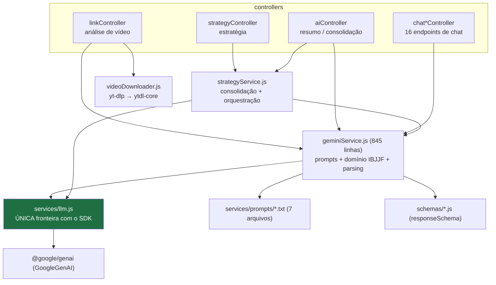
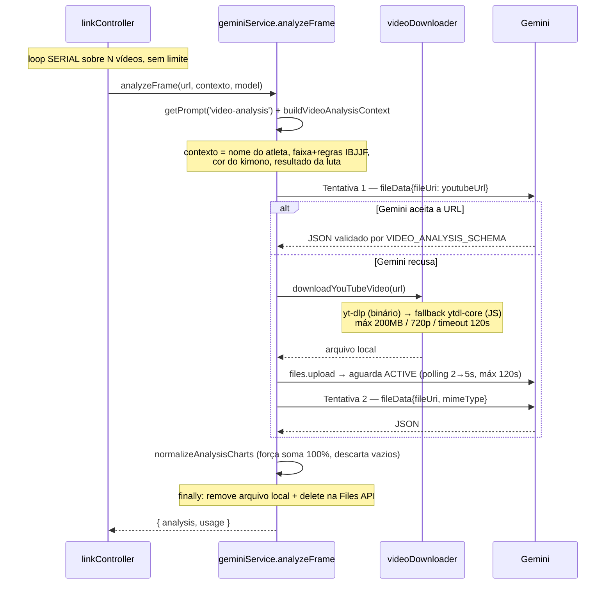
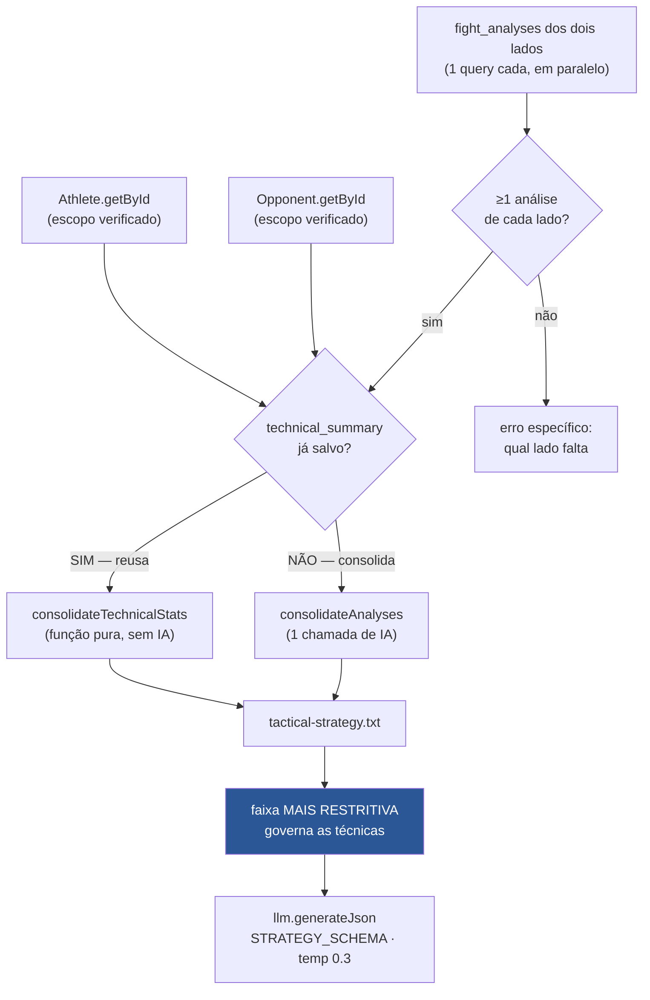

# AI — Integração com IA no JiuMetrics

> **Descreve a integração como está implementada hoje.** Nenhum prompt, modelo ou parâmetro foi alterado nesta etapa.
>
> **Fonte:** `server/src/services/{llm,geminiService,strategyService,videoDownloader}.js`, `server/src/services/prompts/*.txt`, `server/src/schemas/*.js`, `server/src/config/ai.js`, `server/src/models/ApiUsage.js`. Verificado em 2026-08-12 contra `main` (`895066f`).
>
> **Contexto histórico:** a camada de IA foi modernizada na "Fase 1" (commit `c193c8a`), guiada por [`../SPEC-ANALISE-IA.md`](../SPEC-ANALISE-IA.md). O sistema multi-agentes anterior foi **removido** — ver [ADR-006](./decisions/006-camada-unica-de-llm-e-aposentadoria-do-multi-agente.md).

---

# Current Architecture

## Camadas



**Regra arquitetural central:** nenhum controller ou model importa `@google/genai`. Todo acesso ao SDK passa por `services/llm.js`, e os testes mockam esse módulo em vez do SDK. Trocar de modelo ou SDK acontece em um só lugar.

## Provedor e configuração

| Item | Valor |
|---|---|
| Provedor | **Google Gemini** |
| SDK | `@google/genai` 2.13 |
| Credencial | `GEMINI_API_KEY` — se ausente, o cliente é `null` e as chamadas falham com `GeminiApiKeyMissingError` (avisa no boot, não derruba o processo) |
| Interface exposta | `generateJson`, `generateText`, `sendChatMessage`, `uploadVideo`, `deleteFile` |

**Modelos por tarefa** (`config/ai.js#TASK_MODELS`):

| Tarefa | Modelo default | Temperatura |
|---|---|---|
| `VIDEO_ANALYSIS` | `gemini-2.5-pro` | 0.2 |
| `STRATEGY` | `gemini-2.5-pro` | 0.3 |
| `TEXT` (resumo, consolidação) | `gemini-2.5-flash` | 0.4 |
| `CHAT` | `gemini-2.5-flash` | 0.7 |

`resolveModel(task, userModel)` — **a escolha explícita do usuário sempre vence o default**. O valor vem do `localStorage` do cliente e viaja no `req.body.model`. Não é validado (ver *Known Issues*).

`AVAILABLE_MODELS` lista `gemini-3.1-pro-preview`, `gemini-3-pro-preview`, `gemini-2.5-pro`, `gemini-2.5-flash`, `gemini-2.0-flash`. **A mesma lista existe duplicada** em `frontend/src/utils/aiConfig.js`.

## Prompts

7 arquivos `.txt` em `server/src/services/prompts/`, carregados por `prompts/index.js` com cache em memória e substituição `{{PLACEHOLDER}}`:

| Arquivo | Usado em |
|---|---|
| `video-analysis.txt` | análise de vídeo |
| `tactical-strategy.txt` | geração de estratégia |
| `athlete-summary.txt` | `POST /api/ai/athlete-summary` |
| `consolidate-summaries.txt` | consolidação de múltiplos resumos de vídeo |
| `chat-analysis.txt` | chat sobre uma análise |
| `chat-profile.txt` | chat sobre um perfil técnico |
| `chat-strategy.txt` | chat sobre uma estratégia |

`fillPrompt` usa `split().join()` em vez de `String.replace` — imune a `$&`/`$1` no valor substituído. Coberto por `src/__tests__/prompts.test.js` (360 linhas).

⚠️ **Exceção:** existe um oitavo prompt de produção **hardcoded** em `strategyService.js` (~53 linhas, o prompt de consolidação de múltiplas análises). Não está em `services/prompts/`, não é coberto pelo teste de prompts.

## Saída estruturada

`schemas/videoAnalysis.js` e `schemas/strategy.js` definem `responseSchema` no formato OpenAPI do Gemini, enviados com `responseMimeType: 'application/json'`. Isso substituiu o padrão anterior de "JSON de exemplo dentro do prompt + regex para extrair", que era a causa-raiz de uma família de bugs de parse.

**Cobertura:** análise de vídeo ✅ · estratégia ✅ · **chat ❌** (texto livre + regex — ver *Known Issues*).

## Domínio IBJJF no prompt

`config/ai.js#BELT_RULES` é a **fonte única** de regras por faixa (técnicas permitidas, proibidas, observações), com aliases pt/en resolvidos por `resolveBeltKey`. `getBeltLevel` dá o nível numérico (1=branca … 5=preta) para determinar a faixa mais restritiva entre dois competidores.

Não é apenas texto de prompt: `getBeltLevel` alimenta lógica de decisão. Ver [ADR-005](./decisions/005-belt-rules-como-tabela-deterministica.md).

## Rastreamento de custo

`models/ApiUsage.js` mantém `PRICING` por modelo (com faixas *tiered* para os `3-pro-preview`) e `calculateCost`. Toda operação de IA chama `logApiUsage`/`logApiUsageWithType`, que **nunca lança** — falha de registro não derruba a operação, e desde a spec 007 essa tolerância é registrada de forma localizável (`grep "FALHA TOLERADA"`).

✅ **O registro funciona** — 173 linhas, US$ 3,0295 medidos em 2026-08-13. A hipótese de que o RLS bloqueava foi refutada (ver *Known Issues*, AI-4).

## Controle de gasto (spec 009)

O registro era só **observação**: media o gasto e não impedia nada. Um usuário autenticado podia gerar gasto ilimitado. Existem agora três barreiras, todas **antes** da chamada:

| Barreira | Onde | O que impede |
|---|---|---|
| **Allow-list de modelos** | `config/ai.js#resolveModel` | usar um modelo caro (ou uma string arbitrária) escolhido pelo cliente. Desconhecido cai no default da tarefa, com aviso |
| **Teto de vídeos por requisição** | schema zod em `/api/ai/analyze-link` (spec 007) | um corpo com N URLs virar N inferências pagas |
| **Orçamento mensal por tenant** | `services/costGuard.js` + `middleware/budget.js` | o grupo passar de `AI_MONTHLY_BUDGET_USD` (default 50) no mês |

O orçamento conta o gasto **persistido em `api_usage`**, não um contador em memória — é o que faz o limite valer em serverless, onde cada instância tem sua própria memória. É por isso que o gasto de IA tem controle efetivo enquanto o rate limiting genérico (que usa `MemoryStore`) continua não tendo — ver AI-13.

**Por tenant e não por usuário** (decisão P8): o grupo é a unidade que compartilha os dados e a conta. Um teto adicional por usuário dentro do grupo depende do modelo comercial, que não está definido.

## Confiabilidade: retry e timeout (spec 009)

`llm.js` aplica retry com backoff e timeout, com políticas **distintas por fluxo** (`config/ai.js#AI_POLICIES`) — repetir uma inferência de vídeo em `gemini-2.5-pro` custa muito mais que repetir uma consolidação de texto, e o chat tem alguém esperando na tela.

Só é repetido o que `isTransientError` classifica como transitório. **Nunca** são repetidos: quota estourada, conteúdo bloqueado, API key ausente, JSON malformado — cada retry desses seria outra inferência paga sem chance de resultado diferente.

⚠️ **Limite honesto do timeout:** ele interrompe **a nossa espera**, não a inferência do outro lado. Sem cancelamento no SDK, o provedor pode seguir processando e o custo já ter sido incorrido. O valor é não pendurar a função serverless até o `maxDuration`.

## Reprodutibilidade de análise (spec 009)

`metadata` das novas estratégias registra `promptVersions` — o hash do conteúdo de cada template usado. Como é derivado do conteúdo, não existe versão para esquecer de incrementar: editar o prompt muda o identificador.

⚠️ **Limite honesto, para não criar expectativa falsa:** isto dá **auditabilidade** ("com que instrução e modelo isso foi gerado?"), **não replay bit-a-bit**. LLM não é determinístico, e o provedor deprecia modelos. Duas execuções com o mesmo prompt e o mesmo modelo podem divergir. Ver [ADR-013](./decisions/013-versionamento-de-prompt-por-hash.md).

Linhas antigas de `tactical_analyses` ficam **sem** `promptVersions`, e isso é correto: não sabemos qual prompt foi usado nelas.

## Tratamento de erro

`utils/errors.js` define 14 classes tipadas com `statusCode`: `GeminiQuotaExceededError`, `GeminiContentBlockedError`, `GeminiApiKeyMissingError`, `GeminiApiError`, `GeminiProcessingError`, `GeminiParseError`, `VideoDownloadError`, `MissingScopeError`, `BudgetExceededError`, além das genéricas. `parseGeminiError` normaliza o erro cru do SDK e é **idempotente** — reclassificar um erro já classificado degradava o tipo (bug corrigido na spec 009). `isTransientError` decide o que vale repetir.

`videoDownloader.classifyDownloadError` traduz 10 modos de falha do YouTube (bot detection, vídeo privado, restrição de idade, timeout, tamanho, copyright, live…) em mensagens acionáveis em pt-BR.

---

# Fight Analysis

## Entrada

`POST /api/ai/analyze-link` (rate limit `heavyLimiter` 30/15min, autenticado):

```
{
  videos:      [{ url, giColor }],   // N itens — SEM LIMITE
  athleteName: string,
  personId:    string,               // opcional — se presente, persiste
  personType:  'athlete' | 'opponent',
  belt:        string,               // alimenta as regras IBJJF
  matchResult: string,               // 'vitoria-pontos', 'derrota-finalizacao', ...
  model:       string                // opcional, NÃO validado
}
```

**Só YouTube é suportado.** `extractYouTubeId` valida via `new URL()` e rejeita o que não for YouTube. Upload de arquivo **não existe** — `POST /api/ai/analyze-video` é um stub que retorna 400 apontando para `analyze-link`.

## Processamento



Se um vídeo falha, o loop **continua** com os demais; só retorna erro se **nenhum** foi analisado com sucesso.

## Prompt

`video-analysis.txt` + contexto montado em `buildVideoAnalysisContext`, que injeta:

- atleta alvo (com instrução explícita de **ignorar o oponente** no vídeo)
- faixa + regras IBJJF formatadas de `BELT_RULES`
- cor do kimono para identificar quem analisar
- resultado da luta, para contextualizar se o estilo foi eficaz

## Resposta e parsing

`VIDEO_ANALYSIS_SCHEMA` garante a forma. **Não há parsing manual** — `JSON.parse` sobre saída já validada pelo schema; falha lança `GeminiParseError`.

Estrutura: `charts` (5 gráficos comportamentais — Personalidade Geral, Comportamento Inicial, Jogo de Guarda, Jogo de Passagem, Tentativas de Finalização), `technical_stats` (raspagens, passagens, finalizações, tomadas de costas) e `summary` (texto narrativo).

## Pós-processamento

1. `normalizeAnalysisCharts` — força cada gráfico a somar 100%, descarta gráficos sem dado.
2. `consolidateAnalyses` (**função pura, sem IA**) — médias entre os N vídeos.
3. Se houver **mais de um** resumo: `consolidateSummariesWithAI` — 2ª chamada de IA (modelo `TEXT`).

## Armazenamento

| Destino | Quando |
|---|---|
| `fight_analyses` | se `personId` foi enviado (⚠️ sem verificar posse) |
| `athletes/opponents.technical_summary` | reconsolidado logo após salvar, de forma **síncrona** |
| `api_usage` | tokens somados de todos os vídeos (⚠️ provavelmente falha) |

---

# Strategy Generation

## Entrada

`POST /api/strategy/compare` (rate limit `heavyLimiter`, autenticado): `{ athleteId, opponentId, model? }`.

**Apenas IDs** — os dados são carregados no servidor, sob escopo de tenant. Este endpoint faz a verificação de posse corretamente.

## Dados utilizados



O que entra no prompt por lado: `name`, `belt` (+ regras IBJJF formatadas), `resumo` (o `technical_summary` narrativo) e `technical_stats` formatados de forma legível, omitindo zeros.

**Regra de faixa:** `getBeltLevel` compara os dois; a mais restritiva governa. Se a faixa mais restritiva não é preta, um bloco `BELT_WARNING` é injetado no prompt proibindo técnicas ilegais para ela. Faixa vazia ou desconhecida → conjunto de branca.

## Modelo e resposta

`gemini-2.5-pro` (ou a escolha do usuário), temperatura 0.3, **uma única chamada** com `STRATEGY_SCHEMA`. O sistema multi-agentes anterior fazia várias — ver [ADR-006](./decisions/006-camada-unica-de-llm-e-aposentadoria-do-multi-agente.md).

Estrutura de saída: `resumo_rapido` (`como_vencer`, `tres_prioridades`), `analise_de_matchup`, `plano_tatico_faseado`, `cronologia_inteligente`, `checklist_tatico`.

## Armazenamento

| Destino | Conteúdo |
|---|---|
| `tactical_analyses` | `strategy_data` (JSONB) + `metadata` (modelo, tokens, contagens) + nomes **desnormalizados** |
| `strategy_versions` | versão inicial (`edited_by: 'system'`) |
| `api_usage` | tokens da estratégia (⚠️ provavelmente falha) |

Falha ao salvar no histórico **não derruba** a geração — o usuário recebe a estratégia. Falha ao criar a versão inicial também é tolerada.

---

# Chat (refinamento)

Terceiro fluxo de IA, com 3 subtipos (`analysis`, `profile`, `strategy`) e 15 endpoints em `/api/chat`.

**Mitigação de prompt injection** (commit `23b475b`, [ADR-003](./decisions/003-system-instruction-fixa-no-chat.md)):

- `CHAT_SYSTEM_INSTRUCTION` é uma **constante fixa** que nunca interpola dado do usuário;
- o bloco de contexto entra como **primeiro turno `user`**, com aviso explícito de que é dado, não comando;
- o histórico da conversa vem depois.

O papel `system` carrega mais autoridade para o modelo do que uma mensagem comum — colocar dado influenciável do usuário ali era o vetor mais perigoso.

Para contexto `strategy`, um lembrete de mapeamento de campos é reinjetado ao final de cada mensagem, porque após 2–3 turnos o modelo tendia a reutilizar o último campo sugerido (viés de recência).

A IA pode devolver uma **sugestão de edição**, extraída por `extractEditSuggestion` (regex — ver *Known Issues*), que só é aplicada quando o usuário aceita.

---

# Known Issues

Severidade conforme [`../AUDIT.md`](../AUDIT.md) §8. **Nada foi corrigido.**

## HIGH

### AI-1 — O chat é o único caminho sem saída estruturada
`llm.js` documenta como princípio *"saída estruturada SEMPRE via responseSchema"*, mas `sendChatMessage` não aceita schema, e `extractEditSuggestion` volta ao padrão que a Fase 1 aboliu: `match(/---EDIT_SUGGESTION---([\s\S]*?)---END_SUGGESTION---/)`, com fallback para procurar JSON solto, limpeza de cercas markdown e três formatos legados aceitos.
**Impacto:** as sugestões de edição da IA — que **escrevem no banco** — dependem de regex frágil. Quando o parse falha, o usuário recebe "Preparei uma sugestão de alteração para você revisar" e a sugestão é perdida em silêncio.
**Mitigação parcial existente:** `validateStrategyField` valida o shape antes de persistir estratégia. Não há equivalente para edição de análise.

### ~~AI-2~~ — `model` do usuário ia cru para o SDK · ✅ **RESOLVIDO na [spec 009](../specs/009-ai-cost-and-reliability/spec.md)** (2026-08-18)
`resolveModel` retornava `userModel` sem conferir contra a allow-list: (a) o usuário forçava o modelo mais caro em toda tarefa, inclusive chat; (b) string arbitrária chegava ao SDK; (c) a contabilidade quebrava em silêncio, porque `calculateCost` caía no preço do flash para modelo desconhecido.
**Correção:** allow-list em `resolveModel`. Modelo desconhecido **cai no default da tarefa com aviso**, não gera erro — a escolha vem do `localStorage`, e um valor obsoleto salvo no navegador não deve quebrar quem não fez nada errado. `calculateCost` passou a avisar em vez de reprecificar calado.

### ~~AI-3~~ — Nenhum limite de vídeos por request · ✅ **RESOLVIDO nas specs 007 e 009**
`analyzeLink` iterava `videos[]` sem teto, e cada item é uma inferência de vídeo em `gemini-2.5-pro` — a operação mais cara do sistema.
**Correção:** teto de 5 vídeos por requisição (spec 007, schema zod, barrado **antes** de qualquer chamada) + orçamento mensal por tenant (spec 009, `services/costGuard.js`), que também barra antes de gastar e conta o gasto **persistido**, não um contador em memória.
⚠️ **O que continua aberto:** rate limiting genérico segue inoperante em serverless — ver AI-13.

### ~~AI-4~~ — Registro de custo provavelmente não funciona · ❌ **REFUTADO na [spec 002](../specs/002-verification-baseline/spec.md)** (2026-08-13)
A hipótese era que o cliente anon contra a política `auth.uid() = user_id` bloqueava o insert. **Medição: 173 linhas, US$ 3,0295, de 2025-12-14 a 2026-08-12.** A política **não está ativa em produção**.
**Dívida real, menor:** 55 das 173 linhas com `estimated_cost_usd = 0`. A spec 009 impede que isso volte a acontecer (allow-list garante modelo com preço em `PRICING`), mas **não recalcula as linhas antigas** — isso seria migração de dado.
Continua verdade que o registro funciona *por acidente*: o cliente correto seria `service_role`, e isso vem como consequência da [spec 008](../specs/008-database-access-lockdown/spec.md).

## MEDIUM

| # | Problema | Impacto |
|---|---|---|
| ~~AI-5~~ | ✅ **RESOLVIDO na spec 009** — as ~53 linhas de prompt em `strategyService.js` foram para `prompts/consolidate-profile.txt` | A fidelidade é garantida por comparação **byte a byte** contra um golden capturado do código anterior (`prompts/__fixtures__/`). Verificado que o teste detecta a remoção de **um único espaço** |
| AI-6 | **Validação de host do YouTube por substring** — `hostname.includes('youtube.com')` deixa `youtube.com.attacker.net` passar. Também no frontend, que ainda aceita qualquer URL contendo "video" | SSRF limitado: o servidor busca URL de host controlado pelo atacante, e a URL vai ao Gemini como `fileData`. Mitigado por `execFile` sem shell e pelos limites de tamanho/timeout |
| AI-7 | **Prompt injection mitigado só no chat** — `athleteName`, `matchResult` e `belt` entram crus no prompt de análise; `athleteData` inteiro do body vai serializado; e o `technical_summary`, **gerado a partir de vídeo de terceiros**, é reinjetado no prompt de estratégia | Injeção **indireta**: o payload pode vir do vídeo analisado, não do usuário. Impacto atual baixo (dado majoritariamente auto-fornecido, saída não executa nada, schema limita a forma). Sobe se o produto abrir para tenants não confiáveis |
| ~~AI-8~~ | ✅ **RESOLVIDO na spec 009** — `llm.js` ganhou retry com backoff e timeout, com **políticas distintas por fluxo** (`config/ai.js#AI_POLICIES`) | Só repete falha transitória: nunca quota estourada, conteúdo bloqueado ou JSON malformado, porque cada retry é outra inferência paga sem chance de resultado diferente. ⚠️ O timeout interrompe **a nossa espera**, não a inferência do provedor — o custo pode já ter sido incorrido |
| ~~AI-9~~ | ✅ **RESOLVIDO na spec 009** — o fallback de consolidação agora devolve `degraded: true` e prefixa o texto | Antes, `summaries.join(' ')` era persistido em `technical_summary` **indistinguível de um resumo consolidado real**, e alimentava a estratégia como se fosse |
| AI-10 | **Trabalho longo de IA em request serverless** | Download (até 120s) + upload/polling (até 120s) + inferência, × N vídeos em série, sem `maxDuration` no `vercel.json`. Provável timeout **após** consumir tokens. **NEEDS_CONFIRMATION:** plano da Vercel |

## LOW

| # | Problema |
|---|---|
| AI-11 | **`AVAILABLE_MODELS` duplicada** entre `config/ai.js` e `frontend/src/utils/aiConfig.js`. A do backend deixou de ter uma segunda cópia interna na spec 009 (deriva da allow-list), mas a do frontend continua separada. ⚠️ **Nenhum teste guarda a sincronia** — em 2026-09-02 as duas precisaram ser editadas à mão para remover o mesmo modelo descontinuado. É a próxima que vai divergir |
| AI-14 | 🆕 **A análise não é idempotente.** `api_usage` registra duas chamadas idênticas (126.173 tokens, 100 s de intervalo, 2026-08-12): um duplo envio paga duas inferências de `gemini-2.5-pro` pela mesma luta. Não há chave de idempotência nem trava por `(personId, videoUrl)` em janela curta |
| AI-13 | 🆕 **Rate limiting genérico continua inoperante em serverless** — `MemoryStore` conta por instância. A spec 009 resolveu o gasto de IA por outro caminho (orçamento contado no banco), mas o limite de requisições por IP segue sem valer em produção. **Depende de infraestrutura** (store externo ou limite na borda) — decisão do proprietário, não de código |
| AI-12 | **`config/ai.js` mistura domínio e infra** — regras IBJJF, nomes de modelo, temperaturas, limites de download, rate limits e labels de gráfico no mesmo arquivo |
| AI-13 | **`geminiService.js` acumula três papéis** em 845 linhas: montagem de prompt, regras de domínio e parsing |

---

# Constraints

Limites reais, que qualquer proposta de evolução precisa respeitar.

1. **Só YouTube.** Não há upload de arquivo. Depende de `@distube/ytdl-core` e do binário `yt-dlp` — **dependência de sistema não declarada em nenhum manifesto**. Ambos quebram rotineiramente quando o YouTube muda, e são as dependências mais frágeis do projeto. Em produção (Vercel) `yt-dlp` não existe, então o caminho real é sempre `ytdl-core`.
   ⚠️ **Isto é o FALLBACK, não o caminho principal.** A tentativa 1 manda a URL direto ao Gemini, sem download e sem cookie. A [spec 012](../specs/012-youtube-ingestion-lockdown/spec.md) propõe tornar o caminho direto o único.

2. **YouTube pode bloquear por detecção de bot.** Mitigado por `YOUTUBE_COOKIES`, que **expira** e precisa de renovação manual.
   🔴 **Esta mensagem já enganou em produção.** Em 2026-09-02 a tentativa 1 falhava com `403 PERMISSION_DENIED` ("Lightning dunning decision is deny") — a API do Gemini suspensa por faturamento. O erro é engolido por um `console.warn` em `geminiService.js:217`, o fallback dispara para **qualquer** falha, e o usuário recebia "os cookies podem ter expirado". Reproduzido também em chamada de **texto puro, sem vídeo**, o que descartou o YouTube como causa. Ver [spec 012](../specs/012-youtube-ingestion-lockdown/spec.md).

3. **Limites de vídeo:** 200 MB, 720p, timeout de download 120 s, processamento na Files API 120 s.

4. **Serverless não sustenta trabalho longo** — ver AI-10.

5. **Os gráficos não são auditáveis.** Percentuais forçados a somar 100%, sem timestamps nem eventos verificáveis. É interpretação do modelo apresentada como distribuição. `frames_analyzed` é resquício de um caminho de análise por frames estáticos que **já foi removido** do código.

   📊 **Agora medido** (auditoria de 2026-09-02, `server/scripts/audit-analysis-quality.js` sobre 285 análises, nenhuma editada): **76,5% das análises têm ao menos um gráfico com um único rótulo em 100%** — e **8 de 8** no pipeline atual. Outras 17,5% têm valores equidistantes (50/50, 33/33/34), que é contagem renormalizada, não distribuição. Em compensação, o `responseSchema` **funcionou**: rótulo fora do vocabulário canônico (58% em dez/2025) e gráfico que não soma 100 (33%) estão em **0% desde jan/2026**. As regras de coerência aritmética saem quase limpas — o problema medido não é o modelo se contradizer, é o formato exigir número onde não há evento.

6. **Não existe avaliação de qualidade da saída de IA.** Os 357 testes do backend verificam contrato e autorização; nenhum olha o que a IA respondeu sobre um vídeo. `SPEC-ANALISE-IA.md` (F4) registrou isso em 2026-07-23 e continua valendo. **Consequência prática:** trocar de modelo, mudar `mediaResolution` ou reescrever o prompt não tem como ser avaliado — só opinado.
   - `server/src/utils/analysisQuality.js` + `scripts/audit-analysis-quality.js` são o **primeiro degrau**: regras determinísticas, custo zero, sem gabarito. Medem **coerência e contrato**, não acerto.
   - `scripts/eval-video-analysis.js` é o segundo: variância entre execuções, concordância entre modelos e leitura do placar do broadcast — **também sem gabarito humano**, mas com custo real de inferência (≈ US$ 3,37 para 4 vídeos × 3 execuções, mais que todo o gasto histórico do projeto). Roda sob demanda, nunca no CI.
   - O que nenhum dos dois faz: dizer se a análise descreve corretamente o que aconteceu no vídeo. Isso exige gabarito anotado.

7. **`technical_stats` existe em 8 das 285 análises.** A coluna só passou a ser preenchida em ago/2026. Consequência medida em 2026-09-02: **52 das 54 pessoas com análise não têm nenhum dado quantitativo**, e as 41 estratégias já geradas saíram sem número algum — só texto. `formatTechnicalStats` informa isso ao modelo ("Dados técnicos não disponíveis ainda"), e desde 2026-09-03 o `metadata.quantitativeData` da estratégia registra explicitamente quais lados tinham número. Análises antigas **não podem ser retroalimentadas sem reprocessar o vídeo**, o que custa inferência.

8. **Cadeia de compressão lossy até a estratégia:** vídeo → análise estruturada → resumo narrativo → consolidação de N resumos → prompt de estratégia. Cada etapa perde informação, e a estratégia final vê apenas texto mais alguns números agregados. A consolidação acontece em **duas camadas com semânticas diferentes**: `geminiService.consolidateAnalyses` (entre os vídeos de uma requisição) tira **média** de percentuais e de contagens; `StrategyService.consolidateTechnicalStats` (entre as análises de uma pessoa) soma **totais** e depois converte em adjetivo ("tendência agressivo") via `formatChartsAsNarrative`.

9. **`analysis_versions` não tem `user_id`** — restrição de schema que impede autorizar versões por dono sem alterar a tabela.

10. **Não há job assíncrono, fila ou canal de tempo real.** O progresso mostrado na UI é simulado no cliente.

---

# Future Considerations

> **Nada aqui está implementado.**
>
> 🎯 A arquitetura-alvo de IA — cost guard, versionamento de prompt, retry/timeout com políticas distintas para análise e estratégia, e o **limite honesto** da reprodutibilidade — está em [`../JIU_METRICS_REFACTORING_PLAN.md`](../JIU_METRICS_REFACTORING_PLAN.md) §9. Spec: [009](../specs/009-ai-cost-and-reliability/spec.md).

## Documentado em spec anterior

[`../SPEC-ANALISE-IA.md`](../SPEC-ANALISE-IA.md) propõe substituir a metodologia dos gráficos por um **event log com timestamps** + agregação determinística em código (itens A3/A4). Isso tornaria os números auditáveis e rastreáveis ao vídeo. Continua **não implementado**.

## Decidido, não implementado (`PLANNED`)

- **`BELT_RULES` conferida contra o regulamento oficial IBJJF**, mantida como tabela determinística em código, com fonte citada e data de revisão. **Não** virar RAG/base de conhecimento: a legalidade de uma técnica por faixa não pode ser probabilística. Ver [ADR-005](./decisions/005-belt-rules-como-tabela-deterministica.md).
  ⚠️ A **correção esportiva** da tabela atual é `NEEDS_CONFIRMATION` — exige revisão humana com o regulamento em mãos.

## Em consideração (sem decisão)

- Estender `responseSchema` ao chat, encerrando o último parsing por regex.
- Allow-list de modelos + limite de `videos[]` + quota por tenant — depende de o registro de custo funcionar primeiro, para haver visibilidade.
- Job assíncrono (`202 {jobId}` + polling), que também habilitaria progresso real na UI.
- Retry com backoff nas chamadas de inferência, e timeout explícito.
- Marcar `technical_summary` gerado por fallback degradado, para não tratá-lo como equivalente a um resumo consolidado.
- Trazer o prompt hardcoded de `strategyService.js` para `services/prompts/`.
- Trocar de provedor de IA exigiria reescrever `schemas/*.js` (usam `Type` do SDK do Gemini e o dialeto OpenAPI dele) e repensar a ingestão de vídeo (Files API é conceito específico do Gemini). Os controllers não seriam afetados. Para *trocar de modelo*, a arquitetura atual já resolve; para *trocar de provedor*, está ~70% do caminho.

---

## Ver também

- [`ARCHITECTURE.md`](./ARCHITECTURE.md) — camadas e infraestrutura
- [`modules/fight-analysis.md`](./modules/fight-analysis.md) · [`modules/strategies.md`](./modules/strategies.md) · [`modules/chat-and-versions.md`](./modules/chat-and-versions.md)
- [`../SPEC-ANALISE-IA.md`](../SPEC-ANALISE-IA.md) — auditoria e proposta anteriores do pipeline de IA
- [`../AUDIT.md`](../AUDIT.md) §8 — evidência em `arquivo:linha`
