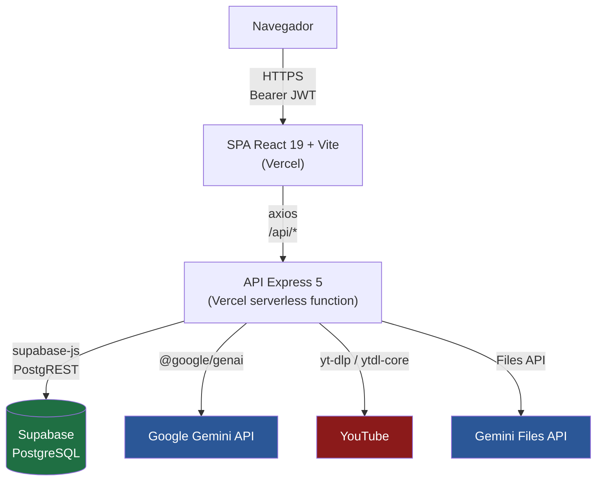
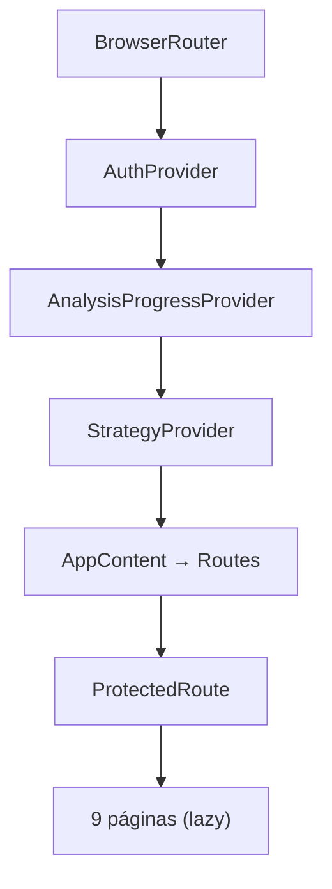
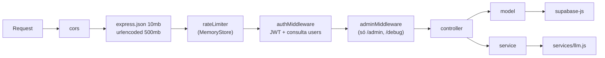
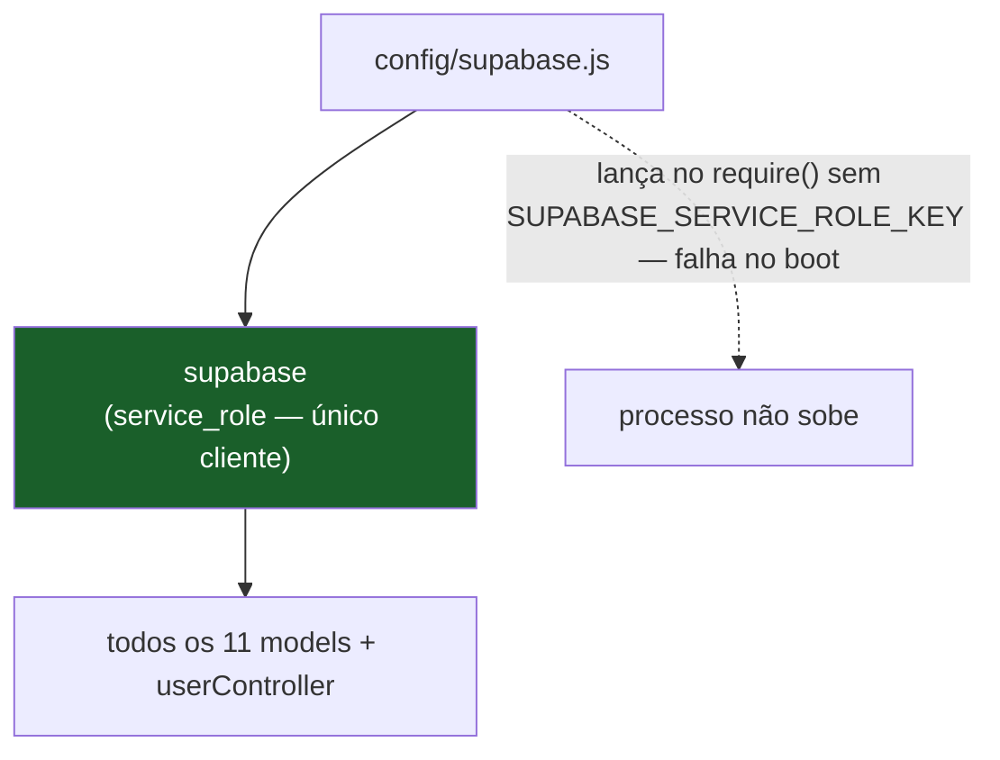
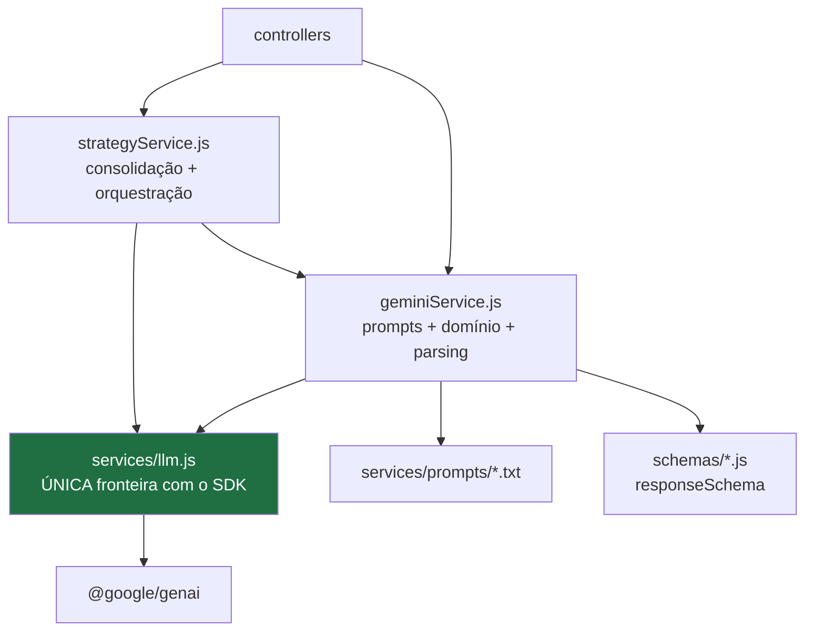
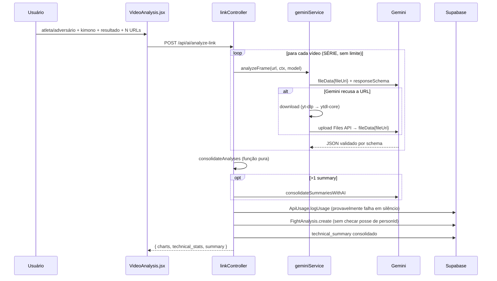
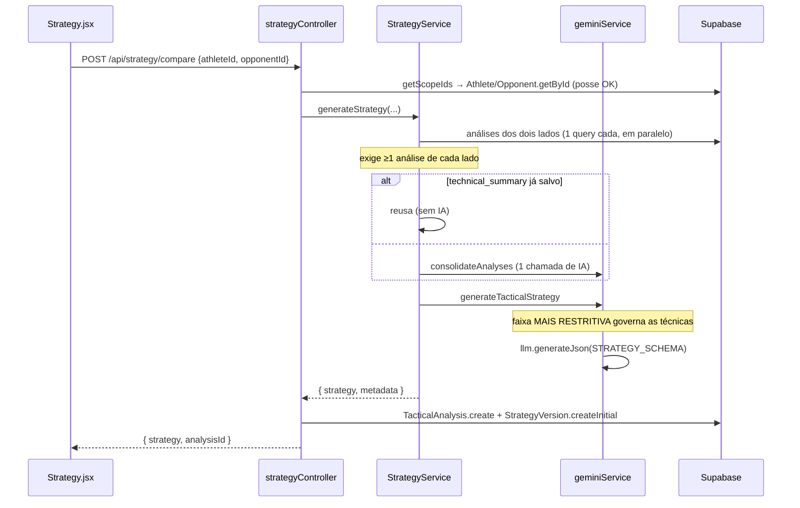

# ARCHITECTURE — JiuMetrics

> **Este documento descreve a arquitetura que EXISTE HOJE, não a desejada.** Problemas arquiteturais aparecem como *Problemas conhecidos*, sem correção.
>
> **Fonte:** leitura do código em `server/src` (69 arquivos) e `frontend/src` (79 arquivos), das 22 migrations, dos 4 workflows de CI e das configs de deploy. Verificado em 2026-08-12 contra `main` (`895066f`). Análise completa em [`../AUDIT.md`](../AUDIT.md).
>
> **Convenção:** `IMPLEMENTED` = existe no código. `PLANNED` = decidido, não implementado. `UNKNOWN` / `NEEDS_CONFIRMATION` = não determinável pelo repositório.
>
> 🎯 **Arquitetura-alvo (`PROPOSED`, não implementada):** [`../JIU_METRICS_REFACTORING_PLAN.md`](../JIU_METRICS_REFACTORING_PLAN.md) §3. Este documento descreve **apenas o que existe**.

---

## 1. Visão geral

JiuMetrics é um **monólito de duas peças** — uma SPA React e uma API Express — sobre Supabase/PostgreSQL, com autenticação JWT própria e análise por IA via Google Gemini.

Não é microserviços, não é monorepo com ferramenta de workspace, não há fila nem worker. `frontend/`, `server/` e `playwright/` são três pacotes npm independentes que coexistem no mesmo repositório, cada um com seu próprio `package.json` e lockfile.



### Decisão estrutural mais importante

**Toda a autorização vive na camada de aplicação.** O banco não a reforça: RLS está desligado em `athletes`, `opponents` e `fight_analyses` (migrations `008`/`009`) e as políticas de `tactical_analyses`, `ai_chat_sessions` e `analysis_versions` são `USING (true)`. Não há rede de segurança abaixo da aplicação.

Como havia **6 endpoints** que esqueciam o filtro de posse (todos corrigidos na [spec 006](../specs/006-ownership-in-data-access/spec.md)), a exigência de escopo desceu do controller para a **assinatura dos models**: hoje a omissão lança `MissingScopeError` em vez de vazar. Continuam duas camadas de aplicação, e zero no banco.

Ver [ADR-002](./decisions/002-rls-desligado-autorizacao-na-aplicacao.md) e [ADR-009](./decisions/009-acesso-ao-banco-exclusivamente-por-service-role.md).

---

## 2. Frontend

**Local:** `frontend/` · **Stack:** React 19.2, Vite 7.2, react-router-dom 6.30, TailwindCSS 4.1, JavaScript (JSX)

**Não há TypeScript no frontend** — 0 arquivos `.ts`/`.tsx` em `frontend/src`. `typescript` e `@types/*` estão em `devDependencies` sem uso. TS existe apenas em `playwright/`. A etapa 1 do [ADR-010](./decisions/010-adotar-typescript-incrementalmente.md) (`checkJs` opt-in) foi implementada na spec 011, mas **só no backend** (`server/src/models/` e `server/src/utils/`, ver §3) — aqui continua `PLANNED`.

### Estrutura

```
frontend/src/
├── main.jsx, App.jsx        # bootstrap + rotas
├── pages/        (11)       # 9 protegidas (lazy) + login e registro (eager)
├── components/   (40)       # analysis, chat, charts, common, forms, routing, video
├── contexts/      (3)       # Auth, AnalysisProgress, Strategy
├── services/     (13)       # clientes HTTP (axios) + normalizers.js (spec 010)
├── utils/         (6)
└── lib/queryClient.js
```

### Composição de providers



### Estado do servidor: dois padrões coexistindo

| Padrão | Páginas |
|---|---|
| React Query (`@tanstack/react-query`) | `Analyses`, `PersonList` (`Athletes`/`Opponents`), `PersonDetail` (spec 013, via `hooks/usePersons.js`), `Strategy`, **`Overview`** (spec 010) |
| `useEffect` + `useState` cru | `Settings`, `AdminUsers`, `ModernLogin` |

O defeito concreto era o `Overview`: criar um atleta invalidava `['athletes']`, mas o dashboard usava `useEffect` com dependência `[]` e só refazia fetch em mount. Migrá-lo para as **mesmas query keys** resolveu sem tocar em nenhum site de mutação.

⚠️ **As 3 páginas restantes continuam no padrão antigo.** `AthleteDetail` migrou na spec 013 — e **tinha** defeito: apagar ou trocar a faixa não invalidava `['athletes']`, e a lista ficava obsoleta por 5 minutos. Nas outras nenhum defeito de dado obsoleto foi relatado, e a spec 010 avisa que migrar "muda o momento do fetch e pode expor race conditions latentes" — cuja rede de proteção seria o E2E, que não roda neste projeto.

⚠️ **Atenção às query keys:** `['analyses']` são as ESTRATÉGIAS (`tactical_analyses`) e `['fightAnalyses']` são as análises de vídeo. A colisão de vocabulário do domínio chegou até aqui.

### Rotas (`App.jsx`)

| Rota | Componente | Proteção |
|---|---|---|
| `/login`, `/register` | `ModernLogin`, `Register` | pública |
| `/` | `Overview` | autenticado |
| `/athletes`, `/athletes/:id` | `PersonList type="athlete"`, `PersonDetail type="athlete"` | autenticado |
| `/opponents`, `/opponents/:id` | `PersonList type="opponent"`, `PersonDetail type="opponent"` | autenticado |
| `/strategy` | `Strategy` | autenticado |
| `/analyze-video` | `VideoAnalysis` | autenticado |
| `/analyses` | `Analyses` | autenticado |
| `/settings` | `Settings` | autenticado |
| `/admin/users` | `AdminUsers` | **admin** |
| `*` | `Overview` | autenticado (catch-all, mascara rota inexistente) |

### Problemas conhecidos

- **Dois padrões de fetch**, com invalidação cruzada ausente → dados obsoletos entre telas. ✅ **Parcialmente resolvido na [spec 010](../specs/010-frontend-consolidation/spec.md):** `Overview` migrou para React Query com as mesmas query keys das outras telas, o que corrigiu o defeito relatado (criar atleta não atualizava o dashboard). `AthleteDetail` migrou na spec 013 (`PersonDetail` + `usePersons`), fechando o defeito de lista obsoleta. Continuam com `useEffect` cru: `Settings`, `AdminUsers`, `ModernLogin` — nenhuma com defeito relatado.
- **Quatro sistemas de estilo simultâneos**: Tailwind, CSS Modules, CSS global (`index.css`, `App.css`), estilos inline.
- **Componentes muito grandes**: `StrategySummaryModal.jsx` (1116 linhas), `AiStrategyBox.jsx` (1016), `Analyses.jsx` (922).
- **Lógica de negócio na UI**: `Analyses.jsx` monta o relatório PDF como template string de HTML (agora em `utils/strategyReportHtml.js`, extraído para poder ser testado). ✅ A duplicação de `athleteStats.js` (238 linhas) **foi removida** na spec 010 — as duas cópias eram código morto, sem nenhum chamador de produção.
- ~~**Sink de XSS**~~ ✅ **fechado na spec 010.** `Analyses.jsx` interpolava conteúdo de IA num template de HTML e jogava em `tempDiv.innerHTML`. Hoje o conteúdo é escapado na fonte (`utils/strategyReportHtml.js`), com 16 testes que verificam **no DOM** que nenhum nó executável é construído. ⚠️ O `innerHTML` e o template-string **continuam existindo** — a vulnerabilidade fechou, o padrão não. Removê-lo depende da comparação visual do PDF que a spec declara pendente.
- **`ProtectedRoute` é UX, não segurança** — `isAdmin` vem do `localStorage`. O backend reconsulta o papel no banco, então não há escalonamento real de privilégio.
- ~~**6 componentes órfãos**~~ ✅ removidos na spec 010. Achado registrado no caminho: `InlineDiff` estava **triplicado** — o arquivo órfão mais uma cópia local declarada dentro de `ProfileSummaryModal` e outra dentro de `AnalysisDetailModal`. As duas locais continuam lá (deduplicá-las é refatoração de componente, fora do escopo da 010).
- **Progresso de análise simulado**: `AnalysisProgressContext` incrementa um percentual por `setInterval`; não reflete progresso real (o backend não expõe progresso — ver §7).

---

## 3. Backend

**Local:** `server/` · **Stack:** Node.js, Express 5.1, CommonJS, JavaScript

### Cadeia de request



### Camadas

| Camada | Papel | Observação |
|---|---|---|
| `routes/` (10) | montagem de endpoints, rate limit, auth | Nenhuma exceção — a query de banco que existia em `routes/fightAnalysis.js` foi removida com a rota `/debug/all` (spec 002) |
| `controllers/` (13) | validação, orquestração, resposta | Resolvem o escopo e o passam adiante. O chat virou 4 controllers na spec 006 |
| `models/` (10) | *data mappers* PostgREST | **Não são entidades de domínio.** Não há camada de domínio. Desde a spec 006 **exigem escopo de posse na assinatura** — chamada sem ele lança |
| `services/` | IA, download de vídeo, **política de autorização**, **orçamento** | `llm.js` (retry/timeout por fluxo), `geminiService.js`, `strategyService.js`, `videoDownloader.js`, `authorization.js` (spec 005), `costGuard.js` (spec 009) |
| `schemas/` | `responseSchema` do Gemini **e** schemas de entrada HTTP | ⚠️ `schemas/*.js` = contrato de **saída** da IA; `schemas/requests/*.js` = contrato de **entrada** da API (zod, spec 007). Confundir os dois produz bug difícil de ver |
| `utils/` | erros, parsers, versões, custo, **guard de escopo** | `scopeGuard.js#requireScope` (spec 006) é o que torna o escopo obrigatório nos models. `tenantScope.js#getScopeIds` é wrapper `@deprecated` — a regra mudou para `services/authorization.js` (spec 005) |
| `config/` | `ai.js` (domínio + infra), `supabase.js` (2 clientes) | |

### Endpoints (fonte de verdade: `server/src/routes/`)

| Prefixo | Endpoints | Rate limit | Auth |
|---|---|---|---|
| `/api/auth` | `POST /register` (desabilitado por padrão), `POST /login`, `GET /validate` | `authLimiter` 20/15min | pública / validate autenticada |
| `/api/athletes` | `GET /`, `GET /:id`, `POST /`, `PUT /:id`, `DELETE /:id` | `generalLimiter` 200/15min | autenticada |
| `/api/opponents` | idem athletes | `generalLimiter` | autenticada |
| `/api/fight-analysis` | `GET /`, `GET /person/:personId`, `GET /:id`, `POST /`, `DELETE /:id` | `generalLimiter` | autenticada |
| `/api/ai` | `POST /analyze-link`, `POST /athlete-summary`, `POST /consolidate-profile`, `POST /analyze-video` (stub 400) | `heavyLimiter` 30/15min | autenticada |
| `/api/strategy` | `POST /compare`, `GET /analyses`, `GET /analyses/:id`, `PATCH /analyses/:id`, `DELETE /analyses/:id`, `GET /analyses/:analysisId/versions`, `POST /analyses/:analysisId/versions/:versionId/restore` | `heavyLimiter` | autenticada |
| `/api/chat` | 15 endpoints (sessão, mensagens, edições, versões, perfil, estratégia) | `chatLimiter` 100/15min (aplicado 2×) | autenticada |
| `/api/usage` | `GET /stats`, `GET /pricing` | `generalLimiter` | autenticada |
| `/api/admin` | `GET/POST /users`, `PATCH /users/:id`, `PATCH /users/:id/role`, `DELETE /users/:id`, `DELETE /users/:id/permanent`, `POST /users/:id/reactivate` | 100/15min | **admin** |
| `/api/debug` | `GET /env-check` | 20/15min | **admin** |
| `/api/health` | `GET` | — | pública |

Detalhe parcial em [`API.md`](./API.md) (incompleto — o código é a fonte de verdade).

### Problemas conhecidos

- ~~**Posse verificada no controller, nunca no model.**~~ ✅ **Resolvido na [spec 006](../specs/006-ownership-in-data-access/spec.md):** `FightAnalysis.update()`/`delete()` aceitavam qualquer ID, e o sistema era seguro só enquanto todo controller lembrasse de filtrar. Hoje o escopo é obrigatório na assinatura (`utils/scopeGuard.js`) e a omissão lança `MissingScopeError`.
- **Rate limiting inoperante em produção**: `MemoryStore` em function serverless — cada instância tem seu contador.
- **Validação de entrada: parcial.** A [spec 007](../specs/007-silent-failures-and-input-validation/spec.md) introduziu `zod` ([ADR-012](./decisions/012-zod-para-validacao-de-entrada.md)) via `middleware/validate.js`, aplicado aos **3 endpoints de IA** — os únicos onde corpo não validado custa dinheiro. Os demais ~12 endpoints que recebem corpo seguem com `if (!campo)` ad hoc. ⚠️ Não leia "a API valida entrada" como verdadeiro: vale só para `/api/ai/*`.
- ~~**Sem lint no backend**~~ ✅ resolvido na spec 003 (conjunto mínimo, bloqueia merge).
- ~~**Sem `helmet` nem headers de segurança**~~ ✅ resolvido na [spec 010](../specs/010-frontend-consolidation/spec.md): `helmet` configurado deliberadamente (CSP e CORP desligados de propósito — API só devolve JSON). CORS **continua** aceitando qualquer `*.vercel.app`.
- ~~**`handleError` devolve `error.message` ao cliente**~~ ✅ resolvido na [spec 007](../specs/007-silent-failures-and-input-validation/spec.md): `errorDetails()` omite o detalhe em produção.
- **Controller obeso**: `linkController.analyzeLink` orquestra IA + persistência + efeitos colaterais numa única função. (`chatController.js`, que tinha 818 linhas, foi dividido em 4 na spec 006.)
- **Cinco `catch` que engolem erro** — causa de três funcionalidades que nunca funcionaram, corrigidas na spec 007. Ver [`PROJECT_STATUS.md`](./PROJECT_STATUS.md#known-issues).
- **Sem tipagem, exceto por `checkJs` em 2 diretórios.** A [spec 011](../specs/011-schema-integrity/spec.md) (etapa 1 do [ADR-010](./decisions/010-adotar-typescript-incrementalmente.md)) ligou `// @ts-check` em `models/` e `utils/` (21 arquivos, zero erro; `npm run typecheck`). Os outros ~48 arquivos de `server/src/` (`controllers/`, `services/`, `routes/`, `middleware/`, `schemas/`) e todo o `frontend/` continuam sem verificação de tipo alguma.

---

## 4. Banco de dados

**Supabase / PostgreSQL**, acessado **exclusivamente via PostgREST** (`@supabase/supabase-js`). **Não há ORM nem query builder SQL.** Detalhe completo em [`DATABASE.md`](./DATABASE.md).

### Um único cliente (spec 008)



Até a spec 008 havia dois clientes (`supabase` anon + `supabaseAdmin` service_role) sem regra documentada sobre qual model usava qual, e `supabaseAdmin` caía **silenciosamente** para o cliente anon quando a chave de serviço não estava definida. Hoje só existe `supabase`, e não há fallback: falta a chave de serviço, o processo não sobe.

⚠️ **O código está pronto; o `REVOKE` do lado do banco não.** Sem ele, a chave anon **continua com GRANT** nas tabelas — unificar o cliente não fecha, sozinho, o acesso direto ao PostgREST. O `REVOKE` está escrito em [`server/migrations/024-revoke-anon-access.sql`](../server/migrations/024-revoke-anon-access.sql), pendente de execução manual pelo proprietário. Ver [`DATABASE.md`](./DATABASE.md) §4.

### Migrations

23 arquivos `.sql` em `server/migrations/`, aplicados **manualmente** colando no SQL Editor do Supabase. **Não há runner nem tabela de controle de estado.**

**Problemas conhecidos:** a tabela `users` nunca é criada por migration (só `ALTER`); falta a `020`; migrations se contradizem entre si (RLS é ligado/desligado 4 vezes); há PII (8 e-mails reais) e um `UPDATE users SET role='user'` sem `WHERE`. **É impossível reconstruir o banco a partir do repositório.**

---

## 5. Autenticação e autorização

Resumo aqui; detalhe em [`AUTHORIZATION.md`](./AUTHORIZATION.md).

**Autenticação:** JWT próprio (`jsonwebtoken` HS256) + `bcrypt`. **Não usa Supabase Auth** — ver [ADR-001](./decisions/001-jwt-proprio-em-vez-de-supabase-auth.md). Token no header `Authorization: Bearer`, guardado em `localStorage`. Sem cookies → **CSRF não se aplica**.

O `authMiddleware` faz três validações por request, com cache em memória de 5 min:

1. `role` lido do **banco**, não do token;
2. `is_active` reconsultado;
3. `token_version` do token comparado com o do banco.

É por isso que **não existe escalonamento de privilégio** neste sistema. Ver [ADR-004](./decisions/004-token-version-para-invalidacao-de-sessao.md).

**Autorização:** dois papéis (`admin`, `user`). Toda a regra de escopo cabe num ponto único de decisão, `services/authorization.js#resolveScope` (spec 005 — antes vivia em `utils/tenantScope.js#getScopeIds`, que agora é só um wrapper `@deprecated`):

- `admin` → todos os `user_id` do mesmo `tenant_id`;
- `user` → apenas o próprio `user_id`.

O ator (`{ id, role, tenantId }`) é extraído do `req` pelo `authMiddleware` (`req.actor`) — o módulo de política nunca importa Express nem lê `req` diretamente, o que o torna testável sem HTTP. Existe também `authorize(actor, action, resource)`, com implementação mínima (equivalente a `resolveScope`), reservado para as dimensões futuras do §6 do [plano de refatoração](../JIU_METRICS_REFACTORING_PLAN.md#6-autenticação-e-autorização--target).

**Problema conhecido:** a regra é correta, mas **não é obrigatória**. `resolveScope` é chamado **23 vezes** nos controllers (contagem verificada em 2026-08-12, preservada pela migração da spec 005) e está **ausente em 6 endpoints**, além de 1 chamada de escrita desprotegida dentro de um endpoint correto — mover o filtro para o model é a spec 006. Ver [`AUTHORIZATION.md`](./AUTHORIZATION.md#known-issues).

---

## 6. Integração com IA

Resumo aqui; detalhe em [`AI.md`](./AI.md).

**Provedor:** Google Gemini via `@google/genai`. **Fronteira única:** `services/llm.js` — nenhum controller ou model importa o SDK.



**Modelos por tarefa** (`config/ai.js#TASK_MODELS`): vídeo e estratégia em `gemini-2.5-pro`; texto e chat em `gemini-2.5-flash`. A escolha explícita do usuário sempre vence — **sem validação contra a allow-list** (problema conhecido).

**Saída estruturada** via `responseSchema` em análise de vídeo e estratégia. **Exceção:** o chat usa texto livre + regex — ver [`AI.md`](./AI.md#known-issues).

O sistema multi-agentes foi **removido** na Fase 1 — ver [ADR-006](./decisions/006-camada-unica-de-llm-e-aposentadoria-do-multi-agente.md).

---

## 7. Infraestrutura e deploy

**Destino de produção: Vercel** — ver [ADR-008](./decisions/008-vercel-como-unico-destino-de-deploy.md).

| Peça | Config | Estado |
|---|---|---|
| Frontend | `frontend/vercel.json` (SPA rewrites) | `IMPLEMENTED` |
| Backend | `server/vercel.json` (`@vercel/node`, todas as rotas → `index.js`) | `IMPLEMENTED` |
| ~~GitHub Pages~~ | ~~`.github/workflows/deploy.yml`~~ | 🟡 **workflow REMOVIDO** (2026-09-02, executando [ADR-008](./decisions/008-vercel-como-unico-destino-de-deploy.md)). ⚠️ **O site continua publicado e no ar** em `lucasxtech.github.io/JiuMetrics/` — remover o workflow para de atualizá-lo, não o tira do ar. Desativar o Pages é ação de painel, do proprietário |

O backend roda como **function serverless**. Isso tem três consequências arquiteturais reais:

1. **Rate limiting em memória não funciona** (§3).
2. **Cache de auth não é compartilhado** entre instâncias — uma desativação pode levar até 5 min para valer em todas.
3. **Trabalho longo de IA não cabe num request.** `POST /api/ai/analyze-link` pode gastar até 120 s baixando vídeo + até 120 s no upload para a Files API + inferência em `gemini-2.5-pro`, **multiplicado por N vídeos, em série**. Não há `maxDuration` no `vercel.json`. **NEEDS_CONFIRMATION:** qual plano da Vercel e qual o timeout efetivo. Um job assíncrono é `PLANNED`, não implementado.

### CI (GitHub Actions)

Estado após a [spec 003](../specs/003-quality-gates/spec.md) (2026-08-13):

| Job | Workflow | Bloqueia? |
|---|---|---|
| Frontend Tests (Vitest) | `ci.yml` | ✅ **sim** |
| **Frontend Lint** (ESLint) | `ci.yml` | ✅ **sim** — passou a bloquear na spec 003 |
| Frontend Build | `ci.yml` | ✅ **sim** |
| Backend Tests (Jest) | `ci.yml` | ✅ **sim** |
| **Backend Lint** (ESLint) | `ci.yml` | ✅ **sim** — job **novo** na spec 003 |
| **Backend Typecheck** (`tsc --noEmit`) | `ci.yml` | ✅ **sim** — job **novo** na spec 011; cobre só os arquivos com `// @ts-check` |
| **Secrets Scanning** (TruffleHog) | `code-quality.yml` | ✅ **sim** — passou a bloquear na spec 003 |
| Integration Check | `ci.yml` | ✅ agrega os 6 portões acima |
| Coverage report | `ci.yml` | ❌ informativo |
| `npm audit` | `ci.yml` | ❌ informativo — pode reprovar por vulnerabilidade transitiva sem correção |
| CodeQL | `code-quality.yml` | ❌ informativo |
| Deps desatualizadas | `code-quality.yml` | ❌ informativo |
| Lighthouse | `performance.yml` | ❌ informativo |
| **E2E (Playwright)** | — | ⏸️ **não roda** |

**Escopo do secrets scanning:** o **diff** (`base..head`), não o histórico — impede a entrada de segredo **novo**; segredo já no histórico não bloqueia PR. Com `--only-verified`, só bloqueia segredo confirmado como ativo.
⚠️ **Limitação:** detecta segredo por padrão reconhecível (chave de API com formato verificável). **Não pega senha genérica** em variável de ambiente.

**Problemas conhecidos:**
- **Os 6 testes E2E do Playwright continuam não rodando no CI.** Ligá-los exige um ambiente de teste (backend + banco + usuário semeado) que não existe — ver a decisão registrada na [spec 003](../specs/003-quality-gates/spec.md) e o pré-requisito da [spec 004](../specs/004-authorization-safety-net/spec.md).
- **O lint do backend usa um conjunto mínimo de regras** (só erro real, não estilo) — ver `server/eslint.config.js`. Ampliar é trabalho de spec futura.
- **Não há Prettier, `.editorconfig` nem hook de pre-commit.**

### Variáveis de ambiente (backend)

| Variável | Obrigatória | Efeito se faltar |
|---|---|---|
| `JWT_SECRET` | **sim** | `throw` no boot |
| `SUPABASE_URL`, `SUPABASE_SERVICE_ROLE_KEY` | **sim** | `throw` no boot (spec 008 — não existe mais `SUPABASE_ANON_KEY` nem fallback entre clientes) |
| `GEMINI_API_KEY` | não | avisa no boot; chamadas de IA falham com erro tipado |
| `YOUTUBE_COOKIES` | não | downloads podem falhar por detecção de bot |
| `ALLOW_PUBLIC_REGISTER` | não | registro público desabilitado. ⚠️ O `.env.example` traz `ALLOW_PUBLIC_REGISTER=true` — copiá-lo para `.env` **habilita** o cadastro público |
| `PORT`, `NODE_ENV`, `CORS_ORIGIN` | não | defaults em `config.js` |

---

## 8. Fluxo de dados — os dois caminhos principais

### Análise de vídeo



### Geração de estratégia



### Fronteira de nomes (`snake_case` × `camelCase`)

O banco fala `snake_case`; a aplicação fala `camelCase`. A tradução acontece em `utils/dbParsers.js` — **apenas para Athlete, Opponent e FightAnalysis**. Os outros 7 models expõem `snake_case` cru.

**Esta fronteira inconsistente é a causa-raiz de uma classe inteira de bugs.** O caso mais visível: a resposta imediata de `POST /api/ai/analyze-link` traz `technical_stats`, mas o mesmo dado lido do banco vem como `technicalStats` — e os componentes de histórico do frontend leem `technical_stats`. Resultado: as estatísticas técnicas aparecem logo após analisar e **nunca** no histórico.

---

## 9. Módulos principais

| Módulo | Documentação | Fronteira |
|---|---|---|
| Atletas e Adversários | [`modules/athletes-opponents.md`](./modules/athletes-opponents.md) | CRUD dos dois lados do confronto |
| Análise de luta | [`modules/fight-analysis.md`](./modules/fight-analysis.md) | vídeo → IA → análise persistida |
| Estratégias | [`modules/strategies.md`](./modules/strategies.md) | atleta × adversário → plano tático |
| Chat e versões | [`modules/chat-and-versions.md`](./modules/chat-and-versions.md) | refinamento conversacional + histórico |
| Usuários e admin | [`modules/users-and-admin.md`](./modules/users-and-admin.md) | identidade, papéis, tenant |
| Rastreamento de uso | [`modules/usage-tracking.md`](./modules/usage-tracking.md) | tokens e custo de IA |

---

## 10. Dependências importantes

| Dependência | Papel | Risco |
|---|---|---|
| `@supabase/supabase-js` | **todo** o acesso a dados | Sem ORM, sem camada de abstração própria — trocar de banco significa reescrever os 10 models |
| `@google/genai` | toda a IA | Isolado em `llm.js`. Vaza em `schemas/*.js` (usa `Type` do SDK) e no conceito de Files API |
| `jsonwebtoken` + `bcrypt` | autenticação inteira | Sem biblioteca de sessão; a lógica é própria |
| `@distube/ytdl-core` **+ binário `yt-dlp`** | download de vídeo | **`yt-dlp` é dependência de sistema não declarada em nenhum manifesto.** O comportamento muda entre a máquina do dev (tem o binário) e a Vercel (não tem). Ambas quebram quando o YouTube muda — são as dependências mais frágeis do projeto, e o produto depende delas |
| `express-rate-limit` | rate limiting | `MemoryStore` não funciona em serverless |
| `html2pdf.js` | export de PDF | Importado estaticamente; entra no bundle de todos |

**Não usadas, porém declaradas:** `@supabase/supabase-js` na raiz, `@tanstack/react-query-devtools`, `typescript` + 3 `@types/*`, provavelmente `uuid` (**NEEDS_CONFIRMATION**).

**Lockfiles:** 6 lockfiles para 3 `package.json` (npm **e** yarn em raiz, `server/` e `frontend/`); `playwright/` sem lockfile. O CI usa `npm ci` — quem rodar `yarn install` resolve uma árvore diferente da testada.

---

## 11. O que NÃO existe na arquitetura

Registrado para evitar suposição. Nenhum destes existe no código:

- fila, worker, job assíncrono ou agendador;
- WebSocket, SSE ou qualquer canal de tempo real (o progresso de análise é simulado no cliente);
- cache no servidor (Redis ou memória) — o único cache é o de auth no `authMiddleware`;
- camada de domínio ou de repositório (os `models/` são *data mappers*);
- ORM ou migration runner;
- feature flags;
- observabilidade estruturada (logs são `console.*` com emoji, sem níveis nem correlação);
- multi-região, réplica de leitura ou CDN próprio;
- upload direto de arquivo de vídeo (só URL do YouTube — `POST /api/ai/analyze-video` é um stub que retorna 400).

---

## Ver também

- [`../AUDIT.md`](../AUDIT.md) — auditoria forense completa com evidência em `arquivo:linha`
- [`DOMAIN.md`](./DOMAIN.md) · [`DATABASE.md`](./DATABASE.md) · [`AUTHORIZATION.md`](./AUTHORIZATION.md) · [`AI.md`](./AI.md)
- [`PROJECT_STATUS.md`](./PROJECT_STATUS.md) — o que está implementado, o que é dívida, o que é planejado
- [`decisions/`](./decisions/) — ADRs
