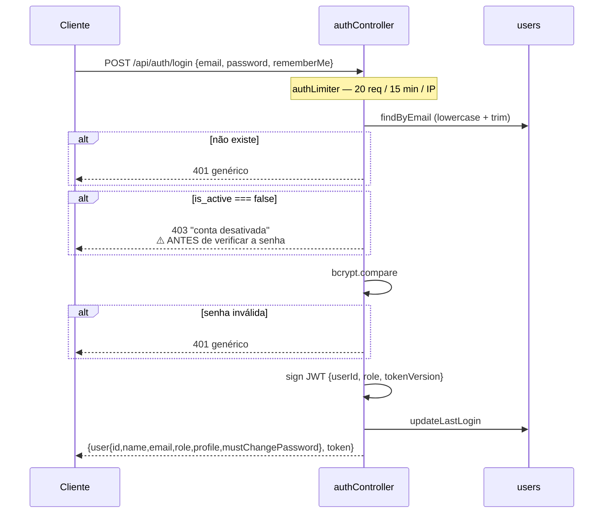
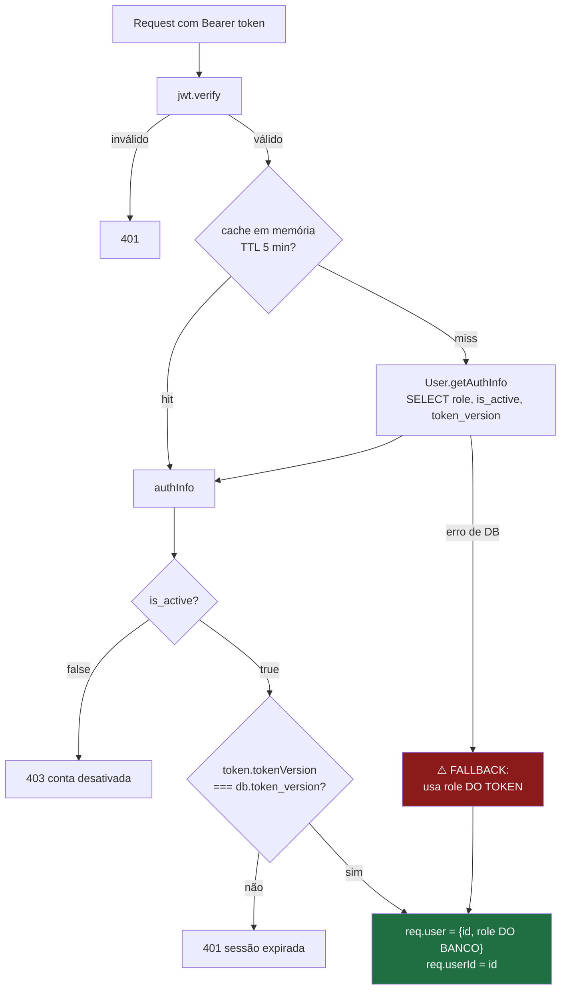
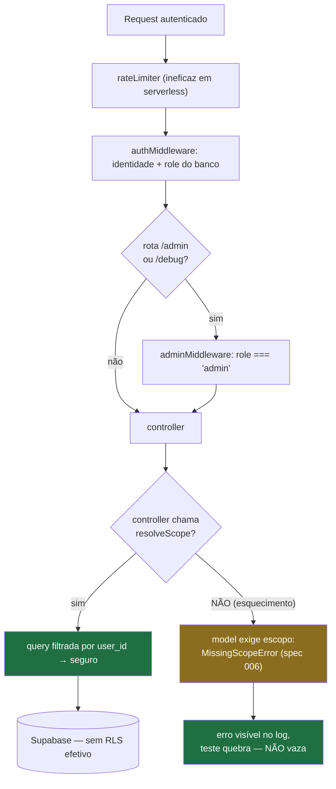

# AUTHORIZATION — JiuMetrics

> **Documento de segurança.** Descreve autenticação e autorização como estão **implementadas hoje**, incluindo as falhas conhecidas e as já corrigidas.
>
> **Fonte:** `server/src/middleware/`, `server/src/controllers/`, `server/src/services/authorization.js`, `server/src/utils/scopeGuard.js`, `server/migrations/`, `frontend/src/contexts/AuthContext.jsx`. Auditado em 2026-08-12 contra `main` (`895066f`); atualizado em 2026-08-18 com as specs 005 e 006, e em 2026-09-24 com a spec 014 (perfil da conta, capacidades). Evidência em `arquivo:linha` na [`../AUDIT.md`](../AUDIT.md) §5 e §6.

---

# Current Implementation

## 1. Tipos de usuário

Desde a spec 014, a conta tem **dois eixos independentes**: `role` (permissão) e `profile` (o que a conta é/vê). Não há grupo além do tenant, e não há tabela de papéis — os dois eixos são colunas fixas.

| Perfil/papel | Como se torna | Vê |
|---|---|---|
| `user` com perfil `atleta` (default) | criado por um admin, ou registro público (desabilitado por padrão) | **apenas o próprio `user_id`**, em tudo |
| `user` com perfil de staff (`professor`, `nutricionista`, `fisioterapeuta`, `preparador_fisico`) | definido pelo admin em `PATCH /api/admin/users/:id/profile`, ou na criação | todos os `user_id` do mesmo `tenant_id` — modelo de **time de confiança**, sem tabela de vínculo nem consentimento por atleta (spec 014) |
| `admin` (qualquer perfil) | promovido por outro admin do mesmo tenant, ou definido via SQL | todos os `user_id` do seu tenant, **e** gerencia usuários (`users:manage`) |

**`role` e `profile` são independentes** (R-05, [`ROADMAP.md`](./ROADMAP.md) §1.1): admin é um toggle por conta, qualquer perfil. Um professor não precisa ser admin para ver o time — é o que a spec 014 resolveu; antes dela, a única forma de um professor ver o grupo era virar admin, o que também lhe dava gestão de contas.

**Confirmado com o proprietário (2026-08-12, revisitado em 2026-09-22): usuário comum vê apenas os próprios dados; admin ou staff vê o grupo.** Esta é a regra de produto, e o código a implementa em `resolveScope` (§5).

`tenant_id` aponta sempre para o admin-raiz do grupo. Um usuário criado por registro público é seu próprio tenant. Ver [ADR-014](./decisions/014-dois-eixos-na-conta-e-time-de-confianca.md) para o porquê do desenho (coluna fixa, não tabela de permissões; time de confiança, não vínculo com consentimento).

## 2. Autenticação

**JWT próprio** — não usa Supabase Auth. Ver [ADR-001](./decisions/001-jwt-proprio-em-vez-de-supabase-auth.md).



| Aspecto | Implementação |
|---|---|
| Algoritmo | HS256, segredo em `JWT_SECRET` (obrigatório — `throw` no boot se faltar) |
| Payload | `{ userId, role, tokenVersion }` — **`profile` não vai no JWT**, é sempre relido do banco pelo `authMiddleware` (spec 014) |
| Expiração | **7 dias**, ou **30 dias** com `rememberMe` |
| Transporte | header `Authorization: Bearer <jwt>` |
| Armazenamento no cliente | `localStorage` (`jiumetrics_token`, `jiumetrics_user`) |
| Refresh token | **não existe** |
| Recuperação de senha | **não existe** — depende de um admin |
| Troca de senha pelo próprio usuário | ✅ **spec 014** — `POST /api/auth/change-password` (autenticado), exige a senha atual, incrementa `token_version` (invalida o token antigo) e devolve token novo |
| Senha provisória obrigatória | ✅ **spec 014** — conta criada por admin nasce com `users.must_change_password = true`; o frontend (`ProtectedRoute`) bloqueia toda rota exceto `/trocar-senha` enquanto isso for verdadeiro |
| Hash de senha | `bcrypt`, 10 rounds |
| CSRF | **não se aplica** — não há cookie de sessão |

`GET /api/auth/validate` e o login devolvem `profile` e `mustChangePassword` desde a spec 014 (lidos do banco, nunca do JWT).

**Registro público** está desabilitado por padrão (`ALLOW_PUBLIC_REGISTER !== 'true'`). A checagem acontece **antes** da consulta por e-mail, então não vaza existência de conta quando desligado. A rota `/register` continua acessível na SPA e retorna 403.

## 3. Identificação por request

`middleware/auth.js` é o ponto único de identificação e faz **três validações**, que juntas são a razão de **não existir escalonamento de privilégio** neste sistema:



1. **`role` vem do banco, não do token** — um JWT com papel alterado ou obsoleto não escala privilégio.
2. **`is_active` é reconsultado** — conta desativada é rejeitada mesmo com token válido.
3. **`token_version` é comparado** — troca de papel ou desativação invalida sessões vivas imediatamente. Ver [ADR-004](./decisions/004-token-version-para-invalidacao-de-sessao.md).
4. **`profile` também vem do banco** (spec 014) — `User.getAuthInfo` devolve `role, is_active, token_version, profile, must_change_password`, e o middleware popula `req.user.profile` e `req.actor.profile`. Uma linha de banco anterior à migration `025` (sem a coluna) vale como `'atleta'` — o perfil mais restritivo. No fallback de falha do banco (AZ-8), `profile` também cai em `'atleta'`, nunca no que o token diria — o token não carrega perfil.

**Cache**: `Map` em memória, TTL 5 min, teto de 5000 entradas com evicção FIFO. `evictAuthCache(userId)` é chamado em toda mutação sensível de usuário. Em ambiente serverless o cache é **por instância** — uma desativação pode levar até 5 min para valer em todas.

## 4. Identificação de admin

`middleware/adminMiddleware.js`: exige `req.user.role === 'admin'` (valor vindo do banco, item 3.1 acima). Registra log de auditoria em acesso concedido **e** negado.

Aplicado em: todo `/api/admin/*` e em `GET /api/debug/env-check`.

## 5. Ownership — a regra de escopo

✅ **SPEC-005 (2026-08-18), estendida na SPEC-014 (2026-09-24):** a regra vive em `server/src/services/authorization.js` — um módulo desacoplado do Express (`resolveScope(actor)`, `authorize(actor, action, resource)`, `can(actor, action, resource)`), não em `utils/tenantScope.js`. `getScopeIds` continua existindo só como wrapper `@deprecated`, delegando ao novo módulo; nenhum call site de produção o chama mais.

```js
const STAFF_PROFILES = ['professor', 'nutricionista', 'fisioterapeuta', 'preparador_fisico'];

async function resolveScope(actor) {
  if (!actor || !actor.id) return [];
  if (actor.role === 'admin' || STAFF_PROFILES.includes(actor.profile)) {
    return User.getGroupUserIds(actor.id); // todos do tenant
  }
  return [actor.id];                        // só o próprio
}
```

**O que mudou na spec 014:** "só admin vê o grupo" virou "admin **ou** staff vê o grupo" — ver [ADR-014](./decisions/014-dois-eixos-na-conta-e-time-de-confianca.md). `actor` é `{ id, role, profile, tenantId }`, extraído do `req` pelo `middleware/auth.js` (que popula `req.actor`) — o módulo de política nunca vê `req`. `tenantId` continua reservado, não usado por `resolveScope` (ver ADR-011). O resultado de `resolveScope` é um array de `user_id` usado como filtro nas queries: `.in('user_id', allowedUserIds)`.

### 5.0 Capacidades por ação (`CAPABILITIES`, spec 014)

Além de "quais `user_id` o ator alcança", `can(actor, action, resource)` responde "o ator pode **esta ação** neste **recurso**?". `action` é uma string `'<área>:<verbo>'`; `resource` carrega `userId` (dono/gestor) e, quando fizer sentido, `accountUserId` (a conta do atleta dono da ficha). **Ação não cadastrada em `CAPABILITIES` é negada** — não existe "permitido por omissão".

`can` monta um contexto comum antes de aplicar a regra da ação:

- **`scope`** — `await resolveScope(actor)`.
- **`isOwn`** — `Boolean(resource.accountUserId) && resource.accountUserId === actor.id`. **Contrato do chamador:** para `isOwn` fazer sentido, o `resource` passado precisa carregar `accountUserId` — se o chamador não souber ou não buscar esse campo, `isOwn` é sempre `false` e a regra correspondente nega mesmo quando deveria permitir. Isto é comportamento correto do ponto de vista de `can` (falha fechado), mas é uma armadilha de integração: buscar a ficha sem o `account_user_id` e assumir que `own-athlete:write` vai "simplesmente funcionar" é o erro mais provável ao consumir esta função.
- **`inScope`** — `Boolean(resource.userId) && scope.includes(resource.userId)`. Para `atleta` isso é só o próprio id; para `admin`/staff é o tenant inteiro.

A matriz completa (idêntica à da [spec](../specs/014-identity-and-profiles/spec.md#autorização--servicesauthorizationjs), transcrita do código):

| `action` | `atleta` | `professor` | fisio · nutri · prep | `admin` (qualquer perfil) |
|---|---|---|---|---|
| `person:read` | próprio escopo | tenant | tenant | tenant |
| `person:write` | próprio escopo | tenant | tenant | tenant |
| `own-athlete:write` (ficha vinculada) | se `accountUserId === actor.id` | idem | idem | idem |
| `training:read` | própria ficha | tenant | tenant | como o perfil |
| `training:write` | própria ficha | **negado** em ficha alheia | tenant | como o perfil |
| `schedule:write` (grade do time) | negado | tenant | negado | como o perfil |
| `competition:write` | própria ficha | tenant | negado | como o perfil |
| `competition:team-event:write` | permitido (atleta pode criar evento) | tenant | negado | como o perfil |
| `health:read` / `health:write` | própria ficha | tenant | tenant | como o perfil |
| `users:manage` | negado | negado | negado | **permitido** |

`training`, `schedule`, `competition` e `health` **não têm endpoint ainda** — entram na tabela para que as specs de competições, agenda e saúde (fases 3–5 do [`ROADMAP.md`](./ROADMAP.md)) só precisem registrar consumidores, sem tocar `resolveScope` de novo. `users:manage` é a única ação hoje efetivamente consumida (equivalente a `adminMiddleware`, que continua decidindo por `role` sem olhar `profile` — R-05).

`competition:team-event:write` é a exceção da tabela: não basta `inScope` porque um `atleta` (escopo `[id]`) pode criar evento de equipe para qualquer colega do tenant — essa regra sozinha consulta `User.getGroupUserIds` diretamente, em vez de usar o `scope` padrão. Não generalizar esse padrão para outras ações sem necessidade equivalente.

**Leitura da coluna `admin` (armadilha comum):** "tenant" nessa coluna só aparece nas duas linhas cuja regra é puramente `inScope` (`person:read`/`person:write` — `inScope` já é o tenant inteiro para `role === 'admin'`, sem olhar `profile`) e em `users:manage`, cuja regra é puramente `actor.role === 'admin'`. **Todas as outras linhas leem `actor.profile`**, e `role` não entra na conta — um admin com `profile: 'atleta'` cai exatamente na coluna `atleta` para essas ações (ex.: `training:read` só dá `própria ficha`, não o tenant, a um admin-atleta). "como o perfil" é a forma correta de ler essas células; não presuma que "admin" implica tenant em nenhuma ação fora das duas exceções citadas.

**O padrão correto**, aplicado consistentemente em `athleteController`, `opponentController`, `fightAnalysisController`, `strategyController`, `usageController`:

```js
const allowedUserIds = await resolveScope(req.actor);
const recurso = await Model.getByIdAndUser(req.params.id, allowedUserIds);
if (!recurso) return res.status(404).json({ error: 'não encontrado' });
// escrita usa o owner REAL do registro, não o requisitante:
await Model.update(id, dados, recurso.userId);
```

Dois detalhes deste padrão que merecem atenção ao replicá-lo:

- **404 em vez de 403** quando o recurso existe mas não pertence ao escopo — não vaza existência.
- **A escrita usa o `userId` do registro**, não o do requisitante. É o que permite a um admin editar o dado de um membro do grupo sem transferir a posse.

### 5.1 O escopo é exigido pelo model, não confiado ao controller

✅ **SPEC-006 (2026-08-18).** Antes, a posse do dado era uma **convenção de chamada**: `FightAnalysis.update(id, dados)` aceitava qualquer ID, e o sistema só era seguro enquanto todo controller lembrasse de filtrar. Seis endpoints não lembraram.

Agora o escopo faz parte da **assinatura**, e a chamada sem ele lança `MissingScopeError` (500 — é erro de contrato interno, não do usuário):

```js
// server/src/utils/scopeGuard.js
const ids = requireScope(allowedUserIds, 'FightAnalysis.update');
```

Rejeita array vazio **e array com elemento falsy** — `[undefined]` é o que realmente chega quando o chamador passa uma variável inexistente, e sem essa checagem a query `.in('user_id', [undefined])` não casaria linha nenhuma, parecendo "não encontrado" em vez de bug.

**Por que lançar, e não devolver `null`:** `null` e lista vazia são indistinguíveis de "não encontrado" e morreriam no primeiro `catch` que só loga — o padrão de falha dominante deste repositório. Um erro tipado aparece no log e quebra o teste.

**`analysis_versions` — a tabela sem dono (decisão P4).** Não tem coluna `user_id`, então a autorização **deriva da análise pai**, verificada em duas etapas na aplicação. Não por coluna denormalizada (exigiria migration + backfill e criaria uma segunda fonte de verdade de posse, que pode divergir do pai) e **não por JOIN do PostgREST, que é impossível aqui**: `analysis_id` é polimórfico — aponta para `fight_analyses` ou `tactical_analyses` conforme `analysis_type` — e não tem foreign key, e o PostgREST só embeda relação declarada. Custo: uma query extra por chamada, aceito deliberadamente e reversível sem tocar em dado.

Quem decide o **status HTTP** é o controller (via `AnalysisVersion.isAnalysisInScope` → 404, para não vazar existência); o model repete a verificação por conta própria, como rede para um chamador futuro que esqueça.

## 6. Proteção por camada

| Camada | Mecanismo | Efetivo? |
|---|---|---|
| **Rotas do frontend** | `ProtectedRoute` (`requireAdmin`) | ❌ **UX apenas** — `isAdmin` vem do `localStorage` |
| **API — autenticação** | `authMiddleware` em todos os routers exceto `/auth/login`, `/auth/register`, `/api/health` | ✅ |
| **API — papel** | `adminMiddleware` em `/admin` e `/debug` | ✅ |
| **API — posse do dado** | `resolveScope` (`services/authorization.js`, spec 005) no controller | ✅ **os 6 endpoints que faltavam foram corrigidos na spec 006** |
| **Model** | escopo **obrigatório na assinatura** (`requireScope`), spec 006 | ✅ chamada sem escopo lança `MissingScopeError`. `analysis_versions` autoriza pela análise pai |
| **Banco (RLS)** | — | ❌ **desligado** em `athletes`/`opponents`/`fight_analyses`; `USING (true)` em outras 3 tabelas — decisão deliberada ([ADR-002](./decisions/002-rls-desligado-autorizacao-na-aplicacao.md)), não vai mudar |
| **Banco (GRANT da chave anon)** | `REVOKE` de `anon`/`authenticated` (spec 008) | 🟡 **código pronto, execução pendente** — o backend já é um único cliente `service_role` sem fallback; o `REVOKE` está escrito em [`server/migrations/024-revoke-anon-access.sql`](../server/migrations/024-revoke-anon-access.sql) e precisa ser colado no SQL Editor do Supabase pelo proprietário (sem credencial de conexão direta ao Postgres neste ambiente, não há como executá-lo por aqui) |
| **Rate limiting** | `express-rate-limit` | ❌ **`MemoryStore` em serverless** — contador por instância |

**A leitura importante desta tabela:** desde a spec 006 existem **duas** camadas de aplicação — o controller resolve o escopo e o model o **exige**. RLS continua desligada de propósito — a defesa de banco escolhida não é reativá-la, é revogar o GRANT da chave anon (spec 008, linha acima). Até essa migration rodar, **quem tiver a chave publicável ainda fala direto com o PostgREST**, contornando as duas camadas de aplicação inteiras. A diferença prática das specs 005/006, independente disso, é que um endpoint novo que esqueça o escopo agora **falha** em vez de vazar — antes, a omissão era silenciosa.

## 7. Fluxo de autorização completo



---

# Known Issues

Severidade conforme [`../AUDIT.md`](../AUDIT.md).

> **Estado em 2026-08-18:** os **7 vazamentos de posse (AZ-1..AZ-7) e o escopo escalar (AZ-10) estão corrigidos** — AZ-1 na spec 002, os demais na [spec 006](../specs/006-ownership-in-data-access/spec.md). Ficam registrados abaixo, riscados, porque descrevem o que era possível e servem de referência ao revisar código novo. AZ-8, AZ-9 e AZ-11..AZ-18 **continuam abertos**.

## CRITICAL

### ~~AZ-1~~ — `GET /api/fight-analysis/debug/all` · ✅ **RESOLVIDO na [spec 002](../specs/002-verification-baseline/spec.md)** (2026-08-13)
A rota devolvia `id`, `person_id`, `person_type`, `user_id` e `created_at` de **todas** as análises de todos os tenants, exigindo apenas autenticação. Foi **removida**, junto com a query de banco que vivia no arquivo de rota.

### ~~AZ-2~~ — `POST /api/chat/manual-edit` escrevia em qualquer tenant · ✅ **RESOLVIDO na [spec 006](../specs/006-ownership-in-data-access/spec.md)** (2026-08-18)
`manualEdit` usava `FightAnalysis.getById(analysisId)` — a variante **sem** filtro de usuário — e um `update()` que também não filtrava, com `analysisId` cru do `req.body`. Qualquer usuário autenticado sobrescrevia `summary`, `charts` ou `technical_stats` de qualquer análise de qualquer tenant, sem sinal para a vítima.
**Correção:** `resolveScope` + `getByIdAndUser` + `update` com escopo. O `getById` sem filtro foi **removido** do model. Regressão coberta por `leaks.test.js`.

### ~~AZ-3~~ — `GET /api/chat/versions/:analysisId` lia versões de qualquer tenant · ✅ **RESOLVIDO na [spec 006](../specs/006-ownership-in-data-access/spec.md)** (2026-08-18)
Nenhum método de `AnalysisVersion` filtrava por usuário, e a tabela `analysis_versions` **não tem coluna `user_id`**. Expunha o `content` completo (summary, charts, stats) de todas as versões de qualquer análise.
**Correção (decisão P4):** a autorização deriva da análise **pai**, em duas etapas na aplicação — ver §5.1. O endpoint devolve **404**, não lista vazia.

### ~~AZ-4~~ — `POST /api/chat/restore-version` revertia análise de qualquer tenant · ✅ **RESOLVIDO na [spec 006](../specs/006-ownership-in-data-access/spec.md)** (2026-08-18)
Nenhuma verificação de posse em ponto algum, e **duas** escritas com IDs do `req.body` (`FightAnalysis.update` e `AnalysisVersion.setAsCurrent`). Era o mais destrutivo dos sete: revertia o conteúdo da análise de outro usuário e mexia no ponteiro de versão atual.
**Correção:** posse verificada antes de qualquer escrita; `setAsCurrent` exige escopo e autoriza pela análise pai.

## HIGH

### ~~AZ-5~~ — `updateContextSnapshot` aceitava qualquer `sessionId` · ✅ **RESOLVIDO na [spec 006](../specs/006-ownership-in-data-access/spec.md)** (2026-08-18)
Dentro de `applyEdit`, que verificava a posse da **análise** corretamente e poucas linhas depois passava um `sessionId` cru do `req.body`. O método filtrava só por `id` e usa `supabaseAdmin` (RLS ignorado), envenenando o `context_snapshot` da sessão de outro usuário — o contexto que a IA daquele usuário receberia nos turnos seguintes.
**Correção:** `updateContextSnapshot`, `addMessage` e `addMessages` exigem o dono. Um `sessionId` alheio é ignorado com aviso, **sem** desfazer a edição da própria análise (que já foi validada e aplicada).
**Por que este importa mais que os outros:** era o mesmo autor, no mesmo arquivo, no mesmo handler que fazia a verificação certa logo acima — a prova de que disciplina de chamada não basta, e de que a exigência tinha de descer para a assinatura do model.

### ~~AZ-6~~ — `POST /api/ai/analyze-link` não validava posse de `personId` · ✅ **RESOLVIDO na [spec 006](../specs/006-ownership-in-data-access/spec.md)** (2026-08-18)
Criava a análise sem verificar que a pessoa existia e pertencia ao usuário, enquanto o caminho equivalente (`POST /api/fight-analysis`) **fazia** essa validação. Não vazava leitura (a listagem filtra por `user_id`), mas criava vínculo para `person_id` de outro tenant e poluía as consolidações de perfil, que agregam por `person_id`.
**Correção:** validação de posse **antes** das chamadas de IA — um pedido que vai terminar em 404 não deve queimar tokens pagos primeiro. `personType` fora de `('athlete','opponent')` passou a ser 400.

### ~~AZ-7~~ — `POST /api/ai/athlete-summary` aceitava corpo arbitrário · ✅ **RESOLVIDO na [spec 006](../specs/006-ownership-in-data-access/spec.md)** (2026-08-18)
`athleteData` era aceito inteiro do `req.body` e serializado direto no prompt, sem validação de schema, sem limite (o teto era o `express.json` de 10 MB) e sem relação com o `user_id` do chamador — abuso de custo de IA e prompt injection direta. Não havia "dado alheio" a ler porque o endpoint não buscava nada: o próprio contrato era a falha.
**Correção:** o endpoint recebe `athleteId` e carrega nome e análises no servidor, dentro do escopo. O formato antigo devolve 400. Contrato coberto por `athleteSummary.test.js`, incluindo um teste que prova que um `athleteData` enviado junto **não alcança o prompt**.

### AZ-8 — Fallback de autenticação abre em falha do banco
Se `User.getAuthInfo` lançar, o middleware continua com o `role` **do token**.
**Impacto:** uma indisponibilidade do Supabase desliga as três proteções ao mesmo tempo — token de conta desativada volta a valer, `token_version` deixa de ser checado, e o papel do token volta a ser aceito.

### AZ-9 — Rate limiting inoperante em produção
`MemoryStore` em function serverless. Enfraquece diretamente a proteção de brute force no login e o teto de operações de IA.

## MEDIUM

| # | Problema | Impacto |
|---|---|---|
| ~~AZ-10~~ | ✅ **RESOLVIDO na spec 006** — `createProfileSession`, `saveProfileSummary` e `restoreProfileVersion` passavam o `userId` escalar em vez do escopo resolvido | O efeito não era vazamento, era o oposto: o **admin perdia** acesso ao dado do próprio grupo, silenciosamente. A busca passou a usar `resolveScope`; a escrita, o `userId` do registro |
| AZ-11 | **Enumeração de usuários** — 403 "conta desativada" retornado antes do `bcrypt.compare` | Descobre contas existentes sem credencial; também dá oráculo de timing |
| AZ-12 | **`handleError` devolve `error.message`** ao cliente em ~30 handlers | Vaza mensagens do PostgREST/Postgres (nome de coluna, constraint violada). **Viola a regra escrita em `.github/copilot-instructions.md`** |
| AZ-13 | **PII em log** — e-mail em toda tentativa de login; log por request no middleware | E-mails em texto claro nos logs da Vercel; relevante para LGPD |
| AZ-14 | **CORS aceita qualquer `*.vercel.app`** | Qualquer deploy na Vercel, inclusive de terceiros, pode chamar a API. Amplia o impacto de XSS em qualquer app nesse domínio |
| ~~AZ-15~~ | ✅ **RESOLVIDO na [spec 010](../specs/010-frontend-consolidation/spec.md)** — não havia header de segurança nenhum. `helmet` no backend (com CSP e CORP **desligadas ali** de propósito: a API devolve JSON, e CSP protege documento) + CSP, `nosniff`, `X-Frame-Options` e `Referrer-Policy` em `frontend/vercel.json`, onde o documento é servido. ⚠️ O CSP está em **Report-Only** — a spec recomenda observar antes de bloquear, e não foi possível verificar no navegador se a política quebra Tailwind ou estilo inline |
| AZ-16 | **Token em `localStorage`** — ✅ o **sink de XSS foi fechado na spec 010**: o conteúdo de estratégia é escapado na fonte antes de entrar no HTML do PDF (`utils/strategyReportHtml.js`), com 16 testes que verificam **no DOM** que nenhum nó executável é construído. O token em `localStorage` **continua** — o que mudou é que não há mais caminho conhecido de XSS para alcançá-lo. ⚠️ O padrão de montar HTML por string segue existindo; removê-lo exige a comparação visual do PDF que a spec 010 declara pendente |
| AZ-17 | **Nenhum validador de schema de entrada** no backend | Habilita AZ-7 e a classe "campo inesperado no body" |
| AZ-18 | **Sem `UNIQUE` em `users.email`** em nenhuma migration | Race condition na criação de usuário. **NEEDS_CONFIRMATION** no banco real |

## Sem risco identificado

Investigados e **descartados**, para não desperdiçar esforço futuro:

- **SQL injection** — todo acesso passa pelo query builder do `supabase-js`, que parametriza. Não há SQL concatenado em runtime.
- **CSRF** — não há cookie de sessão; a credencial é um header `Bearer`.
- **Escalonamento de privilégio** — nenhum caminho encontrado. O `role` do token não é confiado; `createSubUser` força `role: 'user'`; `changeRole` valida enum, proíbe auto-alteração e exige mesmo tenant; `User.update` recebe apenas objetos montados explicitamente pelo controller (sem mass assignment).
- **Vazamento de `password_hash`** — nunca serializado em resposta alguma; `findByEmail` o inclui apenas para o `bcrypt.compare`.

## Não confundir com falha

`ProtectedRoute` ser burlável **não é** falha de autorização. `isAdmin` vem do `localStorage` e um usuário pode liberar a tela `/admin/users`, mas o backend reconsulta o papel no banco e `adminMiddleware` bloqueia toda chamada. O risco real é a equipe futuramente **confundir controle de UI com controle de acesso**. `ProtectedRoute` é UX.

---

# Future Direction

> Direções decididas ou consideradas. **Nada aqui está implementado.**
>
> 🎯 O modelo-alvo completo — por que RBAC puro não serve, e a evolução em três estágios para RBAC + relacionamento + escopo de campo — está em [`../JIU_METRICS_REFACTORING_PLAN.md`](../JIU_METRICS_REFACTORING_PLAN.md) §6.
>
> Specs: [005](../specs/005-authorization-policy-seam/spec.md) (seam de política) e [006](../specs/006-ownership-in-data-access/spec.md) (ownership no acesso a dados).

## Decidido (`PLANNED` / em execução)

✅ **Estágio 1 do seam de política — CONCLUÍDO.** A spec 005 criou o ponto único de decisão (`services/authorization.js`) e migrou os 23 call sites; a spec 006 empurrou a exigência de escopo para os models e fechou os 6 vazamentos (ver §5.1). Ver [JIU_METRICS_REFACTORING_PLAN.md §6.3](../JIU_METRICS_REFACTORING_PLAN.md#63-evolução-em-três-estágios) e [ADR-011](./decisions/011-seam-de-politica-de-autorizacao.md).

✅ **Estágio 2 (papel profissional) — CONCLUÍDO na spec 014 (2026-09-24).** `users.profile` e `CAPABILITIES` (§5.0) preenchem o endereço que `authorize(actor, action, resource)` reservava desde a spec 005. **Deliberadamente sem relacionamento profissional↔atleta com consentimento** — o modelo escolhido foi time de confiança (staff vê o tenant inteiro), não vínculo por atleta. Ver [ADR-014](./decisions/014-dois-eixos-na-conta-e-time-de-confianca.md) para o porquê e o gatilho que reabriria essa escolha (profissional externo à academia). O **Estágio 3** (escopo de campo) continua sem endereço usado.

~~**Acesso ao banco exclusivamente por `service_role`**~~ — 🟡 **spec 008, parcialmente executada (2026-08-24).** O código já é o descrito: cliente único, `service_role`, sem fallback (§6). O `REVOKE` de `anon`/`authenticated` está escrito em [`server/migrations/024-revoke-anon-access.sql`](../server/migrations/024-revoke-anon-access.sql), mas **não foi executado** — falta o proprietário colá-lo no SQL Editor do Supabase. Ver [ADR-009](./decisions/009-acesso-ao-banco-exclusivamente-por-service-role.md).

Consequência que precisa ficar explícita, e que **já vale mesmo antes do `REVOKE` rodar**: com a aplicação corrigida (specs 005–006), o banco deixou de ser necessário como rede de segurança — a garantia de posse já desceu do controller para o model. O `REVOKE` fecha o último caminho que ainda contorna as duas camadas por inteiro: falar direto com o PostgREST usando a chave anon.

## Em consideração (sem decisão)

- ~~**Empurrar o filtro de posse para o model**~~ — ✅ feito na spec 006: `requireScope` na assinatura, `MissingScopeError` quando ausente.
- ~~**Autorização de `analysis_versions`**~~ — ✅ feito na spec 006 (decisão P4): deriva da análise pai, verificada na aplicação. `JOIN` do PostgREST foi descartado como **inviável** (FK ausente + `analysis_id` polimórfico), e a coluna denormalizada como desnecessária.
- ~~**Testes de autorização como portão de CI**~~ — ✅ os testes existem desde a spec 004 e **bloqueiam merge** desde a spec 006, quando deixaram de ser `test.failing`.
- **Token de acesso curto + refresh token** — reduziria a janela de um token vazado (hoje 7–30 dias).
- **Rate limiting com store externo** ou na borda.
- ~~**Papéis profissionais** (nutricionista, fisioterapeuta, preparador físico)~~ — ✅ **existem como perfil de conta desde a spec 014** (`nutricionista`, `fisioterapeuta`, `preparador_fisico`, `professor`). As **áreas** que essas contas editariam (treino, saúde) continuam sem endpoint — ver [`DOMAIN.md`](./DOMAIN.md#6-o-que-não-faz-parte-do-domínio-atual). Quando entrarem, a ausência de RLS precisa ser reavaliada, porque passará a existir dado de saúde cruzando fronteira de organização dentro do mesmo tenant (mitigado apenas pelo registro de acesso planejado para a spec de saúde).

---

## Ver também

- [`ARCHITECTURE.md`](./ARCHITECTURE.md) — camadas e cadeia de request
- [`DOMAIN.md`](./DOMAIN.md) — ownership por entidade
- [`DATABASE.md`](./DATABASE.md) — estado de RLS por tabela
- [`../AUDIT.md`](../AUDIT.md) §5, §6, §9 — evidência em `arquivo:linha`
- [`decisions/001`](./decisions/001-jwt-proprio-em-vez-de-supabase-auth.md), [`002`](./decisions/002-rls-desligado-autorizacao-na-aplicacao.md), [`004`](./decisions/004-token-version-para-invalidacao-de-sessao.md), [`009`](./decisions/009-acesso-ao-banco-exclusivamente-por-service-role.md), [`011`](./decisions/011-seam-de-politica-de-autorizacao.md), [`014`](./decisions/014-dois-eixos-na-conta-e-time-de-confianca.md)
