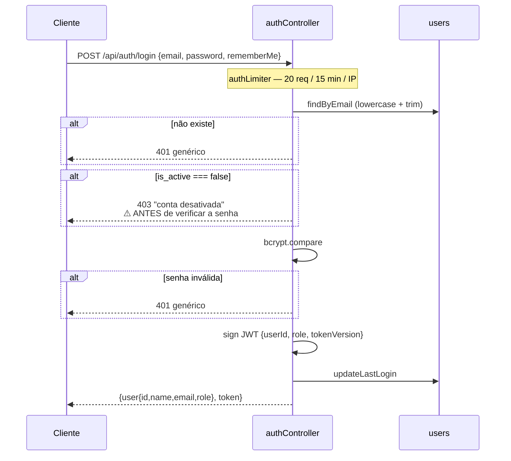
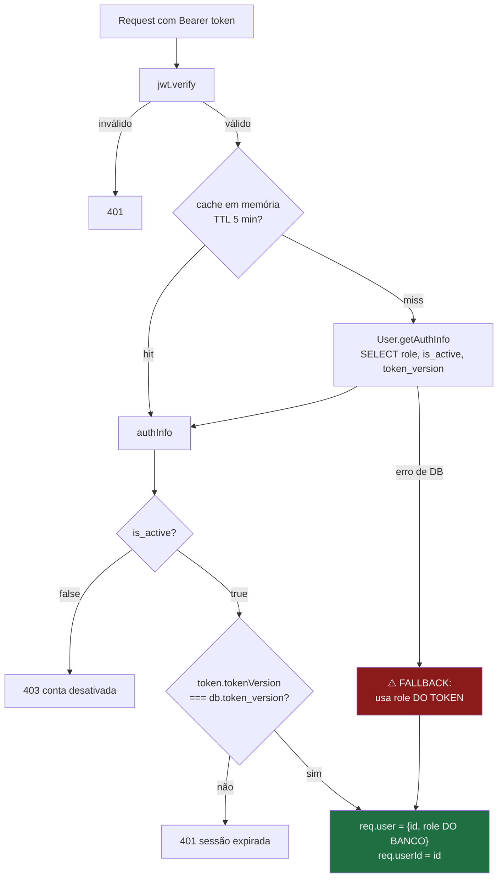
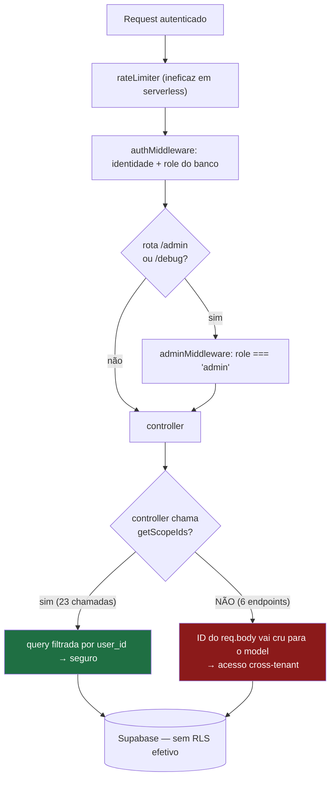

# AUTHORIZATION — JiuMetrics

> **Documento de segurança.** Descreve autenticação e autorização como estão **implementadas hoje**, incluindo as falhas conhecidas. Nada foi corrigido nesta etapa.
>
> **Fonte:** `server/src/middleware/`, `server/src/controllers/`, `server/src/utils/tenantScope.js`, `server/migrations/`, `frontend/src/contexts/AuthContext.jsx`. Verificado em 2026-08-12 contra `main` (`895066f`). Evidência em `arquivo:linha` na [`../AUDIT.md`](../AUDIT.md) §5 e §6.

---

# Current Implementation

## 1. Tipos de usuário

Existem **exatamente dois papéis**. Não há papel intermediário, nem permissão granular, nem grupo além do tenant.

| Papel | Como se torna | Pode |
|---|---|---|
| `user` | criado por um admin, ou registro público (desabilitado por padrão) | ver e gerenciar **apenas os próprios dados** |
| `admin` | promovido por outro admin do mesmo tenant, ou definido via SQL | ver os dados de **todos os membros do seu tenant**, e gerenciar usuários do tenant |

**Confirmado com o proprietário (2026-08-12): usuário comum vê apenas os próprios dados; somente admin vê o grupo.** Esta é a regra de produto, e o código a implementa corretamente onde é aplicada.

`tenant_id` aponta sempre para o admin-raiz do grupo. Um usuário criado por registro público é seu próprio tenant.

## 2. Autenticação

**JWT próprio** — não usa Supabase Auth. Ver [ADR-001](./decisions/001-jwt-proprio-em-vez-de-supabase-auth.md).



| Aspecto | Implementação |
|---|---|
| Algoritmo | HS256, segredo em `JWT_SECRET` (obrigatório — `throw` no boot se faltar) |
| Payload | `{ userId, role, tokenVersion }` |
| Expiração | **7 dias**, ou **30 dias** com `rememberMe` |
| Transporte | header `Authorization: Bearer <jwt>` |
| Armazenamento no cliente | `localStorage` (`jiumetrics_token`, `jiumetrics_user`) |
| Refresh token | **não existe** |
| Recuperação de senha | **não existe** — depende de um admin |
| Hash de senha | `bcrypt`, 10 rounds |
| CSRF | **não se aplica** — não há cookie de sessão |

**Registro público** está desabilitado por padrão (`ALLOW_PUBLIC_REGISTER !== 'true'`). A checagem acontece **antes** da consulta por e-mail, então não vaza existência de conta quando desligado. A rota `/register` continua acessível na SPA e retorna 403.

## 3. Identificação por request

`middleware/auth.js` é o ponto único de identificação e faz **três validações**, que juntas são a razão de **não existir escalonamento de privilégio** neste sistema:



1. **`role` vem do banco, não do token** — um JWT com papel alterado ou obsoleto não escala privilégio.
2. **`is_active` é reconsultado** — conta desativada é rejeitada mesmo com token válido.
3. **`token_version` é comparado** — troca de papel ou desativação invalida sessões vivas imediatamente. Ver [ADR-004](./decisions/004-token-version-para-invalidacao-de-sessao.md).

**Cache**: `Map` em memória, TTL 5 min, teto de 5000 entradas com evicção FIFO. `evictAuthCache(userId)` é chamado em toda mutação sensível de usuário. Em ambiente serverless o cache é **por instância** — uma desativação pode levar até 5 min para valer em todas.

## 4. Identificação de admin

`middleware/adminMiddleware.js`: exige `req.user.role === 'admin'` (valor vindo do banco, item 3.1 acima). Registra log de auditoria em acesso concedido **e** negado.

Aplicado em: todo `/api/admin/*` e em `GET /api/debug/env-check`.

## 5. Ownership — a regra de escopo

Toda a autorização de dados do sistema cabe em 8 linhas (`utils/tenantScope.js`):

```js
async function getScopeIds(req, User) {
  if (req.user?.role === 'admin') return User.getGroupUserIds(req.userId); // todos do tenant
  return [req.userId];                                                     // só o próprio
}
```

O resultado é um array de `user_id` usado como filtro nas queries: `.in('user_id', allowedUserIds)`.

**O padrão correto**, aplicado consistentemente em `athleteController`, `opponentController`, `fightAnalysisController`, `strategyController`, `usageController`:

```js
const allowedUserIds = await getScopeIds(req, User);
const recurso = await Model.getByIdAndUser(req.params.id, allowedUserIds);
if (!recurso) return res.status(404).json({ error: 'não encontrado' });
// escrita usa o owner REAL do registro, não o requisitante:
await Model.update(id, dados, recurso.userId);
```

Dois detalhes deste padrão que merecem atenção ao replicá-lo:

- **404 em vez de 403** quando o recurso existe mas não pertence ao escopo — não vaza existência.
- **A escrita usa o `userId` do registro**, não o do requisitante. É o que permite a um admin editar o dado de um membro do grupo sem transferir a posse.

## 6. Proteção por camada

| Camada | Mecanismo | Efetivo? |
|---|---|---|
| **Rotas do frontend** | `ProtectedRoute` (`requireAdmin`) | ❌ **UX apenas** — `isAdmin` vem do `localStorage` |
| **API — autenticação** | `authMiddleware` em todos os routers exceto `/auth/login`, `/auth/register`, `/api/health` | ✅ |
| **API — papel** | `adminMiddleware` em `/admin` e `/debug` | ✅ |
| **API — posse do dado** | `getScopeIds` no controller | ⚠️ **23 chamadas nos controllers; ausente em 6 endpoints** (+1 chamada de escrita desprotegida dentro de um endpoint correto — AZ-5) |
| **Model** | filtro `user_id` na query | ⚠️ **inconsistente** — `FightAnalysis.update/delete` e todos os métodos de `AnalysisVersion` aceitam qualquer ID |
| **Banco (RLS)** | — | ❌ **desligado** em `athletes`/`opponents`/`fight_analyses`; `USING (true)` em outras 3 tabelas |
| **Rate limiting** | `express-rate-limit` | ❌ **`MemoryStore` em serverless** — contador por instância |

**A leitura importante desta tabela:** existe exatamente **uma** camada efetiva de proteção de dados — o filtro no controller. Não há defesa em profundidade. Onde essa camada falha, o dado fica exposto sem nenhuma rede abaixo.

## 7. Fluxo de autorização completo



---

# Known Issues

Severidade conforme [`../AUDIT.md`](../AUDIT.md). **Nenhum destes foi corrigido.**

## CRITICAL

### ~~AZ-1~~ — `GET /api/fight-analysis/debug/all` · ✅ **RESOLVIDO na [spec 002](../specs/002-verification-baseline/spec.md)** (2026-08-13)
A rota devolvia `id`, `person_id`, `person_type`, `user_id` e `created_at` de **todas** as análises de todos os tenants, exigindo apenas autenticação. Foi **removida**, junto com a query de banco que vivia no arquivo de rota.

### AZ-2 — `POST /api/chat/manual-edit` escreve em qualquer tenant
`chatController.manualEdit` usa `FightAnalysis.getById(analysisId)` — a variante **sem** filtro de usuário — e `FightAnalysis.update()`, que também não filtra. O `analysisId` vem cru do `req.body`.
**Impacto:** qualquer usuário autenticado sobrescreve `summary`, `charts` ou `technical_stats` de qualquer análise de qualquer tenant. Corrupção silenciosa — a vítima não recebe sinal.
**Nota:** `applyEdit`, no mesmo arquivo, faz a verificação corretamente. A inconsistência é interna ao módulo.

### AZ-3 — `GET /api/chat/versions/:analysisId` lê versões de qualquer tenant
Nenhum método de `AnalysisVersion` filtra por usuário, e a tabela `analysis_versions` **não tem coluna `user_id`** — não há como filtrar sem alterar o schema.
**Impacto:** leitura do `content` completo (summary, charts, stats) de todas as versões de qualquer análise.

### AZ-4 — `POST /api/chat/restore-version` reverte análise de qualquer tenant
Nenhuma verificação de posse em ponto algum. Faz `FightAnalysis.update()` e `AnalysisVersion.setAsCurrent()` com IDs do `req.body`.
**Impacto:** destrutivo e persistente — reverte o conteúdo e altera o ponteiro de versão atual de outro usuário.

## HIGH

### AZ-5 — `updateContextSnapshot` aceita qualquer `sessionId`
Dentro de `chatController.applyEdit`. O `sessionId` vem do `req.body` e nunca é validado; o método filtra só por `id` e usa **`supabaseAdmin`** (RLS ignorado).
**Impacto:** envenena o `context_snapshot` da sessão de chat de outro usuário — isto é, o contexto que a IA daquele usuário recebe nos turnos seguintes.

### AZ-6 — `POST /api/ai/analyze-link` não valida posse de `personId`
Cria a análise sem verificar que a pessoa existe e pertence ao usuário. O caminho equivalente (`POST /api/fight-analysis`) **faz** essa validação.
**Impacto:** não vaza leitura (a listagem filtra por `user_id`), mas cria vínculo para `person_id` de outro tenant e polui as consolidações de perfil, que agregam por `person_id`.

### AZ-7 — `POST /api/ai/athlete-summary` aceita corpo arbitrário
`athleteData` é aceito inteiro do `req.body` e serializado direto no prompt, sem validação de schema, sem limite (teto é o `express.json` de 10 MB) e sem relação com o `user_id` do chamador.
**Impacto:** abuso de custo de IA + prompt injection direta. O endpoint não tem noção de posse.

### AZ-8 — Fallback de autenticação abre em falha do banco
Se `User.getAuthInfo` lançar, o middleware continua com o `role` **do token**.
**Impacto:** uma indisponibilidade do Supabase desliga as três proteções ao mesmo tempo — token de conta desativada volta a valer, `token_version` deixa de ser checado, e o papel do token volta a ser aceito.

### AZ-9 — Rate limiting inoperante em produção
`MemoryStore` em function serverless. Enfraquece diretamente a proteção de brute force no login e o teto de operações de IA.

## MEDIUM

| # | Problema | Impacto |
|---|---|---|
| AZ-10 | **Escopo inconsistente no chat de perfil** — `createProfileSession`, `saveProfileSummary` e `restoreProfileVersion` passam o `userId` escalar em vez do array de `getScopeIds` | Admin perde o acesso ao grupo nesses três caminhos; a intenção de escopo deixa de ser legível |
| AZ-11 | **Enumeração de usuários** — 403 "conta desativada" retornado antes do `bcrypt.compare` | Descobre contas existentes sem credencial; também dá oráculo de timing |
| AZ-12 | **`handleError` devolve `error.message`** ao cliente em ~30 handlers | Vaza mensagens do PostgREST/Postgres (nome de coluna, constraint violada). **Viola a regra escrita em `.github/copilot-instructions.md`** |
| AZ-13 | **PII em log** — e-mail em toda tentativa de login; log por request no middleware | E-mails em texto claro nos logs da Vercel; relevante para LGPD |
| AZ-14 | **CORS aceita qualquer `*.vercel.app`** | Qualquer deploy na Vercel, inclusive de terceiros, pode chamar a API. Amplia o impacto de XSS em qualquer app nesse domínio |
| AZ-15 | **Sem headers de segurança** — `helmet` não instalado, sem CSP | Amplia o alcance do sink de XSS em `Analyses.jsx`; permite clickjacking |
| AZ-16 | **Token em `localStorage`** + sink de XSS em `Analyses.jsx` (`innerHTML` com conteúdo de LLM) | XSS → roubo de sessão válida por 7–30 dias, sem revogação seletiva |
| AZ-17 | **Nenhum validador de schema de entrada** no backend | Habilita AZ-7 e a classe "campo inesperado no body" |
| AZ-18 | **Sem `UNIQUE` em `users.email`** em nenhuma migration | Race condition na criação de usuário. **NEEDS_CONFIRMATION** no banco real |

## Sem risco identificado

Investigados e **descartados**, para não desperdiçar esforço futuro:

- **SQL injection** — todo acesso passa pelo query builder do `supabase-js`, que parametriza. Não há SQL concatenado em runtime.
- **CSRF** — não há cookie de sessão; a credencial é um header `Bearer`.
- **Escalonamento de privilégio** — nenhum caminho encontrado. O `role` do token não é confiado; `createSubUser` força `role: 'user'`; `changeRole` valida enum, proíbe auto-alteração e exige mesmo tenant; `User.update` recebe apenas objetos montados explicitamente pelo controller (sem mass assignment).
- **Vazamento de `password_hash`** — nunca serializado em resposta alguma; `findByEmail` o inclui apenas para o `bcrypt.compare`.

## Não confundir com falha

`ProtectedRoute` ser burlável **não é** falha de autorização. `isAdmin` vem do `localStorage` e um usuário pode liberar a tela `/admin/users`, mas o backend reconsulta o papel no banco e `adminMiddleware` bloqueia toda chamada. O risco real é a equipe futuramente **confundir controle de UI com controle de acesso**. `ProtectedRoute` é UX.

---

# Future Direction

> Direções decididas ou consideradas. **Nada aqui está implementado.**
>
> 🎯 O modelo-alvo completo — por que RBAC puro não serve, e a evolução em três estágios para RBAC + relacionamento + escopo de campo — está em [`../JIU_METRICS_REFACTORING_PLAN.md`](../JIU_METRICS_REFACTORING_PLAN.md) §6.
>
> Specs: [005](../specs/005-authorization-policy-seam/spec.md) (seam de política) e [006](../specs/006-ownership-in-data-access/spec.md) (ownership no acesso a dados).

## Decidido (`PLANNED`)

**Acesso ao banco exclusivamente por `service_role`** — revogar todo GRANT de `anon`/`authenticated` nas tabelas; o backend passa a ser o único caminho até o dado. Ver [ADR-009](./decisions/009-acesso-ao-banco-exclusivamente-por-service-role.md).

Consequência que precisa ficar explícita: **isso remove qualquer possibilidade de o banco servir como rede de segurança.** Torna obrigatório que a garantia de posse desça do controller para o model, porque um endpoint esquecido passa a não ter nenhuma defesa abaixo dele.

## Em consideração (sem decisão)

- **Empurrar o filtro de posse para o model** — fazer `FightAnalysis.update/delete` exigirem escopo, para que a próxima omissão de controller *falhe* em vez de vazar. É a correção estrutural; os 6 endpoints são o sintoma.
- **Autorização de `analysis_versions`** — a tabela não tem dono. A autorização precisa derivar da `fight_analysis` pai, o que exige decidir entre `JOIN` na consulta ou adicionar `user_id` denormalizado.
- **Testes de autorização como portão de CI** — hoje não existe um único teste que verifique que o usuário A não lê o dado do usuário B. Nenhuma das 9 falhas acima seria detectada pela suíte atual.
- **Token de acesso curto + refresh token** — reduziria a janela de um token vazado (hoje 7–30 dias).
- **Rate limiting com store externo** ou na borda.
- **Papéis profissionais** (médico, nutricionista, preparador) **não estão no domínio atual** — ver [`DOMAIN.md`](./DOMAIN.md#6-o-que-não-faz-parte-do-domínio-atual). Se entrarem, o modelo binário `admin`/`user` e a ausência de RLS precisam ser reavaliados **antes** de qualquer implementação, porque passariam a existir dados sensíveis cruzando fronteira de organização.

---

## Ver também

- [`ARCHITECTURE.md`](./ARCHITECTURE.md) — camadas e cadeia de request
- [`DOMAIN.md`](./DOMAIN.md) — ownership por entidade
- [`DATABASE.md`](./DATABASE.md) — estado de RLS por tabela
- [`../AUDIT.md`](../AUDIT.md) §5, §6, §9 — evidência em `arquivo:linha`
- [`decisions/001`](./decisions/001-jwt-proprio-em-vez-de-supabase-auth.md), [`002`](./decisions/002-rls-desligado-autorizacao-na-aplicacao.md), [`004`](./decisions/004-token-version-para-invalidacao-de-sessao.md), [`009`](./decisions/009-acesso-ao-banco-exclusivamente-por-service-role.md)
