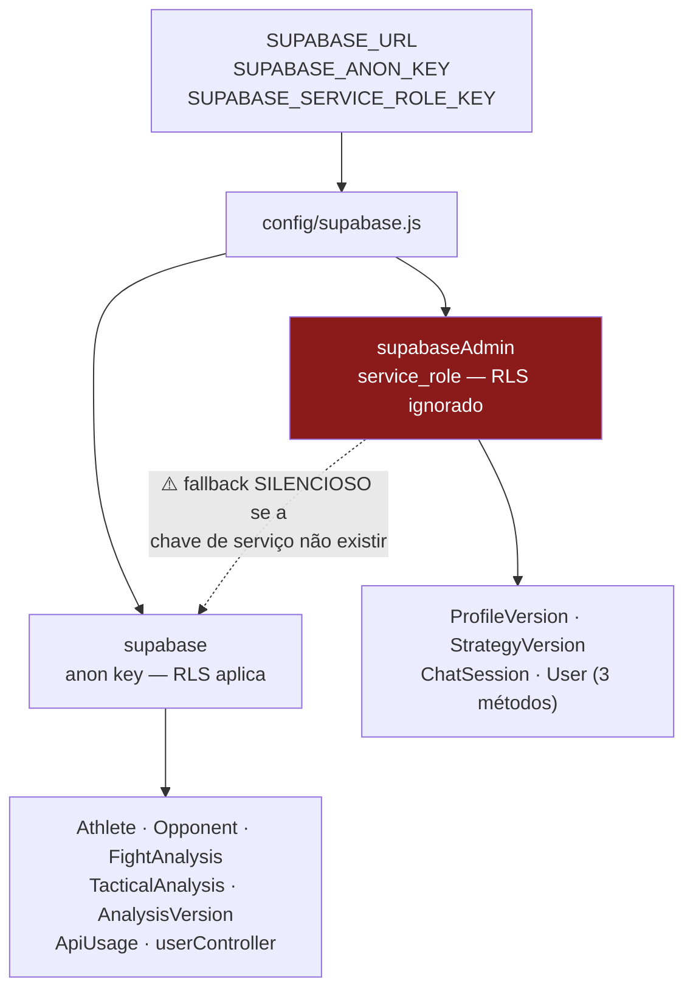
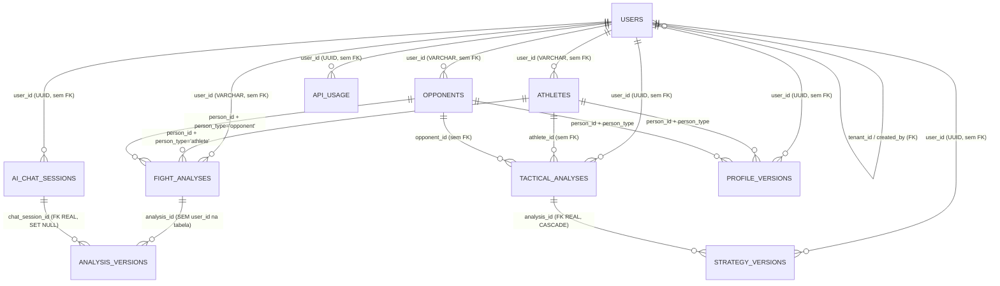

# DATABASE — JiuMetrics

> **Documenta o banco REAL, como derivado das migrations versionadas.** Nada foi alterado; nenhuma migration foi executada.
>
> **Fonte:** as 22 migrations em `server/migrations/`, os 10 models em `server/src/models/`, `server/src/config/supabase.js`. Verificado em 2026-08-12.
>
> ⚠️ **Limitação crítica deste documento:** as migrations **não são a fonte de verdade** do schema (ver §6). A tabela `users` nunca é criada por uma migration, e o estado real de RLS, constraints e GRANTs em produção **não foi consultado**. Tudo que depende disso está marcado `NEEDS_CONFIRMATION`.

---

## 1. Plataforma e acesso

| Item | Valor |
|---|---|
| Banco | PostgreSQL, hospedado no **Supabase** |
| Acesso | **exclusivamente via PostgREST** (`@supabase/supabase-js`) |
| ORM | **nenhum** |
| Query builder SQL | **nenhum** — só o builder do PostgREST (`.select`, `.eq`, `.in`, `.order`) |
| SQL cru em runtime | **nenhum** (os arquivos `.sql` são scripts manuais) |
| Migration runner | **nenhum** — aplicação manual via SQL Editor |

**Consequência de não haver ORM:** todo o mapeamento entre banco e aplicação é manual (`utils/dbParsers.js`), e a garantia de posse é uma convenção de chamada, não um recurso da ferramenta.

### Dois clientes



**Problema conhecido:** a divisão entre os dois clientes é arbitrária e sem regra documentada. Se `SUPABASE_SERVICE_ROLE_KEY` não estiver definida, `supabaseAdmin` **se torna** o cliente anon sem aviso — e as tabelas com política `auth.uid() = user_id` passam a rejeitar as operações (`ChatSession`, `ProfileVersion`, `StrategyVersion`).

---

## 2. Modelo de dados



**Leia este diagrama com atenção ao que está escrito nas arestas:** de 12 relacionamentos, apenas **4 são foreign keys reais**. As outras 8 são convenções mantidas pelo código.

---

## 3. Tabelas

### `users` ⚠️

**Nenhuma migration cria esta tabela.** Só recebe `ALTER` em `017`, `021` e `023`. Foi criada manualmente no dashboard do Supabase. O schema completo é **UNKNOWN**.

| Coluna | Tipo | Origem | Notas |
|---|---|---|---|
| `id` | UUID | UNKNOWN | PK |
| `name`, `email`, `password_hash` | — | UNKNOWN | **`UNIQUE` em `email`: NEEDS_CONFIRMATION** |
| `role` | VARCHAR(20) NOT NULL DEFAULT `'user'` | `017` | `'admin'` \| `'user'` (enum só no código) |
| `created_by` | UUID → `users(id)` ON DELETE SET NULL | `017` | **FK real** |
| `is_active` | BOOLEAN NOT NULL DEFAULT `true` | `017` | soft delete |
| `tenant_id` | UUID NOT NULL → `users(id)` | `021` | **FK real** — aponta para o admin-raiz do grupo |
| `token_version` | INTEGER NOT NULL DEFAULT 1 | `023` | invalidação de sessão |
| `last_login`, `created_at`, `updated_at` | — | UNKNOWN | |

**Índices:** `idx_users_role`, `idx_users_is_active` (`017`), `idx_users_tenant_id` (`021`).

**✅ Colunas reais (medidas em 2026-08-13):** `id, name, email, password_hash, role, is_active, created_by, tenant_id, token_version, last_login, created_at, updated_at` — 12 colunas, exatamente as inferidas das migrations. O schema deixa de ser UNKNOWN.

**População real:** 25 usuários · 3 admins · **0 inativos** · 2 tenants distintos · nenhum sem `tenant_id`.

**🔴 RLS: DESLIGADA ou permissiva — a chave anon lê a tabela inteira, incluindo `password_hash`.** Ver §4. É o achado de segurança mais grave do projeto.

**`UNIQUE` em `email`:** ainda **NEEDS_CONFIRMATION** (não determinável via PostgREST), mas **não há duplicatas hoje** — a constraint é aplicável sem limpeza.

### `athletes` e `opponents`

Criadas em `001` com **colunas idênticas**. Toda alteração posterior foi aplicada às duas.

| Coluna | Tipo | Origem |
|---|---|---|
| `id` | UUID PK DEFAULT `gen_random_uuid()` | `001` |
| `name` | VARCHAR(255) **NOT NULL** | `001` |
| `belt`, `style` | VARCHAR(50) / VARCHAR(100) | `001` |
| `weight`, `height` | DECIMAL(5,2) | `001` |
| `age`, `cardio` | INTEGER (cardio DEFAULT 0) | `001` |
| `strong_attacks`, `weaknesses`, `video_url` | TEXT | `001` |
| `technical_profile` | JSONB DEFAULT `'{}'` | `001` |
| `user_id` | **VARCHAR(255)**, nullable | `002` + `008` (convertida de UUID) |
| `technical_summary` | TEXT | `012` |
| `technical_summary_updated_at` | TIMESTAMPTZ | `012` |

**Índices:** `idx_athletes_name`, `idx_opponents_name` (`001`); `idx_athletes_user_id`, `idx_opponents_user_id` (`002`).
**Triggers:** `update_updated_at_column()` em UPDATE (`001`).
**RLS:** **DESLIGADO** (`008`, `009`).
**FK de `user_id`:** **removida** em `008` (apontava para `auth.users`).

### `fight_analyses`

| Coluna | Tipo | Origem |
|---|---|---|
| `id` | UUID PK | `001` |
| `person_id` | UUID **NOT NULL** | `001` |
| `person_type` | VARCHAR(20) NOT NULL **CHECK** (`'athlete'`,`'opponent'`) | `001` |
| `video_url` | TEXT | `001` |
| `charts` | JSONB DEFAULT `'[]'` | `001` |
| `summary`, `technical_profile` | TEXT | `001` |
| `frames_analyzed` | INTEGER DEFAULT 0 | `001` — resquício de caminho removido |
| `user_id` | **VARCHAR(255)**, nullable | `002` + `008` |
| `current_version` | INTEGER DEFAULT 1 | `010` |
| `is_edited` | BOOLEAN DEFAULT false | `010` |
| `original_summary` | TEXT | `010` |
| `original_charts` | JSONB | `010` |
| `technical_stats` | JSONB | `011` |

**Índices:** `idx_fight_analyses_person(person_id, person_type)`, `idx_fight_analyses_created(created_at DESC)` (`001`); `idx_fight_analyses_user_id` (`002`).
**RLS:** **DESLIGADO** (`008`, `009`).
⚠️ `person_id` é uma **FK polimórfica sem constraint** — pode apontar para `athletes` ou `opponents`, e nada garante que a linha exista.

### `tactical_analyses` (as "Estratégias")

| Coluna | Tipo | Origem |
|---|---|---|
| `id` | UUID PK | `007` |
| `user_id` | **UUID** NOT NULL | `007` |
| `athlete_id`, `opponent_id` | UUID NOT NULL | `007` |
| `athlete_name`, `opponent_name` | TEXT NOT NULL | `007` — **desnormalizados** |
| `strategy_data` | JSONB **NOT NULL** | `007` |
| `metadata` | JSONB | `007` |

**Índices:** `user_id`, `athlete_id`, `opponent_id`, `created_at DESC`.
**Trigger:** `update_tactical_analyses_updated_at()`.
**RLS:** **ligado, mas com políticas `USING (true)`** para SELECT/INSERT/DELETE (`007`) e UPDATE (`015`) — sem efeito prático. Os comentários das migrations dizem: *"Permitir leitura (backend já valida com user_id)"*.

### `ai_chat_sessions`

| Coluna | Tipo | Origem |
|---|---|---|
| `id` | UUID PK | `010` |
| `user_id` | UUID NOT NULL | `010` |
| `context_type` | VARCHAR(20) NOT NULL **CHECK** (`'analysis'`,`'strategy'`,`'profile'`) | `010` + `013` |
| `context_id` | UUID — **nullable** | `010`, alterada em `014` |
| `context_snapshot` | JSONB NOT NULL | `010` |
| `messages` | JSONB DEFAULT `'[]'` | `010` |
| `title` | VARCHAR(255) | `010` |
| `is_active` | BOOLEAN DEFAULT true | `010` |

**Índices:** `user_id`, `(context_type, context_id)`, `created_at DESC`.
**RLS:** ligado, políticas `USING (true)` para as 4 operações.

### `analysis_versions` ⚠️

| Coluna | Tipo | Origem |
|---|---|---|
| `id` | UUID PK | `010` |
| `analysis_id` | UUID NOT NULL | `010` |
| `analysis_type` | VARCHAR(20) NOT NULL **CHECK** (`'fight'`,`'tactical'`) | `010` |
| `version_number` | INTEGER NOT NULL DEFAULT 1 | `010` |
| `content` | JSONB NOT NULL | `010` |
| `edited_by` | VARCHAR(20) NOT NULL **CHECK** (`'user'`,`'ai'`,`'ai_suggestion'`) | `010` |
| `edit_reason` | TEXT | `010` |
| `is_current` | BOOLEAN DEFAULT false | `010` |
| `chat_session_id` | UUID → `ai_chat_sessions(id)` ON DELETE SET NULL | `010` — **FK real** |

⚠️ **Esta tabela não tem coluna `user_id`.** Não há como filtrar versões por dono sem alterar o schema. É a causa estrutural do vazamento AZ-3 em [`AUTHORIZATION.md`](./AUTHORIZATION.md#known-issues).

**Índices:** `(analysis_id, analysis_type)`, `(analysis_id, is_current) WHERE is_current = true` (parcial), `created_at DESC`.
**RLS:** ligado, `USING (true)` — só SELECT e INSERT têm política (não há UPDATE nem DELETE).

### `profile_versions`

| Coluna | Tipo | Origem |
|---|---|---|
| `id` | UUID PK | `013` |
| `person_id` | UUID NOT NULL | `013` |
| `person_type` | VARCHAR(20) NOT NULL **CHECK** | `013` |
| `user_id` | UUID **NOT NULL** | `013` |
| `version_number` | INTEGER NOT NULL DEFAULT 1 | `013` |
| `content` | TEXT **NOT NULL** | `013` |
| `edited_by` | VARCHAR(20) NOT NULL **CHECK** | `013` |
| `edit_reason` | TEXT | `013` |
| `is_current` | BOOLEAN DEFAULT false | `013` |

**Índices:** `(person_id, person_type)`, `user_id`, `(person_id, person_type, version_number DESC)`.
**RLS:** ligado, política `auth.uid() = user_id` **FOR ALL**. Como o model usa `supabaseAdmin`, a política é contornada e não bloqueia.
⚠️ **A tabela está vazia na prática** — `versionManager.saveProfileVersion` passa argumentos incompatíveis, o insert viola os `NOT NULL` e o erro é engolido. **NEEDS_CONFIRMATION:** `SELECT count(*) FROM profile_versions;` (esperado: 0).

### `strategy_versions`

| Coluna | Tipo | Origem |
|---|---|---|
| `id` | UUID PK | `016` |
| `analysis_id` | UUID NOT NULL → **`tactical_analyses(id)` ON DELETE CASCADE** | `016` — **FK real** |
| `user_id` | UUID NOT NULL | `016` |
| `version_number` | INTEGER NOT NULL DEFAULT 1 | `016` |
| `content` | JSONB NOT NULL | `016` |
| `edited_field` | VARCHAR(100) | `016` |
| `edited_by` | VARCHAR(20) NOT NULL **CHECK** (`'user'`,`'ai'`,`'system'`) | `016` |
| `edit_reason` | TEXT | `016` |
| `is_current` | BOOLEAN DEFAULT false | `016` |

**Índices:** `analysis_id`, `user_id`, `(analysis_id, version_number DESC)`, `(analysis_id, is_current) WHERE is_current = true` (parcial).
**RLS:** ligado, `auth.uid() = user_id` FOR ALL — contornado pelo `supabaseAdmin`.
✅ **É a única tabela com FK e CASCADE corretos:** apagar a estratégia apaga suas versões.

### `api_usage`

Criada e recriada **três vezes** (`003` → `004` com `DROP TABLE ... CASCADE` → `006`), com políticas diferentes em cada.

| Coluna | Tipo |
|---|---|
| `id` | UUID PK DEFAULT `uuid_generate_v4()` |
| `user_id` | UUID NOT NULL — a FK para `auth.users(id)` de `003` foi removida em `004`/`006` |
| `model_name` | VARCHAR(100) NOT NULL |
| `operation_type` | VARCHAR(50) NOT NULL |
| `prompt_tokens`, `completion_tokens`, `total_tokens` | INTEGER NOT NULL DEFAULT 0 |
| `estimated_cost_usd` | DECIMAL(10,6) NOT NULL DEFAULT 0 |
| `metadata` | JSONB DEFAULT `'{}'` |

**Índices:** `user_id`, `created_at`, `model_name`.
**RLS:** ligado, `auth.uid() = user_id` para SELECT e INSERT.
**GRANTs:** `004` executa `GRANT ALL ON public.api_usage TO anon, authenticated`.
✅ **VERIFICADO em 2026-08-13 — a tabela FUNCIONA.** 173 linhas, de 2025-12-14 a 2026-08-12, **US$ 3,0295** acumulados (inclusive registros do multi-agente já removido).

A auditoria concluiu que o insert seria rejeitado, porque o model usa o cliente anon contra a política `auth.uid() = user_id`. **A conclusão estava errada:** a política **não está ativa em produção** — a chave anon lê a tabela sem restrição (ver §4). O estado real divergiu das migrations `004`/`006`.

⚠️ **Dívida menor que permanece:** 55 das 173 linhas têm `estimated_cost_usd = 0`, e há um `operation_type` (`strategy_chat`) fora da lista documentada. Qualidade de dado, não persistência.

---

## 4. Estado de RLS — visão consolidada

| Tabela | RLS | Política | Cliente usado pelo código | Efeito real |
|---|---|---|---|---|
| `athletes` | **OFF** (`008`,`009`) | — | anon | acesso total com a chave anon |
| `opponents` | **OFF** (`008`,`009`) | — | anon | acesso total com a chave anon |
| `fight_analyses` | **OFF** (`008`,`009`) | — | anon | acesso total com a chave anon |
| `tactical_analyses` | ON | `USING (true)` | anon | sem efeito |
| `ai_chat_sessions` | ON | `USING (true)` | **admin** | sem efeito |
| `analysis_versions` | ON | `USING (true)` (SELECT/INSERT) | anon | sem efeito |
| `profile_versions` | ON | `auth.uid() = user_id` | **admin** | contornada |
| `strategy_versions` | ON | `auth.uid() = user_id` | **admin** | contornada |
| `api_usage` | ON nas migrations, **inativa na prática** | `auth.uid() = user_id` | anon | ❌ **não bloqueia** — verificado: grava e é lida pela chave anon |
| `users` | UNKNOWN | UNKNOWN | anon | NEEDS_CONFIRMATION |

**Conclusão (revisada após medição):** o banco **não reforça autorização em nenhuma tabela, exceto `profile_versions`** — a única onde a política de fato bloqueia a chave anon. Toda a autorização vive na aplicação. Ver [ADR-002](./decisions/002-rls-desligado-autorizacao-na-aplicacao.md) e [ADR-009](./decisions/009-acesso-ao-banco-exclusivamente-por-service-role.md).

### ✅ Estado REAL medido (2026-08-13, spec 002)

Teste empírico: tentativa de `SELECT` em cada tabela **com a chave anon**. Responde RLS e GRANTs de uma vez.

| Tabela | anon lê? | Linhas expostas |
|---|---|---|
| `users` | ⚠️ **SIM** | **25 — incluindo `password_hash` (bcrypt `$2b$`) e `email`** |
| `athletes` | ⚠️ SIM | 37 |
| `opponents` | ⚠️ SIM | 38 |
| `fight_analyses` | ⚠️ SIM | 285 |
| `tactical_analyses` | ⚠️ SIM | 41 |
| `ai_chat_sessions` | ⚠️ SIM | 285 |
| `analysis_versions` | ⚠️ SIM | 27 |
| `strategy_versions` | ⚠️ SIM | 47 |
| `api_usage` | ⚠️ SIM | 173 |
| `profile_versions` | ✅ **não** | única protegida — a política `auth.uid() = user_id` está ativa aqui |

**Escrita:** um `INSERT` com a chave anon é recusado por violação de `NOT NULL`, **não** por permissão — com dados válidos seria aceito.

**Conclusão:** 9 de 10 tabelas estão abertas à chave publicável que está commitada no git. **`profile_versions` é a única exceção**, o que também explica por que ela é a única tabela cuja política de fato bloqueia — e por que `ProfileVersion` precisa usar `supabaseAdmin`.

Isto **eleva a prioridade da [spec 008](../specs/008-database-access-lockdown/spec.md)**: a exposição de hashes de senha é materialmente mais grave do que a auditoria estimou.

### Consultas de catálogo que permanecem pendentes

Não executáveis via PostgREST (não há RPC de SQL cru nem senha do Postgres no `.env`). Para o proprietário rodar no SQL Editor — **não bloqueiam nenhuma spec**, porque o teste empírico acima já responde o que importa:

```sql
SELECT tablename, rowsecurity FROM pg_tables WHERE schemaname = 'public';
SELECT * FROM pg_policies WHERE schemaname = 'public';
SELECT grantee, table_name, privilege_type
  FROM information_schema.role_table_grants
 WHERE grantee IN ('anon', 'authenticated');
```

---

## 5. Constraints e integridade

### Foreign keys existentes — apenas 4

| FK | Tabela | Ação |
|---|---|---|
| `created_by → users(id)` | `users` | ON DELETE SET NULL |
| `tenant_id → users(id)` | `users` | — |
| `chat_session_id → ai_chat_sessions(id)` | `analysis_versions` | ON DELETE SET NULL |
| `analysis_id → tactical_analyses(id)` | `strategy_versions` | **ON DELETE CASCADE** |

### Foreign keys ausentes — e por quê

A migration `008` **derruba deliberadamente** `athletes_user_id_fkey`, `opponents_user_id_fkey` e `fight_analyses_user_id_fkey`, e converte `user_id` de UUID para VARCHAR(255). O motivo está escrito na própria migration: as FKs apontavam para `auth.users` (Supabase Auth), que o projeto abandonou em favor do JWT próprio. **A correção escolhida foi remover a FK, não reapontá-la para `public.users`.** Ver [ADR-001](./decisions/001-jwt-proprio-em-vez-de-supabase-auth.md).

### `UNIQUE` — nenhuma em todo o diretório de migrations

Consequências verificadas no código:

| Falta | Consequência |
|---|---|
| `users.email` | `createUser`/`register` checam existência e depois inserem → race condition. Com e-mail duplicado, `findByEmail().single()` passa a lançar erro em **todo login** daquele e-mail |
| `(analysis_id, version_number)` nas 3 tabelas de versão | número calculado no app (`length + 1` ou `MAX + 1`) sem transação → duas edições simultâneas geram versões com o mesmo número |
| `is_current` único por conteúdo | `setAsCurrent` faz "update todas → marca uma" sem transação → nada impede duas versões atuais |

**✅ MEDIDO em 2026-08-13 — nenhuma duplicata existe hoje:** zero e-mails duplicados em `users` (25 linhas); zero pares `(analysis_id, version_number)` duplicados em `analysis_versions` (27), `profile_versions` (5) e `strategy_versions` (47). **Todas as constraints `UNIQUE` são aplicáveis sem limpeza prévia.**

Se as constraints já existem em produção (criadas via dashboard) permanece **NEEDS_CONFIRMATION** — não é determinável via PostgREST. Mas isso não bloqueia: aplicá-las é idempotente na prática, já que não há violação.

### `CHECK` existentes

`fight_analyses.person_type`, `ai_chat_sessions.context_type`, `analysis_versions.analysis_type`, `analysis_versions.edited_by`, `profile_versions.person_type`, `profile_versions.edited_by`, `strategy_versions.edited_by`.

⚠️ `POST /api/ai/analyze-link` **não valida** `person_type` no código e depende do CHECK — e o erro resultante é engolido.

### Tipos divergentes de `user_id`

| Tipo | Tabelas |
|---|---|
| **VARCHAR(255)** | `athletes`, `opponents`, `fight_analyses` |
| **UUID** | `tactical_analyses`, `ai_chat_sessions`, `profile_versions`, `strategy_versions`, `api_usage` |

Consequências reais:

1. Nas três primeiras, o banco aceita **qualquer string** como `user_id` — não valida forma.
2. A migration `019` precisa de cast explícito (`user_id::UUID = ANY(...)`) e de filtrar `user_id <> ''` — evidência de que já existiu dado sujo.
3. Nenhuma FK é possível sem unificar o tipo antes.
4. **Mascara bugs:** `Athlete.updateTechnicalProfile` é chamada sem o `userId` e acaba comparando `user_id` com a string `'undefined'`. Com coluna UUID isso teria estourado erro e o bug apareceria; com VARCHAR, retorna zero linhas em silêncio.

### `user_id` nullable

`002` apenas faz `ADD COLUMN`, sem `NOT NULL`. Um registro com `user_id` nulo fica **invisível para todos**, porque toda leitura filtra por `user_id`. Os arquivos `server/DEBUG_ANALYSES.sql` e `server/FIX_USER_ID.sql` existem justamente para caçar esses órfãos.
**✅ MEDIDO em 2026-08-13:** `athletes` **4 de 37** · `opponents` **1 de 38** · `fight_analyses` **62 de 285** com `user_id` nulo — **67 registros invisíveis a todos os usuários**. Nenhum com string vazia.

**✅ Zero valores não-UUID** nas três tabelas → a conversão VARCHAR→UUID da [spec 011](../specs/011-schema-integrity/spec.md) é viável **sem perda de linhas**. Restam apenas os 67 órfãos a decidir (atribuir a um dono ou excluir).

---

## 6. Migrations

22 arquivos em `server/migrations/`, numerados `001`–`019`, `021`–`023`.

### Problemas conhecidos

1. **A tabela `users` nunca é criada** — só `ALTER`. Foi criada manualmente.
2. **Falta a `020`** — a numeração salta. UNKNOWN se existiu e foi perdida.
3. **Sem runner e sem controle de estado** — o `README.md` do diretório instrui a colar SQL no editor do Supabase, na ordem, à mão. **Não há tabela de migrations aplicadas**, então não se sabe o que está em produção.
4. **O README está desatualizado** — documenta até a `009` e diz *"Execute sempre na ordem numérica (001 → 009)"*, ignorando 13 migrations posteriores.
5. **Migrations se contradizem:** RLS é ligado/desligado 4 vezes (`001` cria políticas → `002` desliga → `005` recria `USING (true)` → `008`/`009` desligam). `api_usage` é criada 3 vezes (`003` → `004` com `DROP CASCADE` → `006`).
6. **PII versionada:** `017` contém **8 e-mails pessoais reais**; `019` e `022` também têm e-mails hardcoded; `server/FIX_USER_ID.sql` referencia o nome de uma pessoa real.
7. **Operação destrutiva não idempotente:** `018` executa `UPDATE users SET role = 'user';` — **sem `WHERE`** — e depois repromove um e-mail hardcoded. **Reexecutar essa migration em produção rebaixa todos os admins criados desde então.**
8. **Fósseis de Supabase Auth:** `003` cria FK para `auth.users`; `FIX_USER_ID.sql` consulta `auth.users`. O projeto não usa Supabase Auth.

**Efeito combinado: é impossível reconstruir o banco a partir do repositório.** Qualquer trabalho de schema começa com arqueologia no dashboard.

### Índice das migrations

| # | Arquivo | O que faz |
|---|---|---|
| 001 | `001-schema.sql` | cria `athletes`, `opponents`, `fight_analyses`, índices, triggers, RLS + políticas permissivas |
| 002 | `002-add-user-id.sql` | adiciona `user_id` VARCHAR, índices; **desliga RLS** |
| 003 | `003-api-usage.sql` | cria `api_usage` com FK para `auth.users` |
| 004 | `004-api-usage-final.sql` | **DROP CASCADE** + recria `api_usage`; GRANT para `anon`/`authenticated` |
| 005 | `005-fix-policies.sql` | recria políticas `USING (true)` |
| 006 | `006-fix-api-usage-policy.sql` | recria `api_usage` e políticas `auth.uid() = user_id` |
| 007 | `007-tactical-analyses.sql` | cria `tactical_analyses` + políticas `USING (true)` |
| 008 | `008-corrigir-constraint.sql` | **derruba as FKs de `user_id`**, converte para VARCHAR, **desliga RLS** |
| 009 | `009-execute-este.sql` | reaplica `user_id` + índices, **desliga RLS** |
| 010 | `010-ai-chat-sessions.sql` | cria `ai_chat_sessions` e `analysis_versions`; adiciona colunas de versão em `fight_analyses` |
| 011 | `011-add-technical-stats.sql` | adiciona `fight_analyses.technical_stats` |
| 012 | `012-technical-summary.sql` | adiciona `technical_summary` em `athletes` e `opponents` |
| 013 | `013-add-profile-chat-type.sql` | inclui `'profile'` no CHECK de `context_type`; cria `profile_versions` |
| 014 | `014-allow-null-context-id.sql` | torna `context_id` nullable |
| 015 | `015-add-update-policy.sql` | adiciona política de UPDATE em `tactical_analyses` |
| 016 | `016-strategy-versions.sql` | cria `strategy_versions` com FK CASCADE |
| 017 | `017-add-user-roles.sql` | adiciona `role`, `created_by`, `is_active`; **promove 8 e-mails hardcoded** |
| 018 | `018-fix-admin-roles.sql` | ⚠️ `UPDATE users SET role='user'` **sem WHERE** + repromove 1 e-mail |
| 019 | `019-consolidate-data-to-owner.sql` | move dados de várias contas para uma; desativa as contas de origem |
| — | **020** | **AUSENTE** |
| 021 | `021-add-tenant-id.sql` | adiciona `tenant_id` + FK, propaga em até 3 níveis, torna NOT NULL |
| 022 | `022-fix-tenant-id-migrated-users.sql` | corrige `tenant_id` dos usuários migrados na `019` |
| 023 | `023-add-token-version.sql` | adiciona `token_version` |

### Scripts soltos (não são migrations)

`server/DEBUG_ANALYSES.sql` e `server/FIX_USER_ID.sql` — scripts de diagnóstico/correção pontual, rastreados no git na raiz do `server/`. Contêm PII e consultam `auth.users`.

---

## 7. Queries e ownership

### Padrão de leitura

```js
const allowedUserIds = await resolveScope(req.actor);   // admin → grupo; user → só ele (services/authorization.js, spec 005)
await supabase.from('tabela').select('*').in('user_id', allowedUserIds);
```

### Padrão de escrita

```js
await supabase.from('tabela').update(dados).eq('id', id).eq('user_id', ownerRealDoRegistro);
```

Desde a [spec 006](../specs/006-ownership-in-data-access/spec.md) o escopo é **obrigatório na assinatura** dos métodos de model: chamada sem ele lança `MissingScopeError` em vez de devolver `null` ou lista vazia. `utils/scopeGuard.js#requireScope` é o guard, e rejeita também `[undefined]` — o valor que chega quando o chamador passa uma variável inexistente.

### Ownership por model

| Model | Leitura | Escrita |
|---|---|---|
`TacticalAnalysis` | ✅ `.in('user_id')` em todos | ✅ em todos — **model exemplar** |
`Athlete` / `Opponent` | ✅ | ✅ `.eq('user_id')` |
`FightAnalysis` | ✅ `getByIdAndUser` / `getAll` / `getByPersonId` | ✅ **`update`/`delete` filtram e EXIGEM escopo** (spec 006) |
`AnalysisVersion` | ✅ autoriza pela **análise pai** (spec 006, decisão P4 — a tabela não tem `user_id`) | ✅ idem |
`ProfileVersion` | ✅ | ✅ |
`StrategyVersion` | ✅ | ✅ |
`ChatSession` | ✅ em `getById`/`getByContext`/`delete` | ✅ `addMessage`/`addMessages`/`updateContextSnapshot` exigem o dono (spec 006) |
`ApiUsage` | ✅ | ✅ |
`User` | ✅ por tenant | ✅ |

### Riscos de query

- **Sem paginação:** `Athlete.getAll`, `Opponent.getAll`, `FightAnalysis.getAll` trazem todas as linhas do escopo. Só `TacticalAnalysis.getAll` aceita `limit`/`offset` — e o frontend descarta o `total` que ele devolve.
- **Query mais perigosa:** era `GET /api/fight-analysis/debug/all` (`select('*')` sem filtro nem paginação) — **removida na spec 002**. As restantes são as listagens sem paginação abaixo.
- **Não há N+1.** `Athlete.getAll` usa 3 queries paralelas com agregação em memória — escolha consciente, dado que o PostgREST não faz `GROUP BY` facilmente. `FightAnalysis.getAll` busca nomes de criadores em lote e só quando o grupo tem mais de um membro.
- **SQL injection: não aplicável** — o builder do PostgREST parametriza, e não há SQL concatenado em runtime.

### Fronteira `snake_case` × `camelCase`

`utils/dbParsers.js` traduz — **apenas** para `Athlete`, `Opponent` e `FightAnalysis`. Os outros 7 models expõem `snake_case` cru (alguns têm `parseFromDB` próprio, com convenções diferentes).

**Esta inconsistência é a causa-raiz de uma classe de bugs.** Exemplo verificado: a resposta imediata de `POST /api/ai/analyze-link` traz `technical_stats`, mas o mesmo dado lido do banco vem `technicalStats` — e os componentes de histórico do frontend leem `technical_stats`. As estatísticas técnicas aparecem só logo após analisar, nunca no histórico.

---

## 8. Direção futura

> **Nada implementado.**
>
> 🎯 A classificação completa — **Required Now** / **Useful Later** / **Do Not Change**, com impacto, risco, rollback e estratégia de migração por item — está em [`../JIU_METRICS_REFACTORING_PLAN.md`](../JIU_METRICS_REFACTORING_PLAN.md) §8. Spec: [011](../specs/011-schema-integrity/spec.md).

### Decidido (`PLANNED`)

**Revogar GRANTs de `anon`/`authenticated`; backend acessa por `service_role`** — ver [ADR-009](./decisions/009-acesso-ao-banco-exclusivamente-por-service-role.md).

**Unificar `athletes` e `opponents`** numa entidade com marcação de papel — ver [ADR-007](./decisions/007-unificar-athlete-e-opponent-numa-entidade-com-papel.md). É a migração de **maior risco** do projeto: toca `person_id` polimórfico, `athlete_id`/`opponent_id` e `profile_versions.person_id`, todos sem FK. Depende de unificar o tipo de `user_id` antes.

### Em consideração (sem decisão)

- **Baseline de schema real** via `pg_dump --schema-only`, commitado, + adoção do Supabase CLI como runner.
- **Unificar `user_id` em UUID** e recriar as FKs para `public.users(id)`. Requer limpeza de órfãos antes.
- **Constraints faltantes:** `UNIQUE(users.email)`, `UNIQUE(analysis_id, version_number)`, índice único parcial em `is_current`.
- **Resolver a autorização de `analysis_versions`** — decidir entre `JOIN` com a análise pai ou adicionar `user_id` denormalizado.
- **`NOT NULL` em `user_id`** após limpar órfãos.
- **Paginação** nas listagens e endpoints de `count` para o dashboard.

---

## Ver também

- [`DOMAIN.md`](./DOMAIN.md) — o significado de cada entidade
- [`AUTHORIZATION.md`](./AUTHORIZATION.md) — como o ownership é aplicado (e onde falha)
- [`ARCHITECTURE.md`](./ARCHITECTURE.md) — camada de acesso a dados
- [`../AUDIT.md`](../AUDIT.md) §7 — evidência em `arquivo:linha`
