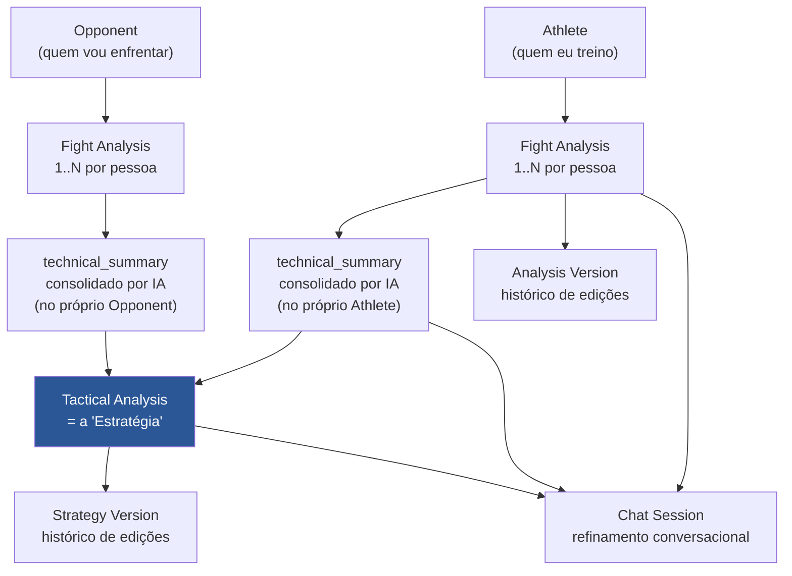
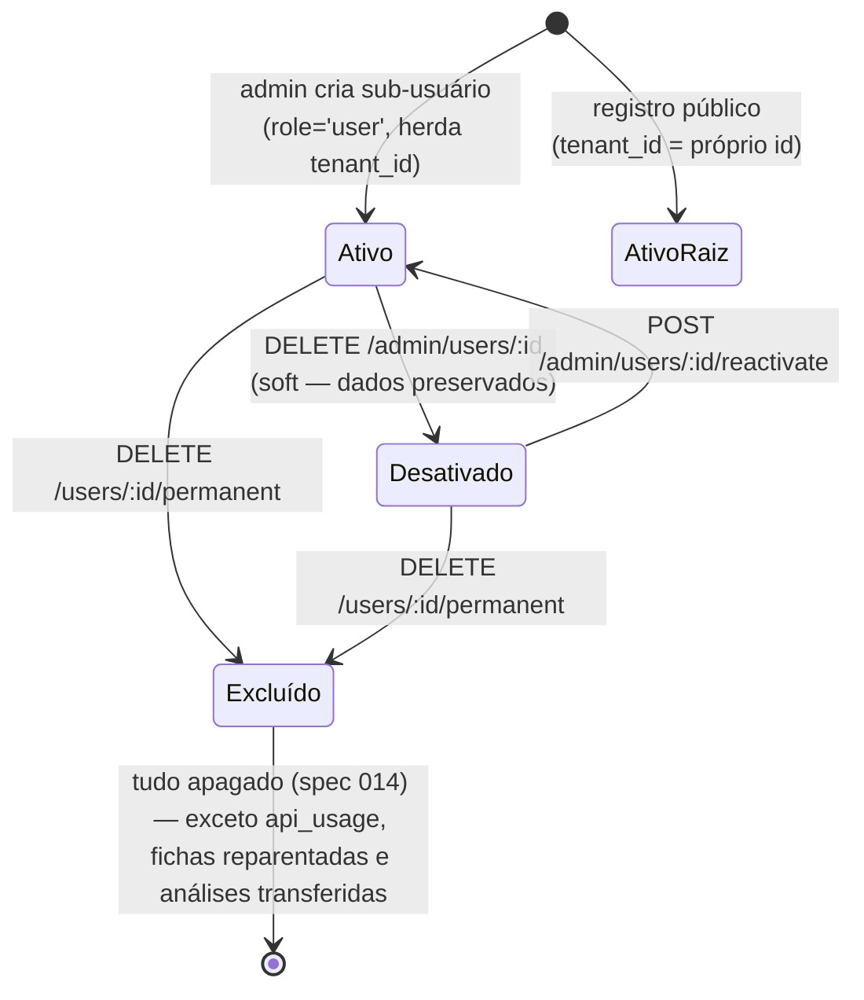
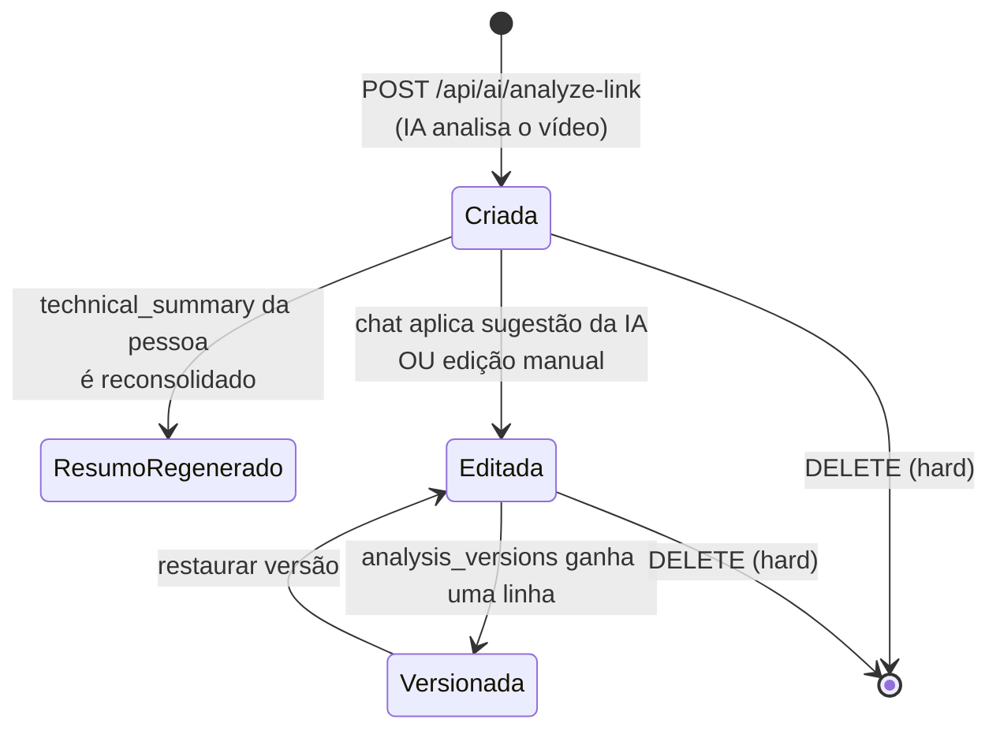
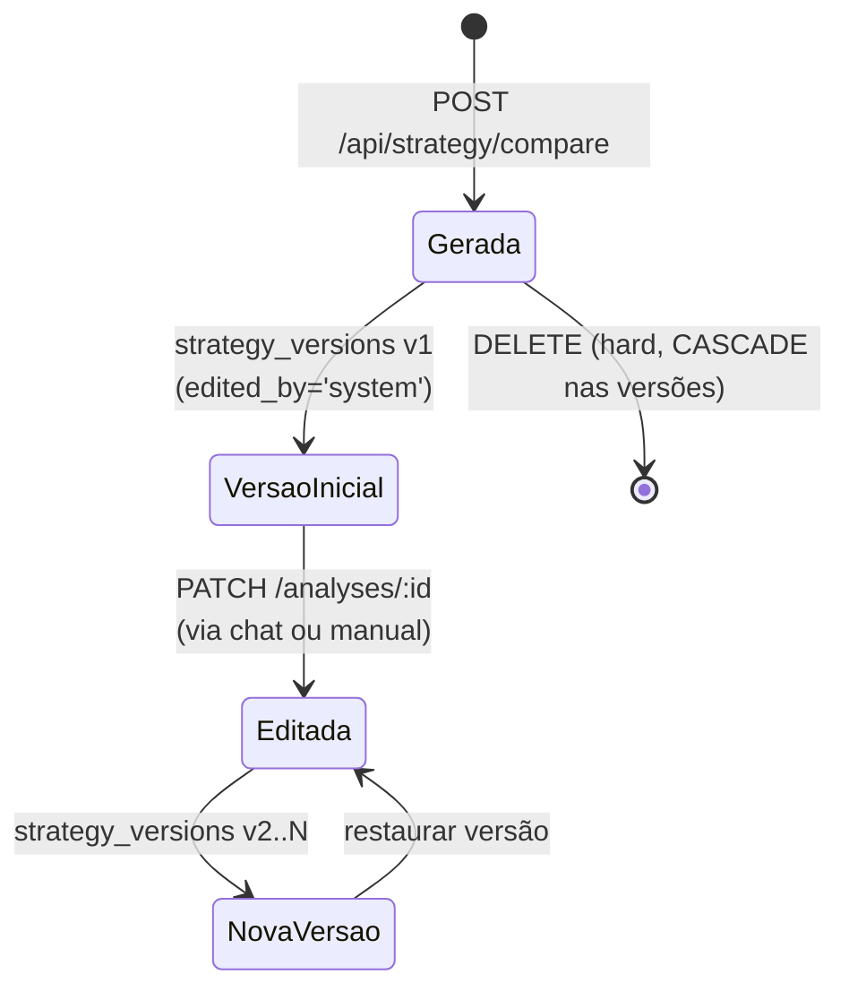
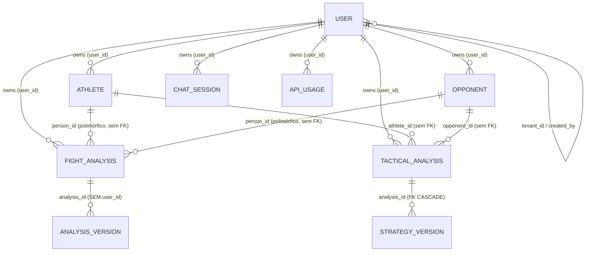

# DOMAIN — JiuMetrics

> **Documenta o domínio que EXISTE HOJE.** Entidades foram extraídas do código e das migrations reais, não de intenção de produto.
>
> **Fonte:** `server/src/models/`, `server/src/controllers/`, `server/migrations/`, verificado em 2026-08-12 contra `main` (`895066f`).
>
> **Nada aqui foi inventado.** O que o código não permite determinar está marcado `UNKNOWN` ou `NEEDS_CONFIRMATION`.

---

## 1. O produto, em uma frase

JiuMetrics analisa vídeos de luta de Jiu-Jitsu com IA para produzir um perfil técnico de cada lutador e, cruzando dois perfis, gerar um plano tático de como vencer um adversário específico.

## 2. Fluxo principal — real

**Regra de porta que define o produto:** não é possível gerar estratégia sem que **atleta e adversário tenham ao menos uma análise de luta cada**. A estratégia não é uma opinião sobre atributos cadastrados — ela é derivada de vídeo analisado. Se falta análise de um dos lados, o fluxo para com erro específico dizendo qual lado falta (`strategyService.js#generateStrategy`).

### Traduzindo os nomes (importante)

O vocabulário do código colide com o da UI. Sem isso, nada abaixo faz sentido:

| Termo | Significa | Onde vive |
|---|---|---|
| **"Fight Analysis"** / "Análise" | análise de **um ou mais vídeos** de uma pessoa | tabela `fight_analyses` |
| **"Strategy"** / "Estratégia" | o plano tático atleta × adversário | tabela **`tactical_analyses`** |
| **"Análises"** (tela `/analyses`) | lista de **estratégias** (`tactical_analyses`), não de análises de luta | `pages/Analyses.jsx` |
| **"Analysis Version"** | versão de uma `fight_analysis` | `analysis_versions` |
| **"Strategy Version"** | versão de uma `tactical_analysis` | `strategy_versions` |
| **"Profile Version"** | versão do `technical_summary` de uma pessoa | `profile_versions` |

A palavra "análise" designa três coisas diferentes, e "estratégia" é persistida com o nome `tactical_analyses`. **Ao ler qualquer código deste repo, confirme de qual das três se trata.**

---

## 3. Entidades

### 3.1 User

**Responsabilidade** — identidade, credencial, papel, pertencimento a grupo e estado da conta.

**Onde vive** — `models/User.js`, `controllers/userController.js`, `controllers/authController.js`, `middleware/auth.js`, tabela `users`.
⚠️ A tabela `users` **não é criada por nenhuma migration** (só recebe `ALTER` em `017`/`021`/`023`). Foi criada manualmente. O schema real completo é `UNKNOWN`.

**Relacionamentos**

- `created_by → users.id` — quem criou (FK real, migration `017`)
- `tenant_id → users.id` — o admin-raiz do grupo (FK real, migration `021`)
- É dono (`user_id`) de **todas** as outras entidades — **sem FK em nenhuma delas**

**Ownership** — raiz de tudo. Cada linha de dado no sistema pertence a um `user_id`.

**Ciclo de vida**

**Campos novos (spec 014)** — `profile` (`VARCHAR(30) NOT NULL DEFAULT 'atleta'`, `CHECK` em `atleta|professor|nutricionista|fisioterapeuta|preparador_fisico`, independente de `role`) e `must_change_password` (`BOOLEAN NOT NULL DEFAULT false`, ligado na criação pelo admin, desligado na primeira troca de senha bem-sucedida).

**Regras de negócio** (`IMPLEMENTED`)

1. Existem exatamente **dois papéis** de permissão: `admin` e `user`. Desde a spec 014, a conta também tem um **perfil** (`profile`) independente do papel — ver §4 para o efeito no escopo.
2. Sub-usuário criado por admin **herda o `tenant_id` do criador**, nasce com o `role` e o `profile` que o admin escolher (default `role: 'user'`, `profile: 'atleta'`), e sempre com `must_change_password: true` (spec 014).
3. Usuário de registro público é **seu próprio tenant** (`tenant_id = id`).
4. Registro público está **desabilitado por padrão** (`ALLOW_PUBLIC_REGISTER`).
5. Admin **não pode** desativar, excluir nem alterar o próprio papel. Desde a spec 014, também não pode **remover o último admin ativo** do tenant (`changeRole` conta admins ativos antes de rebaixar) — a checagem é "ler depois escrever", sem lock nem constraint de banco, e por isso não fecha uma corrida entre dois admins rebaixando um ao outro na mesma janela (dívida registrada em comentário no controller).
6. Toda operação admin sobre outro usuário exige **mesmo `tenant_id`** (`assertSameTenant`), que devolve **404**, nunca 403, para não vazar a existência de conta de outro tenant.
7. Desativar, trocar o papel, trocar o `profile` (spec 014) ou trocar a própria senha **incrementa `token_version`**, invalidando as sessões vivas do usuário imediatamente, e evicta o cache de auth (`evictAuthCache`).
8. **Exclusão permanente apaga tudo** (spec 014, substitui a regra anterior de "transferir ou apagar" — **não há mais opção de transferência**, e `transferToUserId` no corpo é 400): fichas geridas (`athletes.user_id = id`) ou vinculadas (`athletes.account_user_id = id`), suas `fight_analyses`, `analysis_versions` e `profile_versions`, os `opponents` geridos e as `fight_analyses`/`profile_versions` deles, as `tactical_analyses` (com cascata de `strategy_versions` no banco) e as `ai_chat_sessions`. `api_usage` é **preservado** (decisão do proprietário, 2026-09-24) para auditoria em SQL — mas o id excluído sai de `getGroupUserIds`, então essas linhas **deixam de contar** no orçamento mensal (spec 009) e na tela de uso. **Exceção decidida pelo controller, não pela spec original:** uma ficha **gerida** pela conta excluída mas **vinculada** (`account_user_id`) a outra conta viva **dentro do escopo do chamador** não é apagada — é **reparentada** (`user_id` passa a ser o `account_user_id`), junto com suas análises e versões de perfil; contada em `deleted.reparentedAthletes`. Uma ficha vinculada a uma conta **fora** do escopo do chamador não reparenta e é apagada como qualquer outra. **Segunda exceção, também do controller (revisão final da spec 014, 2026-09-24 — o proprietário pode reverter):** `fight_analyses`/`profile_versions` **escritas pela conta** sobre uma pessoa que **sobrevive** à purga (ficha ou adversário do tenant fora do conjunto de exclusão — ex.: o atleta autogerido que o professor excluído analisou) são **transferidas** ao gestor dessa pessoa (`user_id` da ficha/adversário), contadas em `deleted.reassignedAnalyses`/`deleted.reassignedProfileVersions`; se a pessoa vai ser apagada, ou não é encontrada no tenant, a linha é apagada. Ver `User.js#purgeAccount` para a ordem exata (coleta tudo antes de escrever; reparent antes das exclusões; filhos antes de pais) e [ADR-014](./decisions/014-dois-eixos-na-conta-e-time-de-confianca.md)/a spec 014 para o raciocínio completo. **A raiz do tenant não pode ser excluída enquanto houver outros membros** (409) — `users.tenant_id → users(id)` não tem `ON DELETE`, e apagar a raiz com o grupo vivo deixaria a purga feita e só a própria linha falhando.
9. Dados de usuário **desativado continuam visíveis ao grupo** (decisão deliberada, comentada em `User.js`).
10. Senha: mínimo 6 caracteres, hash `bcrypt` com 10 rounds. Sem requisito de complexidade. Troca pelo próprio usuário (`POST /api/auth/change-password`, spec 014) exige a senha atual — inclusive quando é a provisória.

**NEEDS_CONFIRMATION**
- Existe constraint `UNIQUE` em `users.email`? Nenhuma migration cria uma. Sem ela, a criação de usuário tem race condition (checa-depois-insere).
- Um admin promover outro membro do tenant a admin é intenção de produto? O código permite (`PATCH /admin/users/:id/role`).
- `tenant_id` deve suportar hierarquia de mais de um nível? A migration `021` propaga em até 3 níveis, mas `createSubUser` sempre herda do criador direto e `getGroupUserIds` é plano.

---

### 3.2 Athlete e Opponent

**Tratados juntos porque são a mesma coisa no código.** Mesmas colunas, models idênticos (`models/Opponent.js` é cópia de `models/Athlete.js`), mesmo parser (`parseOpponentFromDB = parseAthleteFromDB`). A distinção é **puramente semântica**.

| | Significado |
|---|---|
| **Athlete** | o lutador que o usuário treina/representa |
| **Opponent** | o lutador que vai ser enfrentado |

**Responsabilidade** — representar um lutador: atributos declarados pelo usuário + perfil técnico derivado de IA.

**Campos** — `name` (único obrigatório), `belt`, `weight`, `height`, `age`, `style`, `strong_attacks`, `weaknesses`, `video_url`, `cardio`, `technical_profile` (JSONB), `technical_summary` (TEXT, gerado por IA), `technical_summary_updated_at`, `user_id`, e (só em `athletes`, spec 014) `account_user_id`.

**`account_user_id` (só `athletes`, spec 014)** — `UUID NULL UNIQUE REFERENCES users(id) ON DELETE SET NULL`. Semântica: **a conta da própria pessoa** — o atleta cujo `athletes.name` é este registro. É um campo diferente de `user_id`: `user_id` (VARCHAR, sem FK) continua sendo **quem gerencia** a ficha (o professor que cadastrou, o próprio atleta, ou qualquer admin do tenant); `account_user_id` é **quem é** a ficha, quando essa pessoa tem conta no sistema. Os dois podem divergir (um professor gerencia a ficha de um aluno cuja conta é outra) ou coincidir (o atleta se cadastrou e depois vinculou a própria conta). `UNIQUE` garante no máximo uma ficha por conta. `opponents` **não** ganha esta coluna — adversário não tem conta (ver [ADR-007](./decisions/007-unificar-athlete-e-opponent-numa-entidade-com-papel.md); se a unificação de `athletes`/`opponents` vier, a coluna migra junto).

**Relacionamentos**

- `user_id` → gestor (**sem FK**, tipo `VARCHAR(255)`)
- `account_user_id` (só `athletes`) → a conta da própria pessoa (**FK real**, `UUID`, `ON DELETE SET NULL`, spec 014)
- referenciado por `fight_analyses.person_id` + `person_type` — **FK polimórfica sem constraint**
- referenciado por `tactical_analyses.athlete_id` / `opponent_id` — **sem FK**
- referenciado por `profile_versions.person_id` + `person_type` — **sem FK**

**Ownership** — `user_id`. Leitura filtra com `.in('user_id', allowedUserIds)`; escrita com `.eq('user_id', userId)`.

**Ciclo de vida** — criado manualmente pelo usuário (formulário ou QuickAdd) → recebe análises de luta → ganha `technical_summary` consolidado por IA → pode ser editado, inclusive o resumo via chat → deletado por hard delete.

**Regras de negócio** (`IMPLEMENTED`)

1. Só `name` é obrigatório na criação.
2. ~~**Defaults são fabricados quando o campo é omitido**~~ ✅ **Resolvido na [spec 013](../specs/013-athletes-opponents-consolidation/spec.md):** campo omitido é `null` e a UI mostra só o que foi informado. `belt` passou a ser **obrigatória** na criação (enum fechado), porque uma faixa ausente desligava as regras IBJJF na estratégia.
3. `technical_summary` é **regenerado automaticamente** ao criar ou deletar uma análise da pessoa.
4. Se a pessoa fica com **zero** análises, o `technical_summary` é **limpo**.
5. `belt` alimenta as regras IBJJF na geração de estratégia (ver §3.5, regra 4). Faixa vazia ou desconhecida cai no conjunto mais restritivo (branca).
6. `update` no model usa **allow-list explícita** de campos — não há mass assignment, mesmo o controller passando `req.body` inteiro.

**Problema conhecido** — `technical_profile` (JSONB) **nunca é atualizado** pelo fluxo de criação de análise: `Athlete.updateTechnicalProfile` é chamada com 2 de 3 argumentos e retorna `null` em silêncio.

**NEEDS_CONFIRMATION** — devem permanecer duas entidades separadas? Decisão registrada em [ADR-007](./decisions/007-unificar-athlete-e-opponent-numa-entidade-com-papel.md): **unificar** com marcação de papel (`PLANNED`, não implementado). Motivo original da separação, segundo o proprietário: distinguir os dois lados ao montar a estratégia.

---

### 3.3 Fight Analysis

**Responsabilidade** — o resultado da análise por IA de **um ou mais vídeos** de luta de uma pessoa. É a unidade de evidência do sistema: tudo a jusante (perfil técnico, estratégia) deriva daqui.

**Onde vive** — `models/FightAnalysis.js`, `controllers/fightAnalysisController.js`, `controllers/linkController.js`, tabela `fight_analyses`.

**Campos** — `person_id` + `person_type` (`'athlete'|'opponent'`, CHECK no banco), `video_url` (URLs concatenadas por vírgula quando são vários), `charts` (JSONB — 5 gráficos comportamentais), `summary` (texto narrativo), `technical_profile`, `technical_stats` (JSONB — raspagens, passagens, finalizações, tomadas de costas), `frames_analyzed`, `current_version`, `is_edited`, `original_summary`, `original_charts`, `user_id`.

**Ownership** — `user_id`. ⚠️ **Aplicado apenas na leitura.** `FightAnalysis.update()` e `.delete()` **não filtram `user_id`** — a posse é responsabilidade exclusiva do controller, e 3 controllers não a verificam. Ver [`AUTHORIZATION.md`](./AUTHORIZATION.md#known-issues).

**Ciclo de vida**

**Regras de negócio** (`IMPLEMENTED`)

1. `person_type` só aceita `'athlete'` ou `'opponent'`.
2. A pessoa precisa existir **e pertencer ao escopo do usuário** — validado em `POST /api/fight-analysis`, ⚠️ **mas não** em `POST /api/ai/analyze-link`.
3. Os 5 gráficos comportamentais são **normalizados para somar 100%**, e gráficos sem dado observado são descartados. ⚠️ Percentual forçado a somar 100% é uma interpretação, não uma medida — não há timestamps nem eventos verificáveis por trás. Ver [`AI.md`](./AI.md#constraints).
4. Quando há **mais de um** vídeo, os resumos são consolidados por uma segunda chamada de IA; os números são consolidados por **função pura** (médias), sem IA.
5. Criar ou deletar uma análise dispara a reconsolidação do `technical_summary` da pessoa.
6. Ao ser editada, a **versão original é preservada** antes da primeira alteração (`ensureOriginalVersion`).

**Problemas conhecidos** — a análise pode ser vinculada a `person_id` de outro tenant (via `analyze-link`); pode ser lida e sobrescrita entre tenants (3 endpoints do chat); as estatísticas técnicas nunca aparecem no histórico da UI por divergência `technical_stats` × `technicalStats`.

---

### 3.4 Strategy (persistida como `tactical_analyses`)

**Responsabilidade** — cruzar o perfil técnico de um atleta com o de um adversário e produzir um plano tático de como vencer aquele confronto específico.

**Onde vive** — `models/TacticalAnalysis.js`, `controllers/strategyController.js`, `services/strategyService.js`, tabela `tactical_analyses`.

**Campos** — `user_id`, `athlete_id` + `athlete_name` (**desnormalizado**), `opponent_id` + `opponent_name` (**desnormalizado**), `strategy_data` (JSONB — a estratégia inteira), `metadata` (JSONB — modelo usado, tokens, contagem de análises de cada lado).

**Estrutura de `strategy_data`** (definida por `schemas/strategy.js`): `resumo_rapido` (com `como_vencer` e `tres_prioridades`), `analise_de_matchup`, `plano_tatico_faseado`, `cronologia_inteligente`, `checklist_tatico`.

**Ownership** — `user_id`, filtrado com `.in('user_id', ids)` em **todos** os métodos do model. **É o model mais consistente do projeto** — use-o como referência.

**Ciclo de vida**

**Regras de negócio** (`IMPLEMENTED`)

1. Atleta **e** adversário precisam existir no escopo do usuário.
2. **Ambos precisam ter ≥ 1 análise de luta.** Erro específico indica qual lado falta. É a regra de porta do produto.
3. Se a pessoa já tem `technical_summary` salvo, ele é **reutilizado** em vez de reconsolidar via IA — economia deliberada de custo.
4. **A faixa mais restritiva entre os dois competidores governa as técnicas sugeridas.** Se atleta é marrom e adversário é azul, valem as restrições de azul. Faixa desconhecida → conjunto de branca (fallback seguro: assumir faixa mais permissiva arriscaria sugerir técnica ilegal).
5. Falha ao salvar no histórico **não derruba** a geração — o usuário recebe a estratégia mesmo assim.
6. Edição valida o **shape da seção** antes de persistir (`validateStrategyField`), evitando gravar estratégia corrompida.
7. Uma versão inicial é criada junto com a estratégia.
8. Nomes de atleta e adversário são **copiados** para a linha — a estratégia sobrevive à renomeação (ou exclusão) da pessoa, com o nome de quando foi gerada.

**Problema conhecido** — `+X pts` e `probabilidade` que a UI exibe como métrica são **invenção do modelo**: a estratégia nunca recebeu números verificáveis.

---

### 3.5 Entidades de versionamento

Três históricos independentes, um por tipo de conteúdo editável. Nenhum compartilha implementação.

| Entidade | Versiona | Tabela | Tem `user_id`? | Estado |
|---|---|---|---|---|
| **AnalysisVersion** | `fight_analyses` | `analysis_versions` | ❌ **a coluna não existe** | `IMPLEMENTED` — e globalmente exposto: sem `user_id` não há como filtrar por dono |
| **StrategyVersion** | `tactical_analyses` | `strategy_versions` | ✅ em todos os métodos | `IMPLEMENTED` |
| **ProfileVersion** | `technical_summary` de Athlete/Opponent | `profile_versions` | ✅ em todos os métodos | ⚠️ **QUEBRADO — nunca gravou** |

**Regras comuns** (`IMPLEMENTED`) — versões são numeradas sequencialmente; uma é marcada `is_current`; `edited_by` registra a origem (`user`, `ai`, `ai_suggestion`, `system`); `edit_reason` guarda o motivo.

**Problemas conhecidos**
- ~~`ProfileVersion`~~ ✅ **CORRIGIDO na [spec 007](../specs/007-silent-failures-and-input-validation/spec.md)** (2026-08-18). `versionManager.saveProfileVersion` passava chaves `snake_case` para uma função que desestrutura `camelCase` → todos os campos ficavam `undefined` → o insert violava os `NOT NULL` → o erro morria num `console.warn`. Estava quebrado desde 2026-01-16 (não "nunca funcionou" — a spec 002 mediu 5 linhas do período em que funcionou). O erro agora propaga.
- Sem constraint `UNIQUE(analysis_id, version_number)` e com o número calculado no app sem transação → duas edições simultâneas geram versões com o mesmo número.
- Nada impede duas versões com `is_current = true`.
- `analysis_versions` guarda `content` completo e não tem dono → leitura cross-tenant.

---

### 3.6 ChatSession

**Responsabilidade** — manter uma conversa com a IA para refinar um conteúdo já gerado (uma análise, um perfil técnico ou uma estratégia).

**Onde vive** — `models/ChatSession.js`, `controllers/chat{Session,Analysis,Profile,Strategy}Controller.js`, tabela `ai_chat_sessions`.

**Campos** — `user_id`, `context_type` (`'analysis'|'strategy'|'profile'`, CHECK), `context_id` (**nullable** desde a migration `014`), `context_snapshot` (JSONB — o estado do conteúdo quando o chat começou), `messages` (JSONB — array de turnos), `title`, `is_active`.

**Ownership** — `user_id`, aplicado em `getById`, `getByContext` e `delete`. ⚠️ **Ausente** em `addMessage`, `addMessages` e `updateContextSnapshot`.

**Regras de negócio** (`IMPLEMENTED`)

1. Três tipos de contexto: análise de luta, perfil técnico e estratégia.
2. O snapshot congela o conteúdo no início da conversa, para a IA raciocinar sobre um estado estável.
3. Sessão de estratégia pode ter `context_id = NULL` (estratégia temporária, não persistida).
4. A IA pode devolver uma **sugestão de edição**, que só é aplicada quando o usuário aceita (`POST /api/chat/apply-edit`).
5. O `context_snapshot` é atualizado depois de uma edição aceita.

**Problema conhecido** — `updateContextSnapshot` aceita qualquer `sessionId` do corpo do request, sem validar posse: é possível envenenar o contexto de IA da sessão de outro usuário.

---

### 3.7 ApiUsage

**Responsabilidade** — registrar consumo de tokens e custo estimado por chamada de IA. **É o único controle financeiro do produto.**

**Onde vive** — `models/ApiUsage.js`, `utils/apiUsageLogger.js`, `controllers/usageController.js`, tabela `api_usage`.

**Campos** — `user_id`, `model_name`, `operation_type` (`video_analysis`, `strategy`, `summary`, `consolidate_profile`, `chat_analysis`, `chat_profile`, `chat_strategy`), `prompt_tokens`, `completion_tokens`, `total_tokens`, `estimated_cost_usd`, `metadata` (JSONB).

**Ownership** — `user_id`. Admin vê o consumo do grupo; usuário comum, só o próprio.

**Regras de negócio** (`IMPLEMENTED`) — custo calculado por tabela de preços por modelo, com faixas (*tiered*) para os `3-pro-preview`; modelo desconhecido cai no preço de `gemini-2.5-flash`; falha no registro **nunca** derruba a operação principal.

**Problema conhecido** — o model usa o cliente **anon** contra política RLS `auth.uid() = user_id`, e o projeto não usa Supabase Auth → `auth.uid()` é `NULL` → **o insert é provavelmente rejeitado e o erro é engolido**. As telas de custo mostram zero como se fosse dado real. **NEEDS_CONFIRMATION:** `SELECT count(*) FROM api_usage;`

---

## 4. Ownership — modelo consolidado

**Regra de escopo** — toda a autorização de dados cabe em `services/authorization.js#resolveScope` (spec 005, estendida na spec 014; antes vivia em `utils/tenantScope.js#getScopeIds`, que hoje é só um wrapper `@deprecated`):

| Papel/perfil | Vê |
|---|---|
| `admin` (qualquer perfil) | todos os `user_id` do mesmo `tenant_id` |
| `user` com perfil de staff (`professor`, `nutricionista`, `fisioterapeuta`, `preparador_fisico`) | todos os `user_id` do mesmo `tenant_id` — spec 014, modelo de time de confiança |
| `user` com perfil `atleta` | **apenas o próprio `user_id`** |

Confirmado com o proprietário em 2026-08-12 (revisitado em 2026-09-22): **usuário comum (perfil atleta) vê apenas os próprios dados; admin ou staff vê o grupo.** Ver [ADR-014](./decisions/014-dois-eixos-na-conta-e-time-de-confianca.md) para o porquê do time de confiança (sem tabela de vínculo, sem consentimento por atleta).

**Exceção estrutural** — `analysis_versions` não tem coluna `user_id`. Sua autorização precisaria derivar da `fight_analysis` pai, e hoje não deriva de nada.

---

## 5. Invariantes do domínio

O que deveria ser sempre verdade. Marcado se o código garante.

| # | Invariante | Garantido? |
|---|---|---|
| 1 | Todo dado pertence a exatamente um `user_id` | ⚠️ **não** — `user_id` é nullable em `athletes`/`opponents`/`fight_analyses`; órfão fica invisível a todos. Desde a spec 014, `athletes` também pode ter `account_user_id` (a conta da própria pessoa) **independente** de `user_id` (quem gerencia) — os dois só precisam coincidir se o próprio atleta gerencia a própria ficha |
| 2 | Estratégia só existe se ambos os lados têm ≥1 análise | ✅ em `generateStrategy` |
| 3 | Uma `fight_analysis` aponta para pessoa existente | ⚠️ **não** — sem FK, e `analyze-link` não valida |
| 4 | Técnica sugerida é legal para a faixa mais restritiva | ✅ na montagem do prompt (**correção esportiva da tabela é `NEEDS_CONFIRMATION`**) |
| 5 | `technical_summary` reflete as análises existentes | ✅ na criação/exclusão de análise |
| 6 | Toda edição gera uma versão | ✅ **sim, desde a spec 007** — análise, estratégia e perfil. Uma exceção explícita e correta: a primeira edição de um perfil sem resumo anterior não gera versão, porque não há estado anterior a registrar (`content` é `NOT NULL`) |
| 7 | Uma única versão é `is_current` por conteúdo | ⚠️ **não** — sem constraint nem transação |
| 8 | Número de versão é único por conteúdo | ⚠️ **não** — calculado no app, sem `UNIQUE` |
| 9 | Usuário comum não acessa dado de outro | ✅ **sim, desde a spec 006** — os 6 endpoints sem verificação de posse foram corrigidos, e o escopo é exigido na assinatura dos models |
| 10 | Todo consumo de IA é registrado | ✅ **sim** — refutado como falha na spec 002 (173 linhas, US$ 3,03 medidos). A falha de registro continua **tolerada** por decisão (custo não derruba operação paga), mas agora é observável: `grep "FALHA TOLERADA"`. Dívida remanescente: 55 das 173 linhas com custo zero (spec 009) |

---

## 6. O que NÃO faz parte do domínio atual

Registrado explicitamente para impedir suposição. **Nenhum destes existe** — não há tabela, model, rota nem componente:

- histórico completo de lutas (o que existe é análise de vídeo, não registro de competições)
- histórico de lesões
- acompanhamento médico, nutricional ou físico
- compartilhamento de informação entre profissionais
- categorias de peso, campeonatos, chaves ou resultados oficiais
- planos de treino ou periodização

**Desde a spec 014 (2026-09-24), contas com perfil profissional (`nutricionista`, `fisioterapeuta`, `preparador_fisico`, `professor`) *existem*** — `users.profile` e o escopo de time de confiança em `resolveScope`. **As áreas que essas contas editariam continuam fora do domínio**: não há treino, nutrição nem saúde no banco, e nenhum endpoint dessas áreas existe (`training:*`, `health:*` em `CAPABILITIES` são `PLANNED`, sem consumidor). A distinção importa: a conta e o que ela vê já existem; o que ela editaria, não.

Estes itens são **possível evolução futura**, mencionados aqui apenas como contexto. Tratá-los como parte do domínio atual seria erro factual.

📍 **Desde 2026-09-23 eles têm roadmap:** [`ROADMAP.md`](./ROADMAP.md) — fases, tarefas e as decisões de produto já tomadas (dois eixos `role` × `profile`, modelo de time de confiança). Continua tudo `PLANNED`.

**Se um deles entrar no roadmap**, uma decisão arquitetural atual precisa ser revisitada antes: a ausência de RLS — compartilhar dado clínico dentro do mesmo tenant sem defesa no banco, só com o registro de acesso planejado, é a aposta feita; entre organizações diferentes seria imprudente. O modelo de autorização em si — binário `admin`/`user` **mais** perfil profissional (`professor`, `nutricionista`, `fisioterapeuta`, `preparador_fisico`) — já foi resolvido pela spec 014 (ver [ADR-014](./decisions/014-dois-eixos-na-conta-e-time-de-confianca.md)).

🎯 A análise de viabilidade dessa evolução — se `User` deveria representar um `Athlete`, como modelar profissional ↔ atleta, e **quais decisões precisam ser tomadas agora (custo zero) vs. depois** — está em [`../JIU_METRICS_REFACTORING_PLAN.md`](../JIU_METRICS_REFACTORING_PLAN.md) §7 (escrito **antes** da spec 014; a premissa "nunca assumir que `athletes.user_id` é a conta do próprio atleta" continua válida — é por isso que a spec 014 introduziu `account_user_id` em vez de reinterpretar `user_id`).

---

## Ver também

- [`ARCHITECTURE.md`](./ARCHITECTURE.md) — como o sistema é construído
- [`DATABASE.md`](./DATABASE.md) — tabelas, FKs, constraints
- [`AUTHORIZATION.md`](./AUTHORIZATION.md) — como o ownership é (e não é) aplicado
- [`AI.md`](./AI.md) — como análise e estratégia são geradas
- [`modules/`](./modules/) — detalhe por módulo
- [`../AUDIT.md`](../AUDIT.md) §4 — mapeamento original do domínio, com evidência em `arquivo:linha`
