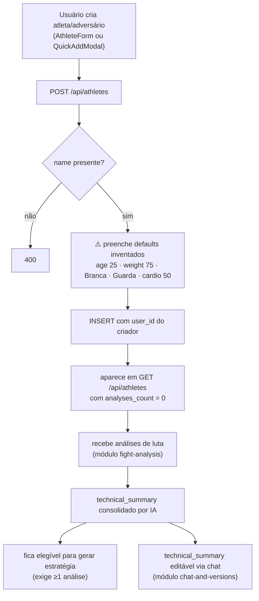

# Módulo: Atletas e Adversários

> **Um único documento para os dois** porque, no código, são a mesma coisa: colunas idênticas, `models/Opponent.js` é cópia de `models/Athlete.js`, e o parser é literalmente compartilhado (`parseOpponentFromDB = parseAthleteFromDB`). Documentá-los separadamente duplicaria o texto exatamente como o código duplica a implementação, e esconderia o fato mais importante sobre eles.
>
> **Código:** `server/src/{models,controllers}/{Athlete,Opponent}.js`, `server/src/utils/dbParsers.js` · **Tabelas:** `athletes`, `opponents` · **Frontend:** `pages/{Athletes,Opponents,AthleteDetail}.jsx`, `components/forms/AthleteForm.jsx`, `components/common/QuickAddModal.jsx`

---

## Responsibility

Manter o cadastro dos lutadores envolvidos em uma análise: atributos declarados pelo usuário (nome, faixa, peso, estilo…) e o perfil técnico derivado de IA (`technical_profile`, `technical_summary`).

A única diferença entre as duas entidades é **semântica**:

| | Significa |
|---|---|
| **Athlete** | o lutador que o usuário treina ou representa |
| **Opponent** | o lutador que vai ser enfrentado |

O motivo original da separação, segundo o proprietário (2026-08-12): permitir distinguir os dois lados ao montar uma estratégia. Decisão de unificar registrada em [ADR-007](../decisions/007-unificar-athlete-e-opponent-numa-entidade-com-papel.md) (`PLANNED`).

## Business Rules

`IMPLEMENTED`, verificadas no código:

1. **Só `name` é obrigatório.** Nenhum outro campo é validado.
2. **Defaults são fabricados quando o campo é omitido:** `age: 25`, `weight: 75`, `belt: 'Branca'`, `style: 'Guarda'`, `cardio: 50`. ⚠️ Dado inventado, exibido depois como fato na tela de estratégia — ver *Known Issues*.
3. **`technical_summary` é gerado por IA**, não pelo usuário. É regenerado automaticamente sempre que uma análise da pessoa é criada ou deletada.
4. **Se a pessoa fica com zero análises, o `technical_summary` é limpo** (não fica desatualizado apontando para evidência que não existe mais).
5. **`belt` alimenta as regras IBJJF** na geração de estratégia. Faixa vazia ou desconhecida cai no conjunto mais restritivo (branca) — fallback seguro, porque assumir faixa mais permissiva arriscaria sugerir técnica ilegal.
6. **`update` no model usa allow-list explícita de campos** — não há mass assignment, mesmo o controller passando `req.body` inteiro. Defesa em profundidade deliberada; preservar ao refatorar.
7. **Exclusão é hard delete.** Não há soft delete aqui (diferente de `users`). As `fight_analyses` da pessoa **não** são apagadas em cascata — não há FK.
8. **Leitura respeita escopo de tenant**, escrita usa o `user_id` real do registro (permite admin editar dado de membro do grupo sem transferir posse).

## Inputs

| Origem | Dado |
|---|---|
| `POST /api/athletes` · `POST /api/opponents` | `name` (obrigatório), `age`, `weight`, `belt`, `style`, `strongAttacks`, `weaknesses`, `cardio`, `videoUrl` |
| `PUT /api/athletes/:id` · `PUT /api/opponents/:id` | qualquer subconjunto dos campos acima (allow-list no model) |
| Módulo de análise de luta | `technical_profile` (via `updateTechnicalProfile` — ⚠️ hoje um no-op) |
| Módulo de análise / consolidação de IA | `technical_summary`, `technical_summary_updated_at` |
| Módulo de chat | `technical_summary` editado pelo usuário ou pela IA |

## Outputs

| Consumidor | Dado |
|---|---|
| `GET /api/athletes` · `/api/opponents` | lista com `creator_name` e `analyses_count` agregados |
| `GET /api/athletes/:id` | registro individual (com `creator_name: null`) |
| Módulo de estratégia | `name`, `belt`, `technical_summary` — os insumos do prompt |
| Módulo de análise de luta | validação de que a pessoa existe e pertence ao escopo |
| Frontend | tudo em `camelCase`, via `parseAthleteFromDB` |

## Dependencies

- `services/authorization.js#resolveScope` — regra de escopo (spec 005; `utils/tenantScope.js#getScopeIds` é wrapper `@deprecated`)
- `utils/dbParsers.js` — tradução `snake_case` → `camelCase`
- `models/User.js#getGroupUserIds` — expansão do escopo para admin
- `supabase` (cliente **anon**) — as tabelas têm RLS **desligado**
- `StrategyService.consolidateAnalyses` — para regenerar o `technical_summary`

## Flow

## Not Responsible For

- **Analisar vídeo ou gerar o `technical_summary`** — isso é do módulo [`fight-analysis`](./fight-analysis.md); aqui o campo apenas é armazenado.
- **Gerar estratégia** — módulo [`strategies`](./strategies.md).
- **Versionar o `technical_summary`** — módulo [`chat-and-versions`](./chat-and-versions.md) (`profile_versions`).
- **Autenticação e definição de escopo** — `middleware/auth.js` e `tenantScope`.
- **Cálculo de atributos para gráficos de radar** — vive em `frontend/src/utils/athleteStats.js` e, duplicado, em `server/src/utils/athleteStatsUtils.js`. Nenhum dos dois pertence a este módulo, e **eles já divergiram**.

## Known Issues

| Severidade | Problema |
|---|---|
| ~~**HIGH**~~ | ✅ **RESOLVIDO na [spec 007](../../specs/007-silent-failures-and-input-validation/spec.md)** — `technical_profile` nunca era atualizado (medido: 0 de 37 atletas). Eram **duas** causas: a chamada com 2 de 3 argumentos, e — descoberto ao corrigir — o merge lia `athlete.technical_profile` de um objeto que `parseAthleteFromDB` entrega em camelCase, então descartava o perfil existente mesmo com a aridade certa. `updateTechnicalProfile` agora exige escopo e **lança** em vez de devolver `null` |
| **HIGH** | **Regra de negócio duplicada e divergente.** `processPersonAnalyses` existe em `frontend/src/utils/athleteStats.js` (238 linhas) e `server/src/utils/athleteStatsUtils.js` (121 linhas), com o comentário *"Versão backend - espelhando a lógica do frontend"*. Já divergiram: o retorno quando `person` é falsy é diferente nos dois. **Decisão P7 pendente** (qual das duas é a correta) — é por isso que a spec 007 deixou `attributes` fora do prompt de `athlete-summary` em vez de escolher uma |
| **MEDIUM** | **Defaults fabricados exibidos como fato.** Um atleta criado pelo QuickAdd com só nome+faixa aparece na tela de estratégia com "75 kg", "25 anos", "Guardeiro" — valores que ninguém informou |
| ~~**MEDIUM**~~ | ✅ **RESOLVIDO na [spec 006](../../specs/006-ownership-in-data-access/spec.md)** — `createProfileSession`, `saveProfileSummary` e `restoreProfileVersion` chamavam `Model.getById(personId, userId)` com escalar em vez do escopo resolvido, e o **admin perdia** acesso ao dado do próprio grupo. A escrita passou a usar o `userId` do registro, para não transferir a posse |
| **MEDIUM** | **Duas tabelas e dois models supostamente idênticos — e que JÁ DIVERGIRAM.** Descoberto na spec 007: `Athlete.updateTechnicalProfile` lia `technical_profile` (errado) enquanto `Opponent.updateTechnicalProfile` lia `technicalProfile` (certo). A mesma função, dois comportamentos. Evidência concreta para o [ADR-007](../decisions/007-unificar-athlete-e-opponent-numa-entidade-com-papel.md) |
| **MEDIUM** | **Sem FK e sem cascade.** Deletar a pessoa deixa `fight_analyses`, `tactical_analyses` e `profile_versions` órfãos apontando para um `person_id` inexistente |
| **MEDIUM** | **RLS desligado** nas duas tabelas + chave anon publicada em `frontend/.env.production` → acesso direto ao banco contornando a API. Ver [`../DATABASE.md`](../DATABASE.md#4-estado-de-rls--visão-consolidada) |
| **LOW** | `AthleteForm` só coleta nome e faixa, mas a tela de estratégia exibe peso/cardio/estilo — que ficam sempre "N/A" ou com o default inventado |
| **LOW** | Sem paginação em `getAll` — todas as linhas do escopo são trazidas |

## Future Considerations

- **Unificação com marcação de papel** — [ADR-007](../decisions/007-unificar-athlete-e-opponent-numa-entidade-com-papel.md), `PLANNED`. Migração de alto risco: `person_id` é polimórfico sem FK, e `tactical_analyses` referencia `athlete_id`/`opponent_id` separadamente. Depende de unificar o tipo de `user_id` primeiro.
- **Eliminar a duplicação de `processPersonAnalyses`** definindo o backend como fonte única.
- **Substituir defaults fabricados** por "não informado", tornando os campos nullable se preciso.
