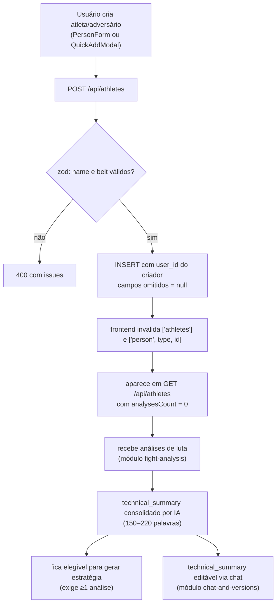

# Módulo: Atletas e Adversários

> **Um único documento para os dois** porque, no código, são a mesma coisa: colunas idênticas e, desde a [spec 012](../../specs/012-athletes-opponents-consolidation/spec.md), **uma única implementação** parametrizada pela tabela — `models/personModel.js` e `controllers/personController.js`. `Athlete.js`/`Opponent.js` e `athleteController.js`/`opponentController.js` são wrappers de poucas linhas que só informam tabela, `person_type` e rótulos.
>
> **Código:** `server/src/models/personModel.js`, `server/src/controllers/personController.js`, `server/src/schemas/requests/person.js`, `server/src/utils/dbParsers.js` · **Tabelas:** `athletes`, `opponents` · **Frontend:** `pages/{PersonList,PersonDetail}.jsx` (e os wrappers `Athletes`, `Opponents`), `components/person/*`, `components/forms/PersonForm.jsx`, `components/common/QuickAddModal.jsx`, `hooks/usePersons.js`, `constants/persons.js`, `services/personService.js`

---

## Responsibility

Manter o cadastro dos lutadores envolvidos em uma análise: atributos declarados pelo usuário (nome, faixa, e opcionalmente peso, altura, idade, estilo, condicionamento, pontos fortes/fracos, vídeo de referência) e o perfil técnico derivado de IA (`technical_profile`, `technical_summary`).

A única diferença entre as duas entidades é **semântica**:

| | Significa |
|---|---|
| **Athlete** | o lutador que o usuário treina ou representa |
| **Opponent** | o lutador que vai ser enfrentado |

O motivo original da separação, segundo o proprietário (2026-08-12): permitir distinguir os dois lados ao montar uma estratégia. Decisão de unificar **as tabelas** registrada em [ADR-007](../decisions/007-unificar-athlete-e-opponent-numa-entidade-com-papel.md) (`PLANNED`, último item da spec 011). A spec 012 unificou **o código**, não o banco.

## Business Rules

`IMPLEMENTED`, verificadas no código:

1. **`name` e `belt` são obrigatórios na criação.** `belt` é um enum fechado (`Branca`, `Azul`, `Roxa`, `Marrom`, `Preta`), validado por zod na borda (`schemas/requests/person.js`). No `PUT` qualquer subconjunto é aceito, mas o corpo não pode ser vazio.
2. **Campo omitido é `null`, nunca default inventado.** ✅ Spec 012 — antes o controller fabricava `age: 25`, `weight: 75`, `style: 'Guarda'`, `cardio: 50` e a tela de estratégia exibia isso como fato. A UI mostra apenas o que foi informado (`describePerson` em `constants/persons.js`).
3. **`technical_summary` é gerado por IA**, não pelo usuário. É regenerado automaticamente sempre que uma análise da pessoa é criada ou deletada (fire-and-forget, tolerante a falha — módulo `fight-analysis`). O cliente HTTP **não** pode escrevê-lo por `PUT /api/athletes/:id`: o schema remove o campo. Quem o grava é o módulo de análise, o de chat e o botão "Gerar com IA" (`POST /api/ai/consolidate-profile`), sempre pelo model.
4. **Se a pessoa fica com zero análises, o `technical_summary` é limpo.**
5. **`belt` alimenta as regras IBJJF** na geração de estratégia. ⚠️ **Correção da doc anterior:** faixa desconhecida ou vazia **não** cai em branca — `getBeltLevel` devolve 5 (preta) e o aviso de restrição só é montado para nível < 5, ou seja, a restrição é **desligada**. Por isso a faixa é enum obrigatória na entrada: a porta foi fechada na borda, não na saída. Registros antigos com valor fora do enum mantêm o comportamento histórico.
6. **`update` no model usa allow-list explícita de colunas** — não há mass assignment. Preservar ao refatorar.
7. **Exclusão é hard delete.** As `fight_analyses`, `tactical_analyses` e `profile_versions` da pessoa **não** são apagadas em cascata — não há FK. O modal de confirmação diz isso ao usuário.
8. **Leitura respeita escopo de tenant**, escrita usa o `user_id` real do registro (permite admin editar dado de membro do grupo sem transferir posse).
9. **Contrato de saída é `camelCase` em todos os endpoints**, inclusive `POST` (✅ spec 012 — antes devolvia a linha crua do banco).

## Inputs

| Origem | Dado |
|---|---|
| `POST /api/athletes` · `POST /api/opponents` | `name`, `belt` (obrigatórios); `age`, `weight`, `height`, `style`, `strongAttacks`, `weaknesses`, `cardio`, `videoUrl` (opcionais, `null` se omitidos) |
| `PUT /api/athletes/:id` · `PUT /api/opponents/:id` | qualquer subconjunto dos campos acima; `null` explícito apaga |
| Módulo de análise de luta | `technical_profile` (via `updateTechnicalProfile`) e `technical_summary` (regeneração automática) |
| `POST /api/ai/consolidate-profile` | `technical_summary`, `technical_summary_updated_at` |
| Módulo de chat | `technical_summary` editado pelo usuário ou pela IA |

## Outputs

| Consumidor | Dado |
|---|---|
| `GET /api/athletes` · `/api/opponents` | lista com `creatorName` e `analysesCount` (conta só `fight_analyses` do próprio `person_type`) |
| `GET /api/athletes/:id` | registro individual (`creatorName: null`) |
| Módulo de estratégia | `name`, `belt`, `technicalSummary` — os insumos do prompt |
| Módulo de análise de luta | validação de que a pessoa existe e pertence ao escopo |
| Frontend | tudo em `camelCase`, via `parseAthleteFromDB` |

## Dependencies

- `services/authorization.js#resolveScope` — regra de escopo
- `middleware/validate.js` + `schemas/requests/person.js` — validação de entrada ([ADR-012](../decisions/012-zod-para-validacao-de-entrada.md))
- `utils/dbParsers.js` — tradução `snake_case` → `camelCase`
- `models/User.js#getGroupUserIds` — expansão do escopo para admin
- `supabase` (cliente `service_role`) — as tabelas têm RLS **desligado**
- `StrategyService.consolidateAnalyses` — para regenerar o `technical_summary`

## Flow

## Not Responsible For

- **Analisar vídeo ou gerar o `technical_summary`** — módulo [`fight-analysis`](./fight-analysis.md); aqui o campo apenas é armazenado.
- **Gerar estratégia** — módulo [`strategies`](./strategies.md).
- **Versionar o `technical_summary`** — módulo [`chat-and-versions`](./chat-and-versions.md).
- **Autenticação e definição de escopo** — `middleware/auth.js` e `services/authorization.js`.
- **Cálculo de atributos para gráficos de radar** — `server/src/utils/athleteStatsUtils.js`, hoje sem consumidor (decisão P7 em [`GAPS.md`](../GAPS.md)).

## Known Issues

| Severidade | Problema |
|---|---|
| **MEDIUM** | **`technical_profile` é escrito e ninguém lê.** A spec 007 corrigiu a escrita (uma query extra por análise); o único leitor era uma prop ignorada de `AthleteCard`, removida na spec 012. Decisão pendente: parar de gravar ou ligar a um consumidor — ver P7/P12 em [`GAPS.md`](../GAPS.md) |
| **MEDIUM** | **Sem FK e sem cascade.** Deletar a pessoa deixa `fight_analyses`, `tactical_analyses` e `profile_versions` órfãos |
| **MEDIUM** | **RLS desligado** nas duas tabelas; o `REVOKE` da chave anon segue pendente — ver [`../DATABASE.md`](../DATABASE.md#4-estado-de-rls--visão-consolidada) |
| **LOW** | `PersonForm` só coleta nome e faixa; os demais campos só entram por API |
| **LOW** | Sem paginação nem busca em `getAll` |
| **LOW** | A regeneração do resumo é fire-and-forget sem sinal de conclusão; a tela recarrega com `setTimeout` de 1 s / 3 s (F18 da SPEC-FRONTEND) |
| ~~**HIGH**~~ | ✅ Spec 007 — `technical_profile` nunca era atualizado |
| ~~**MEDIUM**~~ | ✅ Spec 012 — defaults fabricados exibidos como fato |
| ~~**MEDIUM**~~ | ✅ Spec 012 — models e controllers duplicados (e já divergentes) |
| ~~**MEDIUM**~~ | ✅ Spec 012 — lista desatualizada por 5 min após apagar/trocar faixa (sem invalidação de cache) |
| ~~**MEDIUM**~~ | ✅ Spec 012 — `PUT` com o objeto inteiro sobrescrevia o resumo regenerado em background |
| ~~**LOW**~~ | ✅ Spec 012 — `POST` devolvia `snake_case`; `created_at` lido onde a API entrega `createdAt`; `cardio: 0` virava 50; `age: 'abc'` era 500 |

## Future Considerations

- **Unificação de tabelas com marcação de papel** — [ADR-007](../decisions/007-unificar-athlete-e-opponent-numa-entidade-com-papel.md), `PLANNED`. Com a implementação já única, a migração passa a ser só de dado e rotas.
- **Coletar os campos opcionais no formulário**, ou removê-los do schema e do banco — decisão de produto.
- **Resumo curto separado do perfil completo**: hoje um único `technical_summary` serve card, tela e prompt de estratégia.
