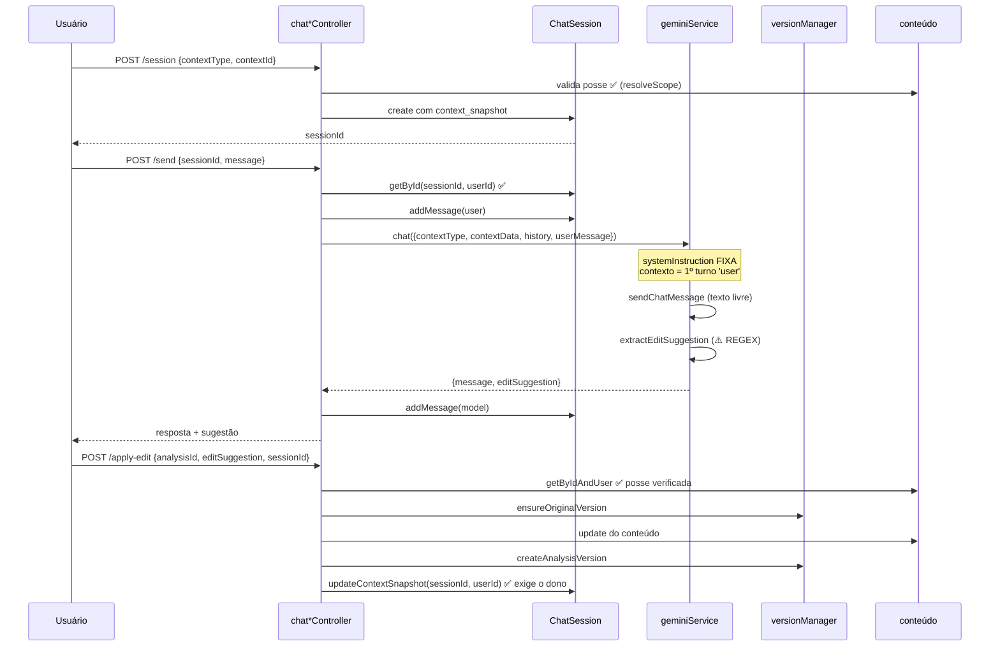

# Módulo: Chat de Refinamento e Versionamento

> **Documentados juntos** porque são a mesma fronteira funcional: o chat é o mecanismo de edição, e o versionamento é o registro dessas edições. Separá-los produziria dois documentos que só falam um do outro.
>
> ⚠️ **Era o módulo com as falhas de segurança mais graves do sistema** — 4 dos 6 endpoints sem verificação de posse, **corrigidos na [spec 006](../../specs/006-ownership-in-data-access/spec.md)**. Continua com uma funcionalidade **quebrada**: o versionamento de perfil (spec 007).
>
> **Código:** `server/src/controllers/chat{Session,Analysis,Profile,Strategy}Controller.js` (divididos na spec 006 — antes era um `chatController.js` de 818 linhas), `server/src/models/{ChatSession,AnalysisVersion,ProfileVersion,StrategyVersion}.js`, `server/src/utils/versionManager.js`, `server/src/services/geminiService.js#chat`, `server/src/services/prompts/chat-{analysis,profile,strategy}.txt` · **Tabelas:** `ai_chat_sessions`, `analysis_versions`, `profile_versions`, `strategy_versions` · **Frontend:** `components/chat/*`, `components/analysis/StrategyVersionHistoryPanel.jsx`, `components/common/{DiffViewer,InlineDiff}.jsx`

---

## Responsibility

Permitir que o usuário **refine conteúdo já gerado pela IA** conversando com ela, e manter o histórico dessas alterações com possibilidade de restaurar versões anteriores.

Três tipos de conteúdo refinável, cada um com sua tabela de versões:

| Contexto (`context_type`) | Refina | Versões em |
|---|---|---|
| `analysis` | uma análise de luta (`fight_analyses`) | `analysis_versions` |
| `profile` | o `technical_summary` de um atleta/adversário | `profile_versions` ⚠️ **quebrado** |
| `strategy` | uma estratégia (`tactical_analyses`) | `strategy_versions` |

## Business Rules

`IMPLEMENTED`, verificadas no código:

1. **A conversa é ancorada num snapshot.** `context_snapshot` congela o estado do conteúdo quando o chat começou, para a IA raciocinar sobre algo estável.
2. **A IA sugere; o usuário decide.** A resposta pode conter uma sugestão de edição, que só é aplicada quando o usuário aceita explicitamente (`POST /api/chat/apply-edit`).
3. **Dados do usuário nunca entram na `systemInstruction`.** `CHAT_SYSTEM_INSTRUCTION` é uma constante fixa; o bloco de contexto entra como **primeiro turno `user`**, com aviso explícito de que é dado, não comando. Ver [ADR-003](../decisions/003-system-instruction-fixa-no-chat.md).
4. **A versão original é preservada** antes da primeira edição de uma análise (`ensureOriginalVersion`).
5. **Só três campos de análise são editáveis:** `summary`, `charts`, `technical_stats`. Qualquer outro `field` na sugestão é rejeitado com 400.
6. **Sessão de estratégia pode ter `context_id = NULL`** (estratégia temporária, não persistida) — migration `014`.
7. **No chat de estratégia, um lembrete de mapeamento de campos é reinjetado** ao final de cada mensagem, porque após 2–3 turnos o modelo tendia a reutilizar o último campo sugerido (viés de recência).
8. **Antes de restaurar uma versão de perfil, a versão atual é salva** como backup.
9. **Edição de estratégia valida o shape da seção** antes de persistir (`validateStrategyField`) — proteção que **não existe** para edição de análise.
10. **Toda a série de versões é numerada sequencialmente**, com uma marcada `is_current` e `edited_by` registrando a origem (`user`, `ai`, `ai_suggestion`, `system`).

## Inputs

16 endpoints em `/api/chat` (`chatLimiter` 100/15min — ⚠️ aplicado duas vezes no mesmo router), todos autenticados:

| Grupo | Endpoints |
|---|---|
| Sessões | `POST /session`, `GET /session/:id`, `GET /sessions/:contextType/:contextId`, `DELETE /session/:id` |
| Mensagens | `POST /send` |
| Edições | `POST /apply-edit`, `POST /manual-edit` |
| Versões de análise | `GET /versions/:analysisId`, `POST /restore-version` |
| Perfil técnico | `POST /profile-session`, `POST /profile-send`, `POST /profile-save`, `GET /profile-versions/:personType/:personId`, `POST /profile-restore` |
| Estratégia | `POST /strategy-session`, `POST /strategy-send` |

Mais dois em `/api/strategy`: `GET /analyses/:analysisId/versions` e `POST /analyses/:analysisId/versions/:versionId/restore`.

## Outputs

- Resposta da IA em texto, já limpa dos marcadores internos (`cleanResponseText`)
- `editSuggestion` (`{ field, newValue, reason }`) quando houver
- Sessão atualizada com o histórico de mensagens
- Conteúdo atualizado (análise, perfil ou estratégia) após aceitar uma edição
- Listagens de versões com preview
- Registro em `api_usage` por tipo (`chat_analysis`, `chat_profile`, `chat_strategy`)

## Dependencies

- `services/geminiService.js#chat` — monta contexto, chama a IA, extrai sugestão
- `services/llm.js#sendChatMessage` — ⚠️ **o único caminho de IA sem `responseSchema`**
- `utils/versionManager.js` — camada fina sobre os models de versão
- `models/ChatSession.js`, `AnalysisVersion.js`, `ProfileVersion.js`, `StrategyVersion.js`
- `models/{FightAnalysis,Athlete,Opponent}.js` — os conteúdos refinados
- `utils/strategyFieldSchema.js` — validação de shape (só estratégia)
- **`supabaseAdmin`** em `ChatSession`, `ProfileVersion` e `StrategyVersion` — RLS ignorada
- `supabase` (anon) em `AnalysisVersion`

## Flow

## Not Responsible For

- **Gerar a análise ou a estratégia originais** — módulos [`fight-analysis`](./fight-analysis.md) e [`strategies`](./strategies.md).
- **Cadastrar pessoas** — módulo [`athletes-opponents`](./athletes-opponents.md).
- **Definir o que é editável** na estratégia — o schema vive em `utils/strategyFieldSchema.js`, compartilhado com o módulo de estratégias.
- **Renderizar diffs** — `components/common/{DiffViewer,InlineDiff}.jsx` são apresentação.

## Known Issues

### ~~CRITICAL — acesso cross-tenant~~ · ✅ **RESOLVIDO na [spec 006](../../specs/006-ownership-in-data-access/spec.md)** (2026-08-18)

Os quatro problemas abaixo compartilhavam a mesma causa: **o `analysisId`/`sessionId` vinha cru do `req.body` e `FightAnalysis.update()/delete()` não filtravam `user_id` no model.** Ficam registrados porque descrevem o que era possível — detalhe da correção em [`../AUTHORIZATION.md`](../AUTHORIZATION.md#known-issues).

| # | Endpoint | O que era possível |
|---|---|---|
| ~~AZ-2~~ | `POST /manual-edit` | Usava `FightAnalysis.getById(analysisId)` — variante **sem** filtro. Sobrescrevia `summary`/`charts`/`technical_stats` de qualquer análise de qualquer tenant, sem sinal para a vítima |
| ~~AZ-3~~ | `GET /versions/:analysisId` | Nenhum método de `AnalysisVersion` filtrava por usuário, e a tabela **não tem coluna `user_id`**. Lia o `content` completo de todas as versões de qualquer análise |
| ~~AZ-4~~ | `POST /restore-version` | **Nenhuma verificação de posse em ponto algum.** Revertia a análise de outro tenant e alterava o ponteiro `is_current` do histórico dele |
| ~~AZ-5~~ | `POST /apply-edit` → `updateContextSnapshot` | O `sessionId` nunca era validado; o método filtrava só por `id` e usa `supabaseAdmin`. Envenenava o contexto de IA da sessão de outro usuário |

**O que torna isso instrutivo:** `applyEdit` — no mesmo arquivo, poucas linhas acima — fazia a verificação de posse **corretamente**. A inconsistência era interna ao módulo, não lacuna de conhecimento. Foi o argumento decisivo para a spec 006 mover a exigência de escopo para a **assinatura do model**, em vez de só corrigir os quatro handlers.

### HIGH

| # | Problema |
|---|---|
| **Versionamento de perfil está quebrado desde 2026-01-16** | `versionManager.saveProfileVersion` chama `ProfileVersion.create({ person_id, person_type, version_number, summary, change_description, created_by })` — chaves em **`snake_case`** — mas a função desestrutura `{ personId, personType, userId, content, editedBy, editReason }` em **`camelCase`**. **Todos os campos ficam `undefined`**, o insert viola os `NOT NULL`, e o erro morre num `console.warn` + `return null`. Também `getByPersonId(personId, personType)` é chamada com 2 de 3 argumentos → `.eq('user_id', undefined)`.  🔄 **REFINADO (verificado em 2026-08-13):** a tabela tem **5 linhas, a última em 2026-01-15**. O `git log` mostra que `ProfileVersion.create` nasceu em **2026-01-09** esperando camelCase, funcionou por 6 dias via chamadas diretas corretas, e **`versionManager.js` foi criado em 2026-01-16 (`2b13a64`) já com o contrato errado**. Não é "nunca funcionou" — é **quebrado desde 2026-01-16**, e as 5 linhas são do período em que funcionava. |
| **Chat é o único caminho de IA sem saída estruturada** | `sendChatMessage` não aceita `responseSchema`, e `extractEditSuggestion` usa `match(/---EDIT_SUGGESTION---([\s\S]*?)---END_SUGGESTION---/)` com fallback para procurar JSON solto, limpeza de cercas markdown e três formatos legados. **Sugestões que escrevem no banco dependem de regex frágil.** Quando o parse falha, o usuário vê "Preparei uma sugestão de alteração para você revisar" e a sugestão é perdida em silêncio |
| **`versionManager` lê a chave errada** | `ensureOriginalVersion` e `createAnalysisVersion` gravam `content.technical_stats`, mas o objeto recebido vem de `parseAnalysisFromDB`, que produz `technicalStats`. **As versões salvas perdem as estatísticas técnicas** |

### MEDIUM

| # | Problema |
|---|---|
| ~~**Escopo escalar em vez de array**~~ | ✅ **spec 006** — os três caminhos de perfil passavam `userId` escalar onde o resto do sistema passa o escopo resolvido, e o **admin perdia** acesso ao dado do grupo. A busca usa `resolveScope`; a escrita, o `userId` do registro |
| ~~**Escritas sem filtro de usuário no model**~~ | ✅ **spec 006** — `ChatSession.addMessage`, `addMessages` e `updateContextSnapshot` passaram a **exigir** o dono na assinatura. A proteção deixou de ser convencional |
| ~~**`type` do query string sem validação**~~ | ✅ **spec 006** — `GET /versions/:analysisId?type=...` valida contra o CHECK da migration 010 (`fight`/`tactical`) e lança `ValidationError` no resto |
| **Sem validação de shape na edição de análise** | Estratégia tem `validateStrategyField`; análise não tem equivalente |
| **`chatLimiter` aplicado duas vezes** no mesmo router |
| **Sem `UNIQUE(analysis_id, version_number)`** nas três tabelas de versão, e o número é calculado no app (`length + 1` ou `MAX + 1`) sem transação → versões com número repetido |
| **`is_current` sem constraint** — `setAsCurrent` faz "update todas → marca uma" sem transação; nada impede duas versões atuais |
| ~~**`controller` obeso**~~ — ✅ **spec 006**: os 818 linhas / 16 handlers foram divididos em `chat{Session,Analysis,Profile,Strategy}Controller.js`, todos abaixo de 280 linhas, em commit de movimentação pura |

### LOW

- **`analysis_versions` só tem política de SELECT e INSERT** (sem UPDATE/DELETE) — mas o código chama `update` em `setAsCurrent`; funciona porque a política é `USING (true)` e o cliente é anon num contexto sem RLS efetiva.
- **11 `alert()`/`confirm()` nativos** nos painéis de chat e histórico.
- Erros engolidos com efeito real: edição via chat que "salva" mas não salvou.

## Future Considerations

- **Estender `responseSchema` ao chat**, encerrando o último parsing por regex do sistema.
- **Resolver a autorização de `analysis_versions`** — a tabela não tem dono; decidir entre `JOIN` com a análise pai ou `user_id` denormalizado. É pré-requisito para corrigir AZ-3 corretamente.
- **Empurrar o filtro de posse para os models** — fazer `FightAnalysis.update/delete` exigirem escopo, para que a próxima omissão de controller *falhe* em vez de vazar. Os 4 endpoints são o sintoma; isto é a causa.
- **Corrigir o contrato de `saveProfileVersion`** e **propagar o erro** em vez de engolir — ver [ADR-004](../decisions/004-token-version-para-invalidacao-de-sessao.md) para o padrão oposto (onde propagar foi a escolha correta).
- **Unificar o pipeline de edição de estratégia** — cluster FE-1 da [`../../SPEC-FRONTEND.md`](../../SPEC-FRONTEND.md).
