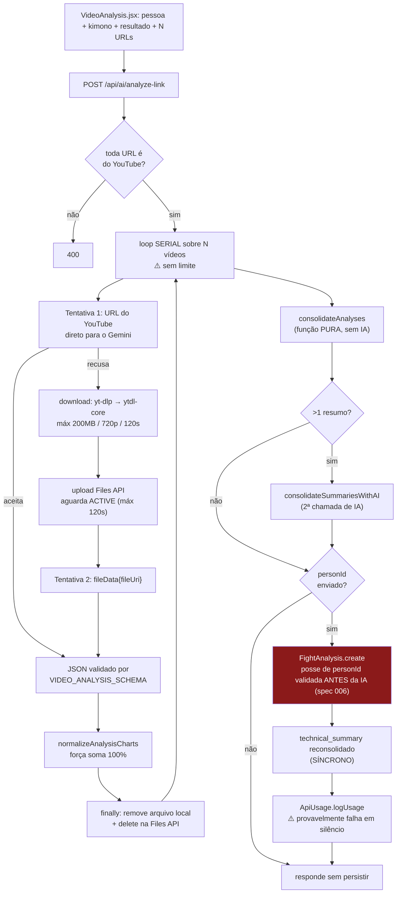

# Módulo: Análise de Luta (Fight Analysis)

> **Código:** `server/src/controllers/{linkController,fightAnalysisController}.js`, `server/src/models/FightAnalysis.js`, `server/src/services/{geminiService,videoDownloader}.js`, `server/src/schemas/videoAnalysis.js`, `server/src/services/prompts/video-analysis.txt` · **Tabela:** `fight_analyses` · **Frontend:** `pages/VideoAnalysis.jsx`, `components/video/*`, `components/analysis/AnalysisDetailModal.jsx`

---

## Responsibility

Transformar **um ou mais vídeos de luta do YouTube** em uma análise estruturada da pessoa alvo: perfil comportamental (5 gráficos), estatísticas técnicas quantitativas e um resumo narrativo.

É a **unidade de evidência do sistema**. Tudo a jusante — o perfil técnico consolidado e a estratégia — deriva daqui. Sem análise, não existe estratégia.

## Business Rules

`IMPLEMENTED`, verificadas no código:

1. **Só YouTube.** `extractYouTubeId` valida com `new URL()` e rejeita o resto. **Não há upload de arquivo** — `POST /api/ai/analyze-video` é um stub que retorna 400 apontando para `analyze-link`.
2. **Uma análise pode cobrir N vídeos.** Cada vídeo é analisado individualmente e os resultados são consolidados numa única linha de `fight_analyses`. O `video_url` guarda as URLs concatenadas por vírgula.
3. **A pessoa alvo é identificada pela cor do kimono**, e o prompt instrui explicitamente a **ignorar o oponente** no vídeo.
4. **O resultado da luta contextualiza a análise** — informar que o atleta perdeu por finalização faz o prompt pedir a identificação do que falhou.
5. **A faixa da pessoa injeta as regras IBJJF** no contexto da análise.
6. **Se um vídeo falha, o loop continua** com os demais. Só retorna erro se **nenhum** vídeo foi analisado com sucesso.
7. **Consolidação híbrida:** os números são consolidados por **função pura** (médias, sem IA); os resumos narrativos, quando há mais de um, por uma **segunda chamada de IA**.
8. **Os 5 gráficos são normalizados para somar 100%**, e gráficos sem nenhum dado observado são descartados.
9. **`person_type` só aceita `'athlete'` ou `'opponent'`** — validado nos controllers de `POST /api/fight-analysis` **e** de `analyze-link` (spec 006) e por CHECK no banco.
10. **A pessoa precisa existir e pertencer ao escopo** — validado em `POST /api/fight-analysis` **e**, desde a spec 006, em `POST /api/ai/analyze-link` (antes das chamadas de IA).
11. **Criar ou deletar análise regenera o `technical_summary`** da pessoa; se sobram zero análises, o resumo é limpo.
12. **A versão original é preservada** antes da primeira edição (`ensureOriginalVersion`).
13. **Exclusão é hard delete.**

## Inputs

`POST /api/ai/analyze-link` (`heavyLimiter` 30/15min, autenticado, **schema zod + orçamento** desde as specs 007/009) — o caminho que **gera** a análise:

```
{
  videos:      [{ url, giColor }],   // N itens — ⚠️ SEM LIMITE
  athleteName: string,
  personId:    string,               // opcional; se presente, persiste
  personType:  'athlete' | 'opponent',
  belt:        string,
  matchResult: string,               // 'vitoria-pontos' | 'derrota-finalizacao' | ...
  model:       string                // opcional, ⚠️ NÃO validado
}
```

`POST /api/fight-analysis` — o caminho que **persiste** uma análise já produzida: `{ personId, personType, videoUrl, videoName, charts, summary, technical_stats, framesAnalyzed }`.

## Outputs

| Consumidor | Dado |
|---|---|
| Resposta imediata do `analyze-link` | `{ charts, technical_stats, summary, videosAnalyzed }` — em **`snake_case`** |
| `GET /api/fight-analysis` · `/:id` · `/person/:personId` | análises em **`camelCase`** (via `parseAnalysisFromDB`) |
| Módulo [`strategies`](./strategies.md) | as análises consolidadas em `technical_summary` + `technical_stats` |
| Módulo [`athletes-opponents`](./athletes-opponents.md) | `technical_summary`, `technical_summary_updated_at` |
| Módulo [`chat-and-versions`](./chat-and-versions.md) | a análise como contexto de chat, e as versões editadas |
| Módulo [`usage-tracking`](./usage-tracking.md) | tokens somados de todos os vídeos |

⚠️ **A assimetria `snake_case` / `camelCase` entre esses dois primeiros é um bug ativo** — ver *Known Issues*.

## Dependencies

- `services/geminiService.js#analyzeFrame` — monta prompt e chama a IA
- `services/llm.js` — fronteira única com `@google/genai`
- `schemas/videoAnalysis.js#VIDEO_ANALYSIS_SCHEMA` — contrato de saída
- `services/prompts/video-analysis.txt`
- `services/videoDownloader.js` — `yt-dlp` (binário, **dependência de sistema não declarada**) → fallback `@distube/ytdl-core`
- Gemini **Files API** — para o caminho de upload
- `config/ai.js` — modelo, temperatura, `BELT_RULES`, limites de vídeo
- `utils/chartUtils.js#normalizeChartData`, `utils/profileUtils.js#extractTechnicalProfile`
- `StrategyService.consolidateAnalyses` — regeneração do resumo
- `utils/tenantScope.js`, `utils/dbParsers.js`

## Flow



## Not Responsible For

- **Cadastrar a pessoa** — módulo [`athletes-opponents`](./athletes-opponents.md).
- **Gerar a estratégia** — módulo [`strategies`](./strategies.md). Este módulo produz evidência sobre **uma** pessoa; cruzar duas é outro módulo.
- **Editar a análise via chat e versionar** — módulo [`chat-and-versions`](./chat-and-versions.md).
- **Decidir o preço/custo** — módulo [`usage-tracking`](./usage-tracking.md).
- **Upload de arquivo de vídeo** — não existe no produto.
- **Progresso da operação** — não há canal de progresso no servidor; a barra na UI é simulada no cliente.

## Known Issues

| Severidade | Problema |
|---|---|
| ~~**CRITICAL**~~ | ✅ **RESOLVIDO na [spec 006](../../specs/006-ownership-in-data-access/spec.md)** — `FightAnalysis.update()` e `.delete()` **não filtravam `user_id`** no model, e 3 endpoints do chat não verificavam posse (`manual-edit`, `restore-version`, `versions`). Hoje o escopo é **obrigatório na assinatura** e a chamada sem ele lança. `getById` (a variante sem filtro) foi removido. Ver [`../AUTHORIZATION.md`](../AUTHORIZATION.md#known-issues) |
| ~~**HIGH**~~ | ✅ **RESOLVIDO na spec 006** — `analyze-link` criava análise vinculada a pessoa de outro tenant, enquanto o caminho equivalente (`POST /api/fight-analysis`) validava. A verificação foi colocada **antes** das chamadas de IA, para um pedido que vai dar 404 não queimar tokens pagos |
| ~~**HIGH**~~ | ✅ **RESOLVIDO nas specs [007](../../specs/007-silent-failures-and-input-validation/spec.md) e [009](../../specs/009-ai-cost-and-reliability/spec.md)** — `videos[]` não tinha limite algum, e cada item é uma inferência em `gemini-2.5-pro`. Hoje: teto de 5 por requisição (schema zod), allow-list de modelos e orçamento mensal por tenant contado **no banco**. A afirmação "o registro de custo está quebrado" era **falsa** — foi refutada pela spec 002 |
| **HIGH** | **Trabalho longo em request serverless.** Download (até 120s) + upload/polling (até 120s) + inferência, × N vídeos em série, sem `maxDuration` no `vercel.json`. Provável timeout **após** consumir tokens. **NEEDS_CONFIRMATION:** plano da Vercel |
| ~~**HIGH**~~ | ✅ **RESOLVIDO na [spec 010](../../specs/010-frontend-consolidation/spec.md)** — as estatísticas técnicas **nunca apareciam no histórico**. A resposta imediata trazia `technical_stats` (snake), o banco devolvia `technicalStats` (camel), e os componentes de histórico leem `technical_stats`: o produto **escondia dado que possuía**. Normalizado na borda dos services (`services/normalizers.js`), que preenche as duas chaves. ⚠️ Verificado por teste, **não na tela** |
| ~~**MEDIUM**~~ | ✅ **RESOLVIDO na [spec 007](../../specs/007-silent-failures-and-input-validation/spec.md)** — `technical_profile` nunca era atualizado. Eram **duas** causas: aridade errada (`updateTechnicalProfile` chamada com 2 de 3 argumentos) e, revelada ao corrigir a primeira, a chave `technical_profile` × `technicalProfile` dentro do próprio model |
| **MEDIUM** | **Validação de host por substring no BACKEND** — `linkController.js:13` ainda faz `hostname.includes('youtube.com')`, e `youtube.com.attacker.net` passa → SSRF limitado. O frontend foi corrigido na [spec 010](../../specs/010-frontend-consolidation/spec.md) (lista exata de hosts + checagem de esquema); **o backend não**, e é ele que decide |
| **MEDIUM** | **Consolidação de perfil pode rodar duas vezes** — `analyze-link` consolida no seu caminho, e `POST /api/fight-analysis` dispara `refreshTechnicalSummary` em *fire-and-forget*. Em serverless, trabalho após `res.json()` pode ser congelado antes de terminar |
| ~~**MEDIUM**~~ | ✅ **RESOLVIDO na [spec 009](../../specs/009-ai-cost-and-reliability/spec.md)** — o fallback gravava `summaries.join(' ')` em `technical_summary`, **indistinguível de um resumo consolidado real**, e alimentava a estratégia como se fosse. Hoje vem com `degraded: true` e prefixo visível |
| **MEDIUM** | **`person_type` não validado em `analyze-link`** — depende do CHECK do banco, e o erro do insert é engolido |
| ~~**MEDIUM**~~ | ✅ **RESOLVIDO na [spec 009](../../specs/009-ai-cost-and-reliability/spec.md)** — retry com backoff e timeout, com política própria por fluxo. ⚠️ O timeout interrompe **a nossa espera**, não a inferência do provedor: sem cancelamento no SDK, o custo pode já ter sido incorrido |
| **MEDIUM** | **`controller` obeso** — `analyzeLink` tem 206 linhas orquestrando IA + persistência + efeitos colaterais |
| **LOW** | **`frames_analyzed` é resquício** de um caminho de análise por frames estáticos já removido; a UI ainda exibe "N frames" |
| **LOW** | **Gráficos não auditáveis** — percentuais forçados a somar 100%, sem timestamps nem eventos verificáveis. Ver [`../AI.md`](../AI.md#constraints) |
| **LOW** | **Sem paginação** em `getAll` / `getByPersonId` |

## Future Considerations

- **Job assíncrono** (`202 {jobId}` + polling) — resolveria o timeout serverless e habilitaria progresso real na UI. `PLANNED`, sem implementação.
- **Event log com timestamps** substituindo os percentuais forçados, com agregação determinística em código — proposto em [`../../SPEC-ANALISE-IA.md`](../../SPEC-ANALISE-IA.md) (A3/A4), não implementado.
- ~~**Normalizador único na borda**~~ ✅ implementado na spec 010 (`frontend/src/services/normalizers.js`). ⚠️ Ele **preenche as duas chaves** de propósito: as telas ainda não migradas leem `technical_stats`, e remover a chave antiga seria mudança de contrato para elas.
- ~~**Limite explícito de vídeos por request** + allow-list de modelos~~ ✅ implementados nas specs 007 e 009.
