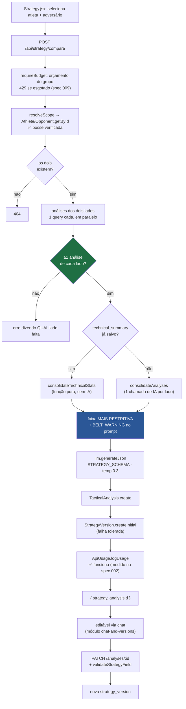

# Módulo: Estratégias

> ⚠️ **Nome da tabela ≠ nome do conceito.** O que o produto chama de "Estratégia" é persistido em **`tactical_analyses`**. E a tela `/analyses` ("Análises") lista **estratégias**, não análises de luta. Ver [`../DOMAIN.md`](../DOMAIN.md#traduzindo-os-nomes-importante).
>
> **Código:** `server/src/controllers/{strategyController,strategyVersionController}.js`, `server/src/services/strategyService.js`, `server/src/models/{TacticalAnalysis,StrategyVersion}.js`, `server/src/schemas/strategy.js`, `server/src/utils/strategyFieldSchema.js`, `server/src/services/prompts/tactical-strategy.txt` · **Tabelas:** `tactical_analyses`, `strategy_versions` · **Frontend:** `pages/{Strategy,Analyses}.jsx`, `components/analysis/{AiStrategyBox,StrategySummaryModal,StrategyVersionHistoryPanel}.jsx`

---

## Responsibility

Cruzar o perfil técnico de um **atleta** com o de um **adversário** e produzir um plano tático de como vencer aquele confronto específico — respeitando as regras IBJJF da faixa mais restritiva entre os dois.

É o **entregável final do produto**: o motivo pelo qual as análises de vídeo existem.

## Business Rules

`IMPLEMENTED`, verificadas no código:

1. **Atleta e adversário precisam existir no escopo do usuário.** Verificação de posse correta neste módulo.
2. **Ambos precisam ter ≥ 1 análise de luta.** Erro específico indica **qual lado** falta. **É a regra de porta do produto:** a estratégia não é opinião sobre atributos cadastrados — é derivada de vídeo analisado.
3. **`technical_summary` salvo é reutilizado** em vez de reconsolidar via IA — economia deliberada de custo. Se não existe, consolida na hora (1 chamada de IA por lado).
4. **A faixa mais restritiva entre os dois competidores governa as técnicas sugeridas.** Atleta marrom × adversário azul → valem as restrições de azul. Se a faixa mais restritiva não é preta, um bloco `BELT_WARNING` é injetado proibindo técnicas ilegais para ela. Faixa vazia ou desconhecida → conjunto de branca (fallback seguro).
5. **Uma única chamada de IA** gera a estratégia, com `STRATEGY_SCHEMA` (`responseSchema`). O sistema multi-agentes anterior fazia várias — ver [ADR-006](../decisions/006-camada-unica-de-llm-e-aposentadoria-do-multi-agente.md).
6. **Falha ao salvar no histórico não derruba a geração** — o usuário recebe a estratégia mesmo assim. Falha ao criar a versão inicial também é tolerada.
7. **Uma versão inicial é criada** junto com a estratégia (`edited_by: 'system'`).
8. **Edição valida o shape da seção antes de persistir** (`validateStrategyField`), evitando gravar estratégia corrompida quando o chat sugere um `newValue` com schema divergente.
9. **Nomes de atleta e adversário são copiados** para a linha (`athlete_name`, `opponent_name`). A estratégia sobrevive à renomeação ou exclusão da pessoa, preservando o nome de quando foi gerada.
10. **Atualização usa o `user_id` real da análise**, não o do requisitante — permite admin editar estratégia de membro do grupo.
11. **Exclusão da estratégia apaga suas versões** (FK `ON DELETE CASCADE` — o único cascade correto do banco).

## Inputs

| Endpoint | Dado |
|---|---|
| `POST /api/strategy/compare` | `{ athleteId, opponentId, model? }` — **apenas IDs**; os dados são carregados no servidor sob escopo de tenant |
| `PATCH /api/strategy/analyses/:id` | `{ strategy_data, edited_field?, edit_reason?, edited_by? }` |
| `GET /api/strategy/analyses` | query: `athleteId`, `opponentId`, `limit`, `offset` |
| `POST .../versions/:versionId/restore` | path params |

**Insumos internos do prompt**, por lado: `name`, `belt` (+ regras IBJJF formatadas), `resumo` (o `technical_summary` narrativo) e `technical_stats` formatados de forma legível, omitindo zeros.

## Outputs

`strategy_data` (JSONB), estrutura definida por `schemas/strategy.js`:

| Campo | Conteúdo |
|---|---|
| `resumo_rapido` | `como_vencer` (1–2 frases) + `tres_prioridades` |
| `analise_de_matchup` | assimetrias entre os dois estilos |
| `plano_tatico_faseado` | plano por fases da luta |
| `cronologia_inteligente` | linha do tempo sugerida |
| `checklist_tatico` | pontos de checagem, incl. "se estiver perdendo" |

`metadata` (JSONB): modelo usado, tokens, contagem de análises de cada lado, se usou resumo salvo, `generatedAt` e — desde a spec 009 — **`promptVersions`**, o hash do conteúdo de cada template usado. Linhas antigas ficam sem esse campo, e isso é correto: não sabemos qual prompt gerou aquelas. ⚠️ Isso dá **auditabilidade**, não replay bit-a-bit — ver [ADR-013](../decisions/013-versionamento-de-prompt-por-hash.md).

Consumidores: `pages/Strategy.jsx` (visualização imediata), `pages/Analyses.jsx` (histórico + export PDF), módulo [`chat-and-versions`](./chat-and-versions.md) (refinamento), módulo [`usage-tracking`](./usage-tracking.md).

## Dependencies

- `services/strategyService.js` — orquestração e consolidação
- `services/geminiService.js#generateTacticalStrategy` — montagem do prompt e chamada
- `services/prompts/{tactical-strategy,consolidate-profile}.txt` — ✅ **nenhum prompt de produção deste módulo vive mais em código** (o de consolidação saiu de `strategyService.js` na spec 009, com teste de comparação byte a byte)
- `services/costGuard.js` — orçamento do grupo, verificado antes de gastar
- `services/llm.js` — fronteira com o SDK
- `schemas/strategy.js#STRATEGY_SCHEMA` · `utils/strategyFieldSchema.js#validateStrategyField`
- `config/ai.js` — `BELT_RULES`, `getBeltLevel`, `TASK_MODELS`, temperatura
- `models/{Athlete,Opponent,FightAnalysis}.js` — insumos
- `models/{TacticalAnalysis,StrategyVersion}.js` — persistência (`StrategyVersion` usa **`supabaseAdmin`**)
- `services/authorization.js#resolveScope` (spec 005)

## Flow

## Not Responsible For

- **Analisar vídeo** — módulo [`fight-analysis`](./fight-analysis.md). Este módulo **consome** análises, nunca as produz.
- **Manter o `technical_summary`** da pessoa — módulo [`athletes-opponents`](./athletes-opponents.md) armazena; [`fight-analysis`](./fight-analysis.md) o gera. Aqui ele é apenas lido (e consolidado na hora se faltar).
- **Conduzir o chat de refinamento** — módulo [`chat-and-versions`](./chat-and-versions.md). Este módulo expõe o `PATCH` que persiste o resultado.
- **Definir as regras IBJJF** — vivem em `config/ai.js#BELT_RULES`, fonte compartilhada. Ver [ADR-005](../decisions/005-belt-rules-como-tabela-deterministica.md).
- **Gerar o PDF** — hoje mora em `pages/Analyses.jsx` (e não deveria estar lá).

## Known Issues

| Severidade | Problema |
|---|---|
| ~~**HIGH**~~ | ✅ **VULNERABILIDADE FECHADA na [spec 010](../../specs/010-frontend-consolidation/spec.md), PADRÃO NÃO.** `pages/Analyses.jsx` interpolava conteúdo de estratégia gerado por IA sobre **vídeo de terceiros** e fazia `tempDiv.innerHTML = content`. `innerHTML` não executa `<script>`, mas **executa handlers** (``), e com o JWT em `localStorage` isso é roubo de sessão válida por 7–30 dias. Hoje o conteúdo é escapado **na fonte** (`utils/strategyReportHtml.js#escapeDeep`, que escapa strings **e chaves de objeto**), com 16 testes que verificam **no DOM** que nenhum nó executável é construído. ⚠️ **O `innerHTML` e o template-string continuam lá** — removê-los exige a comparação visual do PDF que a spec define como obrigatória. Ao editar esse arquivo: leia **somente** do objeto escapado, nunca do dado cru |
| **MEDIUM** | **`+X pts` e `probabilidade` exibidos como métrica** são **invenção do modelo** — a estratégia nunca recebeu números verificáveis. Renderizados como badge quantitativo em `StrategySummaryModal`, `AiStrategyBox` e no PDF |
| **MEDIUM** | **Prompt de consolidação hardcoded** (~53 linhas em `strategyService.js`), fora de `services/prompts/` e fora do teste de prompts — enquanto existe um `consolidate-summaries.txt` para tarefa parecida |
| **MEDIUM** | **Edições no modal da tela Strategy não são persistidas.** O backend já salva a estratégia e devolve `analysisId`, mas o modal o ignora; o "histórico de versões" dali vive em `useState` e morre ao fechar — apesar de a UI dizer "Versões são salvas automaticamente" |
| **MEDIUM** | **Três semânticas de merge diferentes** para a mesma edição, dependendo de onde o usuário clica |
| **MEDIUM** | **`getVersions` devolve o `content` completo** de cada versão junto com o preview — payload desnecessariamente grande (o escopo de usuário, porém, está correto) |
| **MEDIUM** | **Paginação parcial** — `TacticalAnalysis.getAll` aceita `limit`/`offset` (o único model que aceita), mas o frontend **descarta o `total`** que o backend devolve e usa `limit: 20` fixo, sem "carregar mais" |
| **MEDIUM** | **`athlete_id` / `opponent_id` sem FK** — a estratégia pode referenciar pessoa inexistente. Mitigado pela desnormalização dos nomes |
| **LOW** | **Sem `UNIQUE(analysis_id, version_number)`** e número calculado no app sem transação → duas edições simultâneas geram versões com o mesmo número; nada impede duas `is_current` |
| **LOW** | **Componentes gigantes** — `StrategySummaryModal.jsx` (1116 linhas), `AiStrategyBox.jsx` (1016) |
| **LOW** | **Correção esportiva das regras IBJJF é `NEEDS_CONFIRMATION`** — a tabela é aplicada corretamente, mas seu conteúdo não foi validado contra o regulamento vigente. Sugerir técnica ilegal para uma faixa tem consequência real em competição |

## Future Considerations

- **Unificar o pipeline de estratégia** (render + edição + persistência + versões) num caminho só — proposto em [`../../SPEC-FRONTEND.md`](../../SPEC-FRONTEND.md) como cluster FE-1, a ser feito **antes** de qualquer adaptação a um novo formato de dados, para não portar a duplicação.
- **Validar `BELT_RULES` contra o regulamento oficial IBJJF**, mantendo a tabela determinística — [ADR-005](../decisions/005-belt-rules-como-tabela-deterministica.md), `PLANNED`.
- **Rotular estimativas do modelo como estimativas** enquanto não houver números reais.
- **Mover a geração de PDF** para fora do componente de página.
- Trazer o prompt de consolidação para `services/prompts/`.
