# Módulo: Rastreamento de Uso e Custo de IA

> ✅ **VERIFICADO em 2026-08-13 (spec 002): este módulo FUNCIONA.** 173 linhas em `api_usage`, de 2025-12-14 a 2026-08-12, **US$ 3,0295** acumulados.
>
> A auditoria havia concluído que a persistência era rejeitada por RLS. **A conclusão estava errada** — a política `auth.uid() = user_id` não está ativa em produção. Restam duas dívidas **menores** de qualidade de dado, descritas em *Known Issues*.
>
> **Código:** `server/src/models/ApiUsage.js`, `server/src/utils/apiUsageLogger.js`, `server/src/controllers/usageController.js` · **Tabela:** `api_usage` · **Frontend:** `pages/Settings.jsx`, card de custo em `pages/Overview.jsx`, `services/usageService.js`

---

## Responsibility

Registrar cada chamada à API do Gemini com tokens consumidos e custo estimado, e expor estatísticas agregadas por período, modelo e tipo de operação.

**É o único controle financeiro do produto.** Ele **registra** corretamente, mas não há quota, alerta, teto de gasto nem circuit breaker em nenhum lugar do sistema — o registro é observação, não enforcement.

## Business Rules

`IMPLEMENTED`, verificadas no código:

1. **Toda operação de IA registra uso**, com `operation_type` identificando a origem: `video_analysis`, `strategy`, `summary`, `consolidate_profile`, `chat_analysis`, `chat_profile`, `chat_strategy`.
2. **Falha no registro nunca derruba a operação principal.** `logApiUsage`/`logApiUsageWithType` capturam qualquer erro e apenas avisam no console. Decisão defensável — mas engole qualquer falha futura de persistência sem sinal observável.
3. **Custo é calculado por tabela de preços por modelo** (`PRICING`), em USD por 1 M de tokens, com preço separado de input e output.
4. **Modelos `3-pro-preview` usam preço em faixas (*tiered*)** — até 200 K tokens de prompt: $2/$12; acima: $4/$18.
5. **Modelo desconhecido cai no preço de `gemini-2.5-flash`** (`DEFAULT_MODEL`). ⚠️ Combinado com a falta de validação do modelo escolhido pelo usuário, isso significa que o custo registrado pode não ter relação com o cobrado.
6. **Escopo:** admin vê o consumo de todo o grupo; usuário comum vê só o próprio (via `getScopeIds`).
7. **Períodos suportados:** `today`, `week`, `month` (default), `all`.
8. **A resposta agrega por modelo e por operação**, e devolve os 10 registros mais recentes.
9. **`api_usage` não é transferido** quando um usuário é excluído com transferência de dados — é descartado junto com a conta.

## Inputs

**Interno** (chamado por outros módulos):

```js
logApiUsageWithType({
  userId,
  operationType,          // 'video_analysis' | 'strategy' | 'chat_analysis' | ...
  usage: { modelName, promptTokens, completionTokens, totalTokens },
  metadata                // { athleteName, videosCount, personId, ... }
})
```

O objeto `usage` vem sempre de `services/llm.js#extractUsage`, que normaliza o `usageMetadata` do SDK do Gemini. **O `modelName` é o modelo efetivamente usado**, não o solicitado.

**HTTP:**

| Endpoint | Auth | Dado |
|---|---|---|
| `GET /api/usage/stats?period=today\|week\|month\|all` | autenticada | — |
| `GET /api/usage/pricing` | autenticada | — |

## Outputs

`GET /api/usage/stats`:

```
{
  period, startDate, endDate,
  stats: {
    totalCost,        // USD, 6 casas decimais
    totalTokens,
    requestsCount,
    byModel:     [{ model, tokens, cost, count }],
    byOperation: [{ operation, tokens, cost, count }],
    recentUsage: [{ id, model, operation, tokens, cost, createdAt }]   // 10 mais recentes
  }
}
```

`GET /api/usage/pricing`: a tabela `PRICING` completa, com `currency: 'USD'` e `unit: 'per 1M tokens'`.

## Dependencies

- `models/ApiUsage.js` — cálculo, persistência e agregação
- `utils/tenantScope.js#getScopeIds` — escopo admin/usuário
- **`supabase` (cliente anon)** — funciona porque a política RLS de `api_usage` **não está ativa** em produção (verificado 2026-08-13). Frágil por depender disso: se a política for reativada, o registro para de gravar em silêncio
- Tabela `api_usage` — RLS ligada nas migrations, **inativa na prática**
- `services/llm.js#extractUsage` — origem de todo `usage`

## Flow

```mermaid
flowchart TD
    subgraph "Escrita — a cada operação de IA"
        OP["análise · estratégia · resumo · chat"] --> LLM["llm.js#extractUsage<br/>modelo real + tokens"]
        LLM --> LOG["logApiUsageWithType"]
        LOG --> CALC["calculateCost(modelo, tokens)<br/>PRICING, com faixas"]
        CALC --> INS["INSERT em api_usage<br/>via cliente ANON"]
        INS --> OK["✅ gravado<br/>(173 linhas, verificado 2026-08-13)"]
        INS -.->|"se a política RLS for reativada"| REJ["❌ rejeitado"]
        REJ --> WARN["console.warn<br/>⚠️ erro ENGOLIDO — sem sinal"]
    end

    subgraph "Leitura"
        GET["GET /api/usage/stats"] --> SC["getScopeIds"]
        SC --> SEL["SELECT filtrado por user_id + período"]
        SEL --> AGG["aggregateStats: por modelo e operação"]
        AGG --> UI["Settings.jsx · card de custo do Overview"]
    end

    style OK fill:#1f6f43,color:#fff
    style WARN fill:#8b1a1a,color:#fff
```



## Not Responsible For

- **Escolher o modelo** — é `config/ai.js#resolveModel`, e a escolha do usuário não é validada.
- **Impor limites ou quota** — este módulo **apenas observa**. Não existe enforcement de gasto em lugar nenhum do sistema.
- **Faturamento real** — os valores são **estimativas** calculadas de uma tabela mantida à mão; a fonte de verdade é o console do Google Cloud.
- **Alertas** — não há notificação de gasto anômalo.

## Known Issues

| Severidade | Problema |
|---|---|
| ~~HIGH~~ | ❌ **REFUTADO (2026-08-13).** A auditoria concluiu que a persistência nunca funcionou, porque o model usa o cliente anon contra a política `auth.uid() = user_id`. **Medição: 173 linhas, US$ 3,0295, última em 2026-08-12.** A política **não está ativa em produção** — a chave anon lê e escreve `api_usage` sem restrição. Lição registrada: as migrations descrevem um estado que o banco real não tem |
| **MEDIUM** | **55 das 173 linhas têm `estimated_cost_usd = 0`** — custo registrado como zero. Causa provável: modelo ausente de `PRICING` (a tabela histórica inclui `multi-agents (gpt-5.4)`, `gpt-4-turbo-preview`, `gpt-4.1`, do sistema removido) ou `usage` sem tokens. **Subestima o gasto real** |
| **LOW** | **`operation_type` divergente:** existe `strategy_chat` em produção, fora da lista documentada (`chat_strategy`). Nomenclatura histórica inconsistente |
| **HIGH** | **Sem quota, alerta ou teto.** Combinado com: nenhum limite de `videos[]` por request, modelo escolhido pelo cliente sem validação, e rate limiting ineficaz em serverless → **um usuário autenticado pode gerar gasto ilimitado de API, e ninguém vê no painel** |
| **MEDIUM** | **Contabilidade incorreta para modelo desconhecido.** `calculateCost` cai silenciosamente no preço de `gemini-2.5-flash`. Como `resolveModel` aceita qualquer string do cliente, é possível usar um modelo caro e registrar o custo de um barato |
| **MEDIUM** | **`PRICING` é mantida à mão** e pode divergir da tabela real do Google. Não há teste comparando com a fonte oficial |
| **MEDIUM** | **A tabela `api_usage` foi criada três vezes** (`003` → `004` com `DROP CASCADE` → `006`), com políticas diferentes em cada. Estado real medido em 2026-08-13: a política **não bloqueia** (a chave anon lê e escreve). A definição nominal das políticas permanece **UNKNOWN** — só consultável no SQL Editor |
| **LOW** | **`utils/apiUsageLogger.js#logApiUsage`** (a variante sem `operationType`) **não tem chamadores** — código morto, e chama `ApiUsage.create`, método que não existe no model |
| **LOW** | **Sem paginação nas estatísticas** — busca todos os registros do período e agrega em memória |
| **LOW** | **`Settings.jsx` mostra "Nenhum uso registrado"** tanto quando realmente não há uso quanto quando a requisição falhou — o usuário não distingue |
| **LOW** | **A ordem das linhas desta tabela** mistura o refutado com o vigente; a primeira linha é histórica e está riscada de propósito |

## Future Considerations

- **Migrar para `supabaseAdmin`** — a persistência **já funciona**, mas por acidente: depende de a política RLS estar inativa. `service_role` é o cliente correto para escrita de sistema e torna o registro robusto a uma reativação da política. Também é consequência natural da [spec 008](../../specs/008-database-access-lockdown/spec.md).
- **Investigar as 55 linhas com custo zero** — provavelmente modelos ausentes de `PRICING`. É o que hoje subestima o gasto real, e **a visibilidade já existe** (ao contrário do que a auditoria supunha).
- **Quota por usuário/tenant** persistida no banco, com enforcement antes da chamada de IA.
- **Allow-list de modelos**, encerrando tanto o abuso de custo quanto a contabilidade incorreta.
- **Alerta de gasto anômalo.**
- **Teste comparando `PRICING`** com a tabela oficial do Google, ou busca dinâmica.
