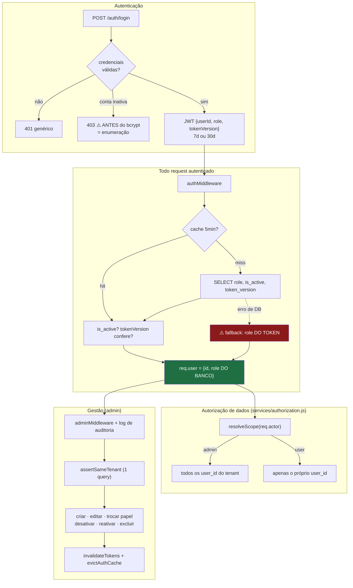

# Módulo: Usuários e Administração

> **É o módulo mais maduro do backend.** Diferente do resto do sistema, aqui a verificação de escopo é consistente, há log de auditoria, e as operações destrutivas exigem decisão explícita. **Use-o como referência de padrão ao corrigir outros módulos.**
>
> **Código:** `server/src/controllers/{userController,authController}.js`, `server/src/models/User.js`, `server/src/middleware/{auth,adminMiddleware}.js`, `server/src/utils/tenantScope.js` · **Tabela:** `users` (⚠️ sem migration de criação) · **Frontend:** `pages/{AdminUsers,ModernLogin,Register,Settings}.jsx`, `contexts/AuthContext.jsx`, `services/{adminService,authService}.js`

---

## Responsibility

Gerenciar identidade, credenciais, papéis e pertencimento a grupo (`tenant`). Desde a spec 005, a decisão de autorização em si vive em `services/authorization.js` (`resolveScope`/`authorize`) — este módulo fornece o `actor` (via `authMiddleware`) e o `User.getGroupUserIds` que a política consome, mas não é mais a origem da regra.

Concentra três coisas que em sistemas maiores estariam separadas: autenticação, gestão de usuários e a regra de escopo de dados.

## Business Rules

`IMPLEMENTED`, verificadas no código:

### Papéis e grupo

1. **Exatamente dois papéis:** `admin` e `user`. Sem papel intermediário, sem permissão granular.
2. **Sub-usuário criado por admin herda o `tenant_id` do criador** e nasce sempre `role: 'user'`.
3. **Usuário de registro público é seu próprio tenant** (`tenant_id = id`), tornando-se raiz do próprio ecossistema.
4. **`tenant_id` sempre aponta para o admin-raiz do grupo** — permite múltiplos admins no mesmo grupo sem quebrar o isolamento. Ver [ADR-002](../decisions/002-rls-desligado-autorizacao-na-aplicacao.md) para o modelo de isolamento resultante.
5. **Escopo de dados:** admin vê todos os `user_id` do seu `tenant_id`; usuário comum vê **apenas o próprio**. Confirmado com o proprietário em 2026-08-12.

### Proteções

6. **Admin não pode desativar, excluir nem alterar o próprio papel** — evita que se tranque fora ou se auto-rebaixe.
7. **Toda operação admin sobre outro usuário exige mesmo `tenant_id`** (`assertSameTenant`, resolvido em **uma única query** buscando os dois `tenant_id` de uma vez).
8. **Desativar ou trocar papel incrementa `token_version`**, invalidando as sessões vivas do usuário imediatamente, e evicta o cache de auth. Ver [ADR-004](../decisions/004-token-version-para-invalidacao-de-sessao.md).
9. **Toda operação admin gera log de auditoria** — inclusive as **negadas** (`adminMiddleware` loga tentativa recusada com o `userId`).
10. **`role` é sempre lido do banco**, nunca do JWT — é a razão de não existir escalonamento de privilégio no sistema.

### Ciclo de vida do usuário

11. **Desativação é soft delete** — os dados são preservados e **continuam visíveis ao grupo** (decisão deliberada, comentada em `User.js`).
12. **Exclusão permanente exige decisão explícita:** transferir os dados para outro usuário do tenant **ou** apagá-los. Não há terceira opção nem default silencioso.
13. **Na transferência, movem-se** `athletes`, `opponents`, `fight_analyses` e `tactical_analyses`. **`ai_chat_sessions` e `api_usage` não são transferidos** — são descartados com o usuário.
14. **Registro público desabilitado por padrão** (`ALLOW_PUBLIC_REGISTER !== 'true'`), e a checagem vem **antes** da consulta por e-mail — não vaza existência de conta quando desligado.

### Credenciais

15. **Senha:** mínimo 6 caracteres, `bcrypt` com 10 rounds. Sem requisito de complexidade.
16. **E-mail:** normalizado (`lowercase` + `trim`), validado com `/^\S+@\S+\.\S+$/` e limite de 254 chars — regex deliberadamente sem aninhamento para **evitar ReDoS**, com comentário explicando a escolha.
17. **JWT:** HS256, payload `{userId, role, tokenVersion}`, expiração 7 dias (ou 30 com `rememberMe`).
18. **`password_hash` nunca é serializado** em nenhuma resposta.

## Inputs

| Endpoint | Auth | Dado |
|---|---|---|
| `POST /api/auth/login` | pública (`authLimiter` 20/15min) | `{ email, password, rememberMe }` |
| `POST /api/auth/register` | pública, **desabilitada por padrão** | `{ name, email, password }` |
| `GET /api/auth/validate` | autenticada | — |
| `GET /api/admin/users` | **admin** | — |
| `POST /api/admin/users` | **admin** | `{ name, email, password }` |
| `PATCH /api/admin/users/:id` | **admin** | `{ name?, password? }` |
| `PATCH /api/admin/users/:id/role` | **admin** | `{ role: 'admin'\|'user' }` |
| `DELETE /api/admin/users/:id` | **admin** | — (soft) |
| `DELETE /api/admin/users/:id/permanent` | **admin** | `{ transferToUserId? }` |
| `POST /api/admin/users/:id/reactivate` | **admin** | — |

## Outputs

- **JWT + objeto do usuário** (`{id, name, email, role}`) no login/registro
- **`req.user = {id, role}`**, **`req.userId`** e **`req.actor = {id, role, tenantId}`** (spec 005) para todos os controllers a jusante — é a saída mais consumida do módulo
- **`User.getGroupUserIds`** — consumido por `services/authorization.js#resolveScope`, não chamado diretamente pelos controllers
- **Lista de usuários do tenant** para o painel admin (com `creator`, `is_active`, `last_login`)
- **Logs de auditoria** no stdout

## Dependencies

- `jsonwebtoken`, `bcrypt`
- `supabase` (**anon**) para a maioria das operações; **`supabaseAdmin`** em `transferData`, `deleteAllData` e `hardDelete`
- `JWT_SECRET` — **obrigatória**: o processo lança erro no boot se faltar
- Cache em memória no `authMiddleware` (`Map`, TTL 5 min, teto 5000, evicção FIFO)

## Flow

## Not Responsible For

- **Autorização de dados de domínio** — desde a spec 005, a regra vive em `services/authorization.js` (`resolveScope`/`authorize`), não neste módulo. Este módulo fornece o `actor` (via `authMiddleware`) e `User.getGroupUserIds`, que a política consome; aplicar `resolveScope` continua sendo responsabilidade de cada controller (e 6 deles não aplicam).
- **RLS no banco** — não existe RLS efetiva. Ver [`../DATABASE.md`](../DATABASE.md#4-estado-de-rls--visão-consolidada).
- **Proteção de rotas no frontend** — `ProtectedRoute` é UX; a decisão real é do backend.
- **Recuperação de senha** — **não existe** no produto.
- **Convite por e-mail / onboarding** — admin cria a conta e informa a senha por fora. Não há envio de e-mail em nenhum ponto do sistema.

## Known Issues

| Severidade | Problema |
|---|---|
| **HIGH** | **Fallback de autenticação abre em falha do banco.** Se `User.getAuthInfo` lançar, o middleware segue com o `role` **do token**. Uma indisponibilidade do Supabase desliga as três proteções ao mesmo tempo: token de conta desativada volta a valer, `token_version` deixa de ser checado, e o papel do token volta a ser aceito. Um JWT antigo de admin só precisa que o banco fique instável |
| **HIGH** | **A tabela `users` não tem migration de criação.** Só recebe `ALTER` em `017`/`021`/`023`. O schema real é **UNKNOWN** e não é reconstruível a partir do repositório |
| **MEDIUM** | **Enumeração de usuários** — 403 "conta desativada" retornado **antes** do `bcrypt.compare`. Descobre contas existentes sem credencial, e dá oráculo de timing (não passa por bcrypt) |
| **MEDIUM** | **PII em log** — e-mail logado em toda tentativa de login; presença de header + path logados em **todo** request autenticado. E-mails em texto claro nos logs da Vercel; relevante para LGPD |
| **MEDIUM** | **Sem `UNIQUE` em `users.email`** em nenhuma migration → `createUser`/`register` checam existência e depois inserem (race condition). Com e-mail duplicado, `findByEmail().single()` passa a lançar erro em **todo login** daquele e-mail. **NEEDS_CONFIRMATION** no banco real |
| **MEDIUM** | **Rate limiting ineficaz em produção** — `MemoryStore` em function serverless, então o `authLimiter` de 20/15min não protege de brute force |
| **MEDIUM** | **Cache de auth não é distribuído** — `evictAuthCache` limpa só a instância local. Em serverless multi-instância, uma desativação pode levar até 5 min para valer em todas (mitigado por `token_version` ser reconsultado quando o cache expira) |
| **MEDIUM** | **Migrations com PII e operação destrutiva** — `017` versiona **8 e-mails pessoais reais**; `018` executa `UPDATE users SET role='user'` **sem WHERE** e repromove um e-mail hardcoded. Reexecutar a `018` em produção **rebaixa todos os admins** criados desde então |
| **LOW** | **Sem recuperação de senha** — usuário que esquece depende de um admin |
| **LOW** | **`/register` acessível na SPA** com registro desabilitado no servidor — o usuário preenche o formulário e recebe 403 |
| **LOW** | **O `.env.example` traz `ALLOW_PUBLIC_REGISTER=true`** — copiá-lo para `.env` (o procedimento documentado de setup) **habilita o cadastro público**, invertendo o default seguro do código |
| **LOW** | **Token de 30 dias sem refresh** — token vazado vale até 30 dias; a única revogação (`token_version`) derruba **todas** as sessões do usuário |
| **LOW** | **`bcrypt` com 10 rounds** (recomendado atual ≥12); senha mínima de 6 caracteres sem complexidade |
| **LOW** | **`AdminUsers.jsx` (660 linhas)** usa `useEffect` cru enquanto outras telas usam React Query, e tem um sistema de toast artesanal que não é reutilizado |

## Future Considerations

- **Falhar fechado no `authMiddleware`** (401/503) em vez de confiar no token. Se disponibilidade for requisito, servir do cache expirado — nunca do token.
- **Verificar a senha antes de diferenciar a resposta**, encerrando a enumeração.
- **Access token curto + refresh token**, reduzindo a janela de um token vazado.
- **Rate limiting com store externo** (Redis/Upstash) ou na borda.
- **Baseline de schema real** de `users` via `pg_dump --schema-only`, mais `UNIQUE(email)`.
- **Papéis profissionais** (médico, nutricionista, preparador físico) **não existem no domínio atual** — ver [`../DOMAIN.md`](../DOMAIN.md#6-o-que-não-faz-parte-do-domínio-atual). Se entrarem no roadmap, o modelo binário `admin`/`user` e a ausência de RLS precisam ser reavaliados **antes**, porque passariam a existir dados sensíveis cruzando fronteira de organização.
