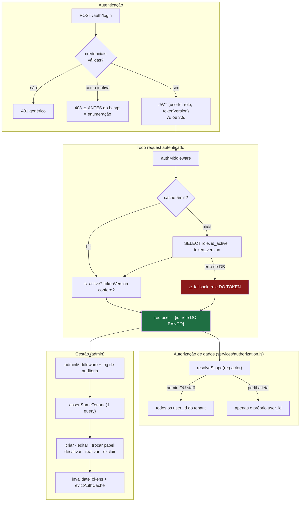

# Módulo: Usuários e Administração

> **É o módulo mais maduro do backend.** Diferente do resto do sistema, aqui a verificação de escopo é consistente, há log de auditoria, e as operações destrutivas exigem decisão explícita. **Use-o como referência de padrão ao corrigir outros módulos.**
>
> **Código:** `server/src/controllers/{userController,authController}.js`, `server/src/models/User.js`, `server/src/services/authorization.js`, `server/src/schemas/requests/users.js`, `server/src/middleware/{auth,adminMiddleware}.js`, `server/src/utils/tenantScope.js` (wrapper `@deprecated`), `server/scripts/link-accounts.js` · **Tabela:** `users` (⚠️ sem migration de criação) · **Frontend:** `pages/{AdminUsers,ChangePassword,ModernLogin,Register,Settings}.jsx`, `contexts/AuthContext.jsx`, `components/routing/ProtectedRoute.jsx`, `services/{adminService,authService,api}.js`

---

## Responsibility

Gerenciar identidade, credenciais, papéis, **perfil profissional** (spec 014) e pertencimento a grupo (`tenant`). Desde a spec 005, a decisão de autorização em si vive em `services/authorization.js` (`resolveScope`/`can`/`authorize`) — este módulo fornece o `actor` (via `authMiddleware`, agora com `profile`) e o `User.getGroupUserIds` que a política consome, mas não é mais a origem da regra.

Concentra quatro coisas que em sistemas maiores estariam separadas: autenticação, gestão de usuários, a regra de escopo/capacidades de dados, e — desde a spec 014 — o vínculo entre uma conta e a ficha de atleta que a representa.

## Business Rules

`IMPLEMENTED`, verificadas no código:

### Papéis, perfil e grupo

1. **Dois eixos independentes desde a spec 014:** `role` (`admin`/`user`, decide gestão de contas) e `profile` (`atleta`/`professor`/`nutricionista`/`fisioterapeuta`/`preparador_fisico`, decide o que a conta vê). Admin é um toggle por conta, qualquer perfil (R-05) — não é mais preciso virar admin para um professor ver o time.
2. **Sub-usuário criado por admin herda o `tenant_id` do criador**, nasce com o `role`/`profile` escolhidos pelo admin (default `role: 'user'`, `profile: 'atleta'`) e **sempre com `must_change_password: true`** (spec 014).
3. **Usuário de registro público é seu próprio tenant** (`tenant_id = id`), tornando-se raiz do próprio ecossistema.
4. **`tenant_id` sempre aponta para o admin-raiz do grupo** — permite múltiplos admins no mesmo grupo sem quebrar o isolamento. Ver [ADR-002](../decisions/002-rls-desligado-autorizacao-na-aplicacao.md) para o modelo de isolamento resultante.
5. **Escopo de dados (`resolveScope`):** admin **ou** perfil de staff vê todos os `user_id` do seu `tenant_id`; perfil `atleta` com `role=user` vê **apenas o próprio**. Confirmado com o proprietário em 2026-08-12, revisitado em 2026-09-22 — ver [ADR-014](../decisions/014-dois-eixos-na-conta-e-time-de-confianca.md).
6. **Capacidades por ação (`CAPABILITIES`, spec 014):** além do escopo, `can(actor, action, resource)` decide **o que** cada perfil pode fazer numa área (`person:*`, `training:*`, `schedule:*`, `competition:*`, `health:*`, `users:manage`). `training`, `schedule`, `competition` e `health` não têm endpoint ainda — a tabela existe para as specs de competições/agenda/saúde só registrarem consumidor, sem tocar `resolveScope` de novo. Ação não cadastrada é **negada**. Detalhe da matriz em [`../AUTHORIZATION.md`](../AUTHORIZATION.md#50-capacidades-por-ação-capabilities-spec-014).
7. **Uma ficha de `athletes` pode estar vinculada à conta da própria pessoa** (`athletes.account_user_id`, spec 014) — no máximo uma por conta (`UNIQUE`). `athletes.user_id` (quem gerencia) não muda de significado; as duas colunas podem divergir.

### Proteções

8. **Admin não pode desativar, excluir nem alterar o próprio papel** — evita que se tranque fora ou se auto-rebaixe. Desde a spec 014, também **não pode remover o último admin ativo** do tenant (checagem "ler depois escrever", sem lock — dois admins rebaixando um ao outro na mesma janela ainda podem, em teoria, zerar os admins).
9. **Toda operação admin sobre outro usuário exige mesmo `tenant_id`** (`assertSameTenant`, resolvido em **uma única query** buscando os dois `tenant_id` de uma vez), com **404**, nunca 403.
10. **Desativar, trocar papel, trocar perfil (spec 014) ou trocar a própria senha (spec 014) incrementa `token_version`**, invalidando as sessões vivas do usuário imediatamente, e evicta o cache de auth. Ver [ADR-004](../decisions/004-token-version-para-invalidacao-de-sessao.md).
11. **Toda operação admin gera log de auditoria** — inclusive as **negadas** (`adminMiddleware` loga tentativa recusada com o `userId`).
12. **`role` e `profile` são sempre lidos do banco**, nunca do JWT — é a razão de não existir escalonamento de privilégio no sistema.

### Ciclo de vida do usuário

13. **Desativação é soft delete** — os dados são preservados e **continuam visíveis ao grupo** (decisão deliberada, comentada em `User.js`).
14. **Exclusão permanente apaga tudo, sem transferência** (spec 014 — substitui a regra anterior de "transferir ou apagar"; `transferToUserId` no corpo agora é **400**): fichas geridas ou vinculadas, suas análises e versões, adversários, estratégias e chats. `api_usage` é **preservado** (é o livro-caixa do tenant). **Exceção decidida pelo controller:** uma ficha gerida pela conta excluída mas vinculada a **outra** conta viva **dentro do escopo do chamador** é **reparentada**, não apagada — ver [`../DOMAIN.md`](../DOMAIN.md#31-user) regra 8 e a [spec 014](../../specs/014-identity-and-profiles/spec.md) para o raciocínio completo. A **raiz do tenant não pode ser excluída** enquanto houver outros membros (409).
15. **Registro público desabilitado por padrão** (`ALLOW_PUBLIC_REGISTER !== 'true'`), e a checagem vem **antes** da consulta por e-mail — não vaza existência de conta quando desligado.

### Credenciais

16. **Senha:** mínimo 6 caracteres, `bcrypt` com 10 rounds. Sem requisito de complexidade.
17. **E-mail:** normalizado (`lowercase` + `trim`), validado com `/^\S+@\S+\.\S+$/` e limite de 254 chars — regex deliberadamente sem aninhamento para **evitar ReDoS**, com comentário explicando a escolha.
18. **JWT:** HS256, payload `{userId, role, tokenVersion}` (**`profile` não vai no JWT** — sempre relido do banco), expiração 7 dias (ou 30 com `rememberMe`).
19. **`password_hash` nunca é serializado** em nenhuma resposta.
20. **Troca de senha pelo próprio usuário** (`POST /api/auth/change-password`, spec 014): exige a senha atual (inclusive quando é a provisória), zera `must_change_password`, incrementa `token_version` e devolve token novo. Conta criada por admin nasce com `must_change_password: true`; o frontend (`ProtectedRoute`) bloqueia toda rota, exceto `/trocar-senha`, enquanto isso for verdadeiro.

## Inputs

Todos os endpoints com corpo, novos ou alterados pela spec 014, validam com zod (`schemas/requests/users.js`) — regra 7 de *Security* do [`CLAUDE.md`](../../CLAUDE.md).

| Endpoint | Auth | Dado |
|---|---|---|
| `POST /api/auth/login` | pública (`authLimiter` 20/15min) | `{ email, password, rememberMe }` |
| `POST /api/auth/register` | pública, **desabilitada por padrão** | `{ name, email, password }` |
| `GET /api/auth/validate` | autenticada | — |
| **`POST /api/auth/change-password`** *(spec 014)* | autenticada | `{ currentPassword, newPassword }` |
| `GET /api/admin/users` | **admin** | — |
| `POST /api/admin/users` | **admin** | `{ name, email, password, profile, isAdmin, createAthlete, athlete?: { belt } }` |
| `PATCH /api/admin/users/:id` | **admin** | `{ name?, password? }` |
| `PATCH /api/admin/users/:id/role` | **admin** | `{ role: 'admin'\|'user' }` |
| **`PATCH /api/admin/users/:id/profile`** *(spec 014)* | **admin** | `{ profile }` |
| **`PATCH /api/admin/users/:id/athlete`** *(spec 014)* | **admin** | `{ athleteId: string\|null }` |
| `DELETE /api/admin/users/:id` | **admin** | — (soft) |
| `DELETE /api/admin/users/:id/permanent` | **admin** | `{}` — **`transferToUserId` agora é 400** (spec 014, R-13) |
| `POST /api/admin/users/:id/reactivate` | **admin** | — |

## Outputs

- **JWT + objeto do usuário** (`{id, name, email, role, profile, mustChangePassword}` no login; spec 014) no login/registro
- **`req.user = {id, role, profile, mustChangePassword}`**, **`req.userId`** e **`req.actor = {id, role, profile, tenantId}`** (spec 005, `profile` desde a spec 014) para todos os controllers a jusante — é a saída mais consumida do módulo
- **`User.getGroupUserIds`** — consumido por `services/authorization.js#resolveScope`, não chamado diretamente pelos controllers
- **`User.getLinkedAthletes`/`linkAthlete`** — a ficha vinculada a cada conta, consumida por `publicUser()` no controller e pela tela de Usuários (spec 014)
- **`CAPABILITIES`/`can`** (`services/authorization.js`, spec 014) — tabela de capacidades por perfil × ação, consumida pelas specs de competições/agenda/saúde quando existirem endpoints nessas áreas
- **Lista de usuários do tenant** para o painel admin (com `profile`, `athleteId`/`athleteName`, `is_active`, `last_login`)
- **Logs de auditoria** no stdout

## Dependencies

- `jsonwebtoken`, `bcrypt`, `zod` (`schemas/requests/users.js`, spec 014)
- **Um único cliente Supabase, `service_role`** (`config/supabase.js`, spec 008) — não existe mais `supabaseAdmin` nem cliente `anon` separado; a distinção "`anon` para a maioria, `supabaseAdmin` em `transferData`/`deleteAllData`/`hardDelete`" descrevia o estado **anterior** à spec 008 e não existe mais no código (`transferData`/`deleteAllData` foram substituídos por `User.purgeAccount` na spec 014, que também usa o cliente único)
- `JWT_SECRET` — **obrigatória**: o processo lança erro no boot se faltar
- Cache em memória no `authMiddleware` (`Map`, TTL 5 min, teto 5000, evicção FIFO) — a chave continua sendo só `userId`; o **valor** cacheado (`authInfo`) agora também carrega `profile`/`must_change_password`, ao lado de `role`/`is_active`/`token_version`
- `server/scripts/link-accounts.js` (spec 014) — script Node fora do request path, para o procedimento de migração dos 25 usuários atuais (dry-run + arquivo de decisões)

## Flow

## Not Responsible For

- **Autorização de dados de domínio** — desde a spec 005 (capacidades por ação desde a spec 014), a regra vive em `services/authorization.js` (`resolveScope`/`can`/`authorize`), não neste módulo. Este módulo fornece o `actor` (via `authMiddleware`, com `profile`) e `User.getGroupUserIds`, que a política consome; aplicar `resolveScope`/`can` continua sendo responsabilidade de cada controller.
- **As áreas que um perfil profissional editaria** — treino, agenda, competição, saúde. `CAPABILITIES` já reserva as ações (`training:*`, `schedule:*`, `competition:*`, `health:*`), mas nenhuma tem endpoint ainda (fases 3–5 do [`../ROADMAP.md`](../ROADMAP.md)). Este módulo só decide **quem entra no tenant e o que vê**, não o que existe para ver.
- **Registro de acesso à área de saúde** — planejado para a spec de saúde (fase 5); não existe hoje, porque a área de saúde em si não existe.
- **RLS no banco** — não existe RLS efetiva. Ver [`../DATABASE.md`](../DATABASE.md#4-estado-de-rls--visão-consolidada).
- **Proteção de rotas no frontend** — `ProtectedRoute` é UX; a decisão real é do backend.
- **Recuperação de senha** — **não existe** no produto.
- **Convite por e-mail / onboarding** — admin cria a conta e informa a senha por fora. Não há envio de e-mail em nenhum ponto do sistema.

## Known Issues

| Severidade | Problema |
|---|---|
| **HIGH** | **Fallback de autenticação abre em falha do banco.** Se `User.getAuthInfo` lançar, o middleware segue com o `role` **do token**. Uma indisponibilidade do Supabase desliga as três proteções ao mesmo tempo: token de conta desativada volta a valer, `token_version` deixa de ser checado, e o papel do token volta a ser aceito. Um JWT antigo de admin só precisa que o banco fique instável |
| **HIGH** | **A tabela `users` não tem migration de criação.** Só recebe `ALTER` em `017`/`021`/`023`. O schema real é **UNKNOWN** e não é reconstruível a partir do repositório |
| **MEDIUM** | **Enumeração de usuários** — 403 "conta desativada" retornado **antes** do `bcrypt.compare`. Descobre contas existentes sem credencial, e dá oráculo de timing (não passa por bcrypt) |
| **MEDIUM** | **PII em log** — e-mail logado em toda tentativa de login; presença de header + path logados em **todo** request autenticado. E-mails em texto claro nos logs da Vercel; relevante para LGPD |
| **MEDIUM** | **Sem `UNIQUE` em `users.email`** em nenhuma migration → `createUser`/`register` checam existência e depois inserem (race condition). Com e-mail duplicado, `findByEmail().single()` passa a lançar erro em **todo login** daquele e-mail. **NEEDS_CONFIRMATION** no banco real |
| **MEDIUM** | **Rate limiting ineficaz em produção** — `MemoryStore` em function serverless, então o `authLimiter` de 20/15min não protege de brute force |
| **MEDIUM** | **Cache de auth não é distribuído** — `evictAuthCache` limpa só a instância local. Em serverless multi-instância, uma desativação pode levar até 5 min para valer em todas (mitigado por `token_version` ser reconsultado quando o cache expira) |
| **MEDIUM** | **Migrations com PII e operação destrutiva** — `017` versiona **8 e-mails pessoais reais**; `018` executa `UPDATE users SET role='user'` **sem WHERE** e repromove um e-mail hardcoded. Reexecutar a `018` em produção **rebaixa todos os admins** criados desde então |
| **LOW** | **Sem recuperação de senha** — usuário que esquece depende de um admin |
| **LOW** | **`/register` acessível na SPA** com registro desabilitado no servidor — o usuário preenche o formulário e recebe 403 |
| **LOW** | **O `.env.example` traz `ALLOW_PUBLIC_REGISTER=true`** — copiá-lo para `.env` (o procedimento documentado de setup) **habilita o cadastro público**, invertendo o default seguro do código |
| **LOW** | **Token de 30 dias sem refresh** — token vazado vale até 30 dias; a única revogação (`token_version`) derruba **todas** as sessões do usuário |
| **LOW** | **`bcrypt` com 10 rounds** (recomendado atual ≥12); senha mínima de 6 caracteres sem complexidade |
| **LOW** | **`AdminUsers.jsx` cresceu para 800+ linhas** (era 660, spec 014 acrescentou perfil, vínculo de ficha e o modal de exclusão sem transferência) — usa `useEffect` cru enquanto outras telas usam React Query, e tem um sistema de toast artesanal que não é reutilizado. Continua sem o redesenho planejado (R-29, fase 2 do [`../ROADMAP.md`](../ROADMAP.md)) |
| **LOW** | **`changeRole` sem lock contra corrida** (spec 014) — a checagem do último admin ativo é "ler depois escrever"; dois admins rebaixando um ao outro na mesma janela podem, em teoria, zerar os admins do tenant. Fechar de verdade exige constraint ou lock no banco |

## Future Considerations

- **Falhar fechado no `authMiddleware`** (401/503) em vez de confiar no token. Se disponibilidade for requisito, servir do cache expirado — nunca do token.
- **Verificar a senha antes de diferenciar a resposta**, encerrando a enumeração.
- **Access token curto + refresh token**, reduzindo a janela de um token vazado.
- **Rate limiting com store externo** (Redis/Upstash) ou na borda.
- **Baseline de schema real** de `users` via `pg_dump --schema-only`, mais `UNIQUE(email)`.
- ~~**Papéis profissionais** (nutricionista, fisioterapeuta, preparador físico) não existem no domínio atual~~ — ✅ **existem como perfil de conta desde a spec 014**. O que falta agora são as **áreas** que essas contas editariam (treino, agenda, saúde) — ver [`../DOMAIN.md`](../DOMAIN.md#6-o-que-não-faz-parte-do-domínio-atual) e [`../ROADMAP.md`](../ROADMAP.md) fases 3–5. Quando entrarem, a ausência de RLS precisa ser reavaliada, porque passará a existir dado de saúde cruzando fronteira de organização dentro do mesmo tenant.
- **Tela de Usuários redesenhada** conforme o protótipo `Perfis e acessos` — contadores, filtros de perfil, registro de acesso à saúde (vazio até a fase 5). R-29, [`../ROADMAP.md`](../ROADMAP.md) fase 2.
- **Reverter a decisão de reparent** (ver [`../DOMAIN.md`](../DOMAIN.md#31-user) regra 8) se o proprietário decidir que uma ficha vinculada a outra conta deveria mesmo ser apagada junto com quem a geria, não reparentada.
