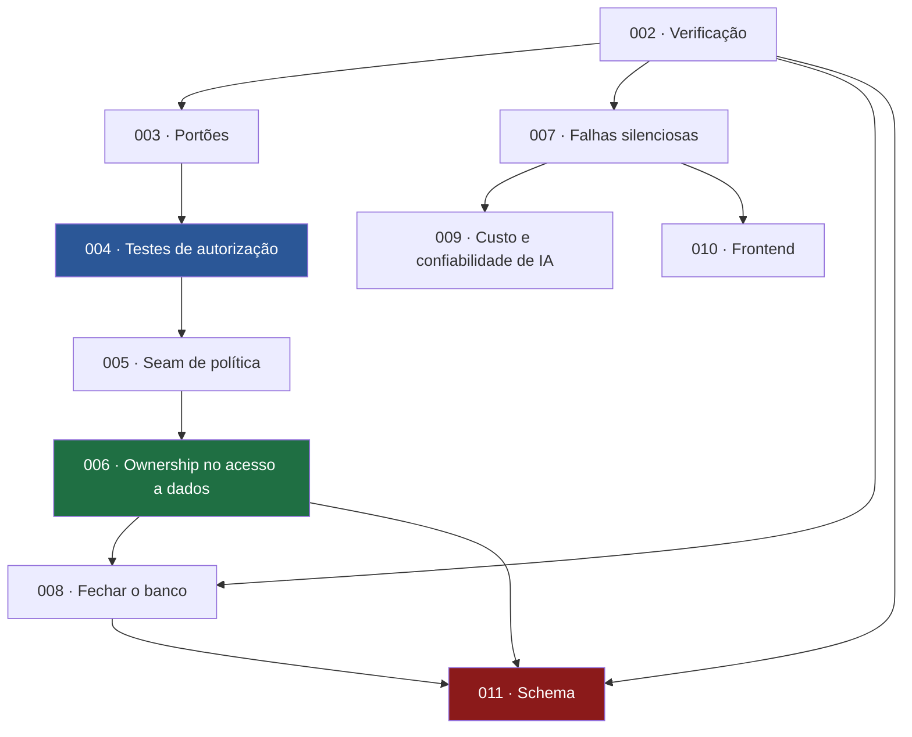

# Specs

Histórico versionado das mudanças planejadas do JiuMetrics. **Fazem parte oficial do repositório e ficam no Git** — nunca no `.gitignore`.

## Índice

| # | Spec | Etapa | Status |
|---|---|---|---|
| [001](./001-refactor-foundation/spec.md) | Refatoração de fundação (umbrella) | — | **Superseded** por 002–011 |
| [002](./002-verification-baseline/spec.md) | Verificação e contenção | 0 | ✅ **Implemented** (parcial — 5 itens pendentes de acesso do proprietário) |
| [003](./003-quality-gates/spec.md) | Portões de qualidade no CI | 1 | ✅ **Implemented** (item de E2E diferido para a 004) |
| [004](./004-authorization-safety-net/spec.md) | Rede de testes de autorização | 2 | ✅ **Implemented** |
| [005](./005-authorization-policy-seam/spec.md) | Seam de política de autorização | 3 | ✅ **Implemented** |
| [006](./006-ownership-in-data-access/spec.md) | Ownership obrigatório no acesso a dados | 4 | ✅ **Implemented** (E2E declarado como não executado) |
| [007](./007-silent-failures-and-input-validation/spec.md) | Falhas silenciosas e validação de entrada | 5 | ✅ **Implemented** (validação parcial: 3 endpoints de IA) |
| [008](./008-database-access-lockdown/spec.md) | Fechamento do acesso ao banco | 6 | Proposed |
| [009](./009-ai-cost-and-reliability/spec.md) | Custo e confiabilidade de IA | 7 | ✅ **Implemented** (R4, rate limiting, bloqueado por infraestrutura) |
| [010](./010-frontend-consolidation/spec.md) | Consolidação do frontend | 8 | ✅ **Implemented** (parcial — 3 itens dependem de verificação visual/E2E) |
| [011](./011-schema-integrity/spec.md) | Integridade de schema | 9 | Proposed |

As specs **002 a 007, 009 e 010 foram executadas** (002 e 003 em 2026-08-13; as demais em 2026-08-18). Restam `Proposed`: **008** (bloqueada por pergunta ao proprietário) e **011**. O plano que as origina e justifica a ordem é [`JIU_METRICS_REFACTORING_PLAN.md`](../JIU_METRICS_REFACTORING_PLAN.md).

**Com a 006, os 7 vazamentos de posse da auditoria estão fechados** e o escopo passou a ser exigido na assinatura dos models.

> ⚠️ **A execução da 002 mudou o escopo de duas specs seguintes:** o registro de custo de IA **funciona** (refutado), então o item correspondente saiu da [007](./007-silent-failures-and-input-validation/spec.md) e a [009](./009-ai-cost-and-reliability/spec.md) **deixou de depender** dela. E a exposição de `password_hash` pela chave anon sugere **antecipar a [008](./008-database-access-lockdown/spec.md)** — decisão pendente do proprietário.

### Ordem de execução e dependências



**✅ [002](./002-verification-baseline/spec.md) e [003](./003-quality-gates/spec.md) concluídas.** Próxima recomendada: [004](./004-authorization-safety-net/spec.md) — que agora carrega também o pré-requisito de ambiente de teste herdado da 003 (ligar o Playwright no CI). Alternativa: **[008](./008-database-access-lockdown/spec.md), se o proprietário optar por antecipar** o fechamento do banco diante da exposição de hashes de senha.
**Spec 007 pode correr em paralelo** às 005–006 (coordenando arquivos).
**Spec 011 é grande demais para uma unidade** e deve ser quebrada quando chegar a vez, com os números reais da 002 em mãos.

### Specs sem número ainda

Deliberadamente não planejadas em detalhe, porque dependem de fatos que a spec 002 vai estabelecer:

- **Saída estruturada no chat** — muda como a IA responde; não deve entrar de carona na spec 009 (decisão P9)
- **Job assíncrono** para análise de vídeo — mudança de arquitetura de execução
- **Logging estruturado** — logger com nível, request id e PII redigida
- **Validação semântica da saída de IA** — rejeitar estratégia que sugere técnica ilegal para a faixa

### Specs anteriores (formato antigo, na raiz)

Mantidas porque continuam válidas e são de boa qualidade.

| Spec | Escopo | Status |
|---|---|---|
| [`../SPEC-ANALISE-IA.md`](../SPEC-ANALISE-IA.md) | Pipeline de análise com IA | **Fase 1 implementada** ([ADR-006](../docs/decisions/006-camada-unica-de-llm-e-aposentadoria-do-multi-agente.md)); fases posteriores não |
| [`../SPEC-FRONTEND.md`](../SPEC-FRONTEND.md) | Frontend | **Nenhum item implementado** — verificado em 2026-08-12. A spec 010 recorta dela o que é segurança e dado corrompido |

## Quando uma spec é obrigatória

Quando a mudança toca **arquitetura, domínio, banco, autorização, API, IA, ou a responsabilidade de um módulo**.

Não precisam: correção pontual de bug, ajuste de texto, mudança de estilo, atualização de documentação.

## Formato

Numeração sequencial, uma pasta por spec, `spec.md` dentro. Seções:

```
Status · Context · Problem · Goal · Scope · Out of Scope · Requirements ·
Technical Considerations · Acceptance Criteria · Testing Strategy ·
Documentation Impact · Risks · Dependencies
```

**Status possíveis:** `Proposed` · `Approved` · `In Progress` · `Implemented` · `Superseded` · `Cancelled`

## Regras

1. **Spec antes da implementação**, não depois.
2. **Uma spec = uma unidade implementável e revisável.** Uma spec que cobre 34 itens em 6 etapas não é planejamento — é uma lista de desejos. Foi o que aconteceu com a [001](./001-refactor-foundation/spec.md), e por isso ela foi substituída.
3. **Status atualizado conforme o trabalho avança.** Uma spec `Proposed` já implementada engana o próximo leitor.
4. **`Out of Scope` é tão importante quanto `Scope`.** É o que impede a spec de crescer durante a implementação.
5. **Não descreva funcionalidade inexistente como existente.** Use `IMPLEMENTED` / `PLANNED`.
6. **Se abandonada, marque `Cancelled` e diga por quê** — em vez de apagar. O motivo de não fazer algo é informação útil.
7. **Material exploratório vai para `.ai/`**, não para cá. Specs são decisões, não rascunhos.
